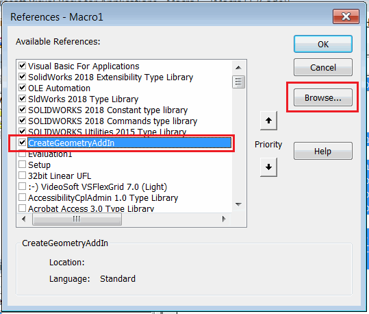
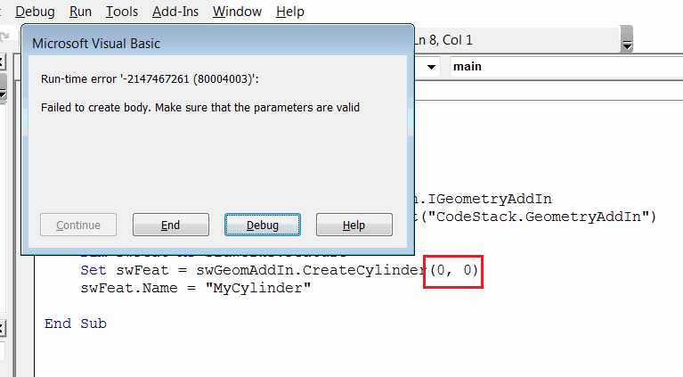
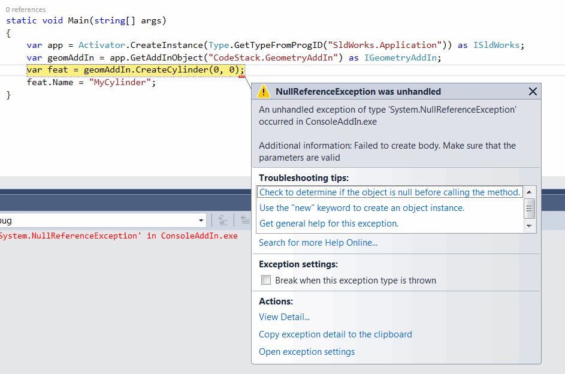

 Call functions of a SOLIDWORKS add-in from a standalone application or macro by retrieving the add-in object using the SOLIDWORKS API (enabling add-in custom API)
image: object-browser-interface.png
labels: [add-in api,addin object,invoke]
sidebar_position: 1
---
This article explains how to call functions of a SOLIDWORKS add-in from a standalone application or macro by retrieving the add-in object using the SOLIDWORKS API.

This is based on the same technique demonstrated in the video tutorial on reusing .NET functions from VBA macros with enabled COM communication:



## Enabling API in the Add-in

To enable the API in the add-in, you need to follow a few rules:

* The add-in must implement a COM-visible interface that exposes COM-visible functions.
* All parameters and return values of these functions must also be COM-visible.
* The add-in must generate a type library (TLB) with the definitions of these API functions.

When developing a C# application, you need to create a COM-visible interface and implement it in the add-in.

```cs
[ComVisible(true)]
public interface IMyAddInApi
{
    void FooApiMethod();
} 

[ComVisible(true), Guid("799A191E-A4CF-4622-9E77-EA1A9EF07621")]
public class MyAddIn : ISwAddIn
{
    ...
    public void FooApiMethod()
    {
        //Implement
    }
}
```

If you have selected the "Register for COM interop" option in Visual Studio, all COM-visible functions, classes, and interfaces will be automatically added to the TLB file.

{ width=550 }

## Example Add-in with API

The following add-in example is built using the [SwEx.AddIn Framework](/docs/codestack/labs/solidworks/swex/add-in/), but the same technique can be applied to add-ins built using different methods.

The add-in adds a menu command under the "Tools" menu that allows creating a cylinder feature.

{ width=350 }

When called from the menu, the cylinder will have hardcoded parameter values.

{ width=350 }

Additionally, the add-in exposes a public API named *CreateCylinder* that allows creating a cylinder. The API has two parameters:

* Diameter
* Height

and returns a pointer to an [IFeature](https://help.solidworks.com/2018/english/api/sldworksapi/solidworks.interop.sldworks~solidworks.interop.sldworks.ifeature.html). Since the SOLIDWORKS API is COM-visible, the add-in can use this interface directly in communication.

The *CreateCylinder* function itself is used by the add-in's *Create Cylinder* command.

### C# Add-in Source Code

```cs
using CodeStack.SwEx.AddIn;
using CodeStack.SwEx.AddIn.Attributes;
using CodeStack.SwEx.AddIn.Enums;
using SolidWorks.Interop.sldworks;
using SolidWorks.Interop.swconst;
using System;
using System.Diagnostics;
using System.Runtime.InteropServices;

namespace CodeStack.Examples.CreateGeometryAddIn
{
    [SwEx.Common.Attributes.Title("Create Geometry")]
    public enum Commans_e
    {
        [CommandItemInfo(swWorkspaceTypes_e.Part)]
        [SwEx.Common.Attributes.Title("Create Cylinder")]
        CreateCylinder
    }

    [ComVisible(true)]
    public interface IGeometryAddIn
    {
        IFeature CreateCylinder(double diam, double height);
    } 

    [AutoRegister("CreateGeometryAddIn", "Sample add-in for creating geometry", true)]
    [ComVisible(true), Guid("799A191E-A4CF-4622-9E77-EA1A9EF07621")]
    [ProgId("CodeStack.GeometryAddIn")]
    public class AddIn : SwAddInEx, IGeometryAddIn
    {
        public override bool OnConnect()
        {
            this.AddCommandGroup<Commans_e>(OnButtonClick);

            return true;
        }

        private void OnButtonClick(Commans_e cmd)
        {
            try
            {
                switch (cmd)
                {
                    case Commans_e.CreateCylinder:
                        CreateCylinder(0.1, 0.1);
                        break;
                }
            }
            catch(Exception ex)
            {
                Trace.WriteLine(ex.Message);
                App.SendMsgToUser2("Failed to create geometry", 
                    (int)swMessageBoxIcon_e.swMbStop, (int)swMessageBoxBtn_e.swMbOk);
            }
        }
        
        public IFeature CreateCylinder(double diam, double height)
        {
            var part = App.ActiveDoc as IPartDoc;

            if (part == null)
            {
                throw new NotSupportedException("Only part document are supported");
            }

            var modeler = App.IGetModeler();

            var body = modeler.CreateBodyFromCyl(new double[]
            {
                0, 0, 0,
                0, 1, 0,
                diam / 2, height
            });

            if (body != null)
            {
                var feat = part.CreateFeatureFromBody3(body, false,
                    (int)swCreateFeatureBodyOpts_e.swCreateFeatureBodySimplify) as IFeature;

                if (feat != null)
                {
                    return feat;
                }
                else
                {
                    throw new NullReferenceException("Failed to create feature from body");
                }
            }
            else
            {
                throw new NullReferenceException("Failed to create body. Make sure that the parameters are valid");
            }
        }
    }
}

```


## Accessing the Add-in

To access the add-in and its API, you need to retrieve a pointer to the add-in interface. You can use the [SOLIDWORKS API function ISldWorks::GetAddInObject](https://help.solidworks.com/2018/english/api/sldworksapi/solidworks.interop.sldworks~solidworks.interop.sldworks.isldworks~getaddinobject.html) to get the pointer to the add-in using either the program ID (ProgID) or the globally unique identifier (GUID).

The following code snippet retrieves the pointer from the add-in using its GUID. This is assigned by using the [Guid](https://docs.microsoft.com/en-us/dotnet/api/system.runtime.interopservices.guidattribute) attribute on the add-in class:

```vb
Set swGeomAddIn = swApp.GetAddInObject("{799A191E-A4CF-4622-9E77-EA1A9EF07621}")
```

Alternatively, you can retrieve the add-in by its ProgId. If the ProgId is not explicitly specified, it is equal to *Namespace*.*ClassName*

```vb
Set swGeomAddIn = swApp.GetAddInObject("CodeStack.Examples.CreateGeometryAddIn.AddIn")
```

It is recommended to explicitly specify the ProgId by using the [ProgId](https://docs.microsoft.com/en-us/dotnet/api/system.runtime.interopservices.progidattribute) attribute. In this case, you can change the class and namespace during refactoring while keeping the ProgId the same.

```cs
[ComVisible(true), Guid("799A191E-A4CF-4622-9E77-EA1A9EF07621")]
[ProgId("CodeStack.MyAddIn")]
public class AddIn : ISwAddIn
{
}
```

### Calling the Add-in Functions from a Macro

* Create a new VBA macro.
* Add a reference to the add-in type library in the "Tools->References" menu of the VBA editor.

{ width=450 }

Note that the interface will be visible in the Object Browser:

{ width=350 }

#### Calling the Add-in Function from a VBA Macro

```vb
Dim swApp As SldWorks.SldWorks

Sub main()

    Set swApp = Application.SldWorks
    
    Dim swGeomAddIn As CreateGeometryAddIn.IGeometryAddIn

    Set swGeomAddIn = swApp.GetAddInObject("CodeStack.GeometryAddIn")
    
    Dim swFeat As SldWorks.Feature
    Set swFeat = swGeomAddIn.CreateCylinder(0.2, 0.5)
    swFeat.Name = "MyCylinder"
    
End Sub
```


This macro will create a cylinder with custom parameters and rename it using the returned feature pointer.

{ width=350 }

Note that add-in errors are correctly thrown in the macro. For example, an exception will be generated when providing invalid input:

{ width=500 }

### Calling the Add-in from a Standalone Application

Similar to VBA macros, you can automate the add-in from a [standalone application](/docs/codestack/solidworks-api/getting-started/stand-alone/). To achieve type safety, you need to add a reference to the add-in DLL. Note that if the add-in is a .NET add-in, you cannot add the .tlb file as a reference, but you need to add the actual add-in DLL.

#### VB.NET Standalone Application

```vb
Imports CodeStack.Examples.CreateGeometryAddIn
Imports SolidWorks.Interop.sldworks

Module Module

    Sub Main()

        Dim app As ISldWorks = GetObject("", "SldWorks.Application")
        Dim geomAddIn As IGeometryAddIn = app.GetAddInObject("CodeStack.GeometryAddIn")
        Dim feat As IFeature = geomAddIn.CreateCylinder(0.2, 0.2)
        feat.Name = "MyCylinder"

    End Sub

End Module

```


#### C# Standalone Application

```cs
using CodeStack.Examples.CreateGeometryAddIn;
using SolidWorks.Interop.sldworks;
using System;

namespace ConsoleAddIn
{
    class Program
    {
        static void Main(string[] args)
        {
            var app = Activator.CreateInstance(Type.GetTypeFromProgID("SldWorks.Application")) as ISldWorks;
            var geomAddIn = app.GetAddInObject("CodeStack.GeometryAddIn") as IGeometryAddIn;
            var feat = geomAddIn.CreateCylinder(0.2, 0.2);
            feat.Name = "MyCylinder";
        }
    }
}

```


Exceptions can also be handled in the standalone application.

{ width=550 }

> The above methods of connecting to the SOLIDWORKS instance (Activator::CreateInstance or GetObject) may create a new invisible SOLIDWORKS instance in some cases instead of connecting to an existing session. These instances will be created as background applications without loading any add-ins, so the code will fail. To force the connection to the active session of SOLIDWORKS, refer to the article [Connecting by Querying the COM Instance from the Running Object Table (ROT)](/docs/codestack/solidworks-api/getting-started/stand-alone/#method-b-connecting-by-querying-the-com-instance-from-the-running-object-table-rot).

#### Notes

While it is possible to avoid declaring COM-visible interfaces and objects and use *dynamic* to retrieve and invoke add-in functions from a .NET application, this method is not recommended for the following reasons:

* It is not type-safe.
* Performance may be significantly affected as the framework needs to look up and find the appropriate objects in memory.
* Unexpected behavior may occur as it may map to incorrect objects.

Download the source code from [GitHub](https://github.com/codestackdev/solidworks-api-examples/tree/master/swex/add-in/create-geometry-api).