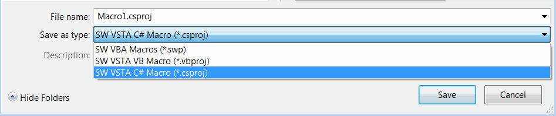
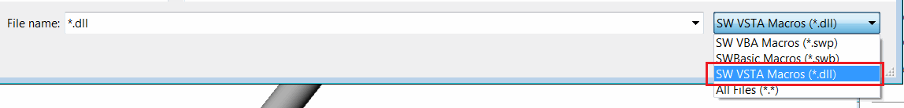

This article explains how to create and run VSTA macros (C# or VB.NET) from existing code.

* Create a new macro by calling the Tools->Macro->New command in the SOLIDWORKS menu.
* Set the filter for the VSTA macro (.vbproj or .csproj) based on the source code.

{ width=450 }

* Copy or remember the namespace of the macro marked in the *SolidWorksMacro.cs* file:

{ width=450 }

* Delete all the code from the *SolidWorksMacro.cs* file and paste the new source code into it.

* Modify the namespace to the original namespace.

> If the namespace is not modified, the following issue will occur: [Invalid Namespace in VSTA (C# or VB.NET) Macro](/docs/codestack/solidworks-api/troubleshooting/macros/vsta-invalid-namespace/)

Unlike VBA macros, VSTA macros must be compiled into a dll. Call the Build->Compile command in the code editor menu to compile the macro. You can also directly run the macro by clicking the green arrow button. Once the compilation is complete, the dll will be generated in the *bin\Release* folder of the macro, and the full path will be printed in the Output window as shown below.

{ width=450 }

* To run the VSTA macro, open the Tools->Macro->Run command in the SOLIDWORKS menu and select the filter for the VSTA macro (dll).

{ width=550 }

> Running the macro only requires the binary file. Therefore, you can copy the contents of the *bin\Release* folder to a new location or share it with other users. It is necessary to copy all the contents of the *bin\Release* folder (not just the macro dll) to avoid the following error: [Failed to Run VSTA (C# or VB.NET) Macro](/docs/codestack/solidworks-api/troubleshooting/macros/run-vsta-macro-error/)

### Keeping VSTA Macros Running

You can set an option to keep the VSTA macro running after execution. This is useful if the macro needs to monitor SOLIDWORKS events and does not need to be unloaded immediately after execution. To enable this behavior, uncheck the Stop VSTA debugger on macro exit option in the Tools->Options->System Options dialog in the SOLIDWORKS menu.

{ width=450 }