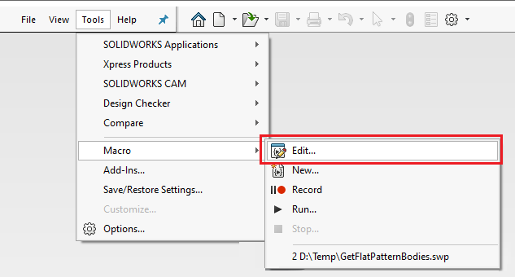

 在SOLIDWORKS中编辑现有的VBA和VSTA宏
image: edit-macro.png
---
VBA宏（*.swb和*.swp）以及VSTA宏（*.csproj和*.vbproj）的源代码可以直接在SOLIDWORKS中进行编辑。

* 导航到*工具->宏->编辑*菜单命令

* 浏览指定的宏（必要时更改文件过滤器）
* 或者从最近的文件中选择宏（如果可用）

此命令将打开新的VBA编辑器或Visual Studio（VSTA宏编辑器）。

根据需要修改代码并保存更改