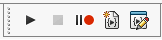
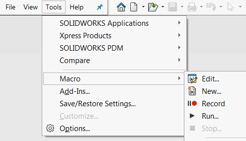



宏是类似脚本的应用程序，可以直接在SOLIDWORKS环境中执行和编辑。

宏利用SOLIDWORKS API和第三方组件API（如Excel或文件系统）来补充SOLIDWORKS功能。在大多数情况下，宏被用作自动化脚本，以增强重复任务的功能。

可以从各种资源（如官方[SOLIDWORKS论坛](https://forum.solidworks.com/community/api)或[CodeStack 'Goodies'](/docs/codestack/solidworks-tools)）下载数千个宏。

SOLIDWORKS支持的宏有两个主要类别：VSTA和VBA宏。有关更多详细信息，请参阅[宏类型](/docs/codestack/solidworks-api/getting-started/macros/types)文章。

宏工具栏提供以下命令：

* [运行宏](/docs/codestack/solidworks-api/getting-started/macros/run/)
* [录制宏](/docs/codestack/solidworks-api/getting-started/macros/recording/)（以及停止录制和暂停）
* 创建新的空白宏
* [编辑宏](/docs/codestack/solidworks-api/getting-started/macros/edit/)
* [将宏分配给按钮](/docs/codestack/solidworks-api/getting-started/macros/macro-buttons/)

上述命令也可以从菜单中选择。

{ width=300 }

由于宏通常在生产环境中使用，因此能够调试和排除宏以确保质量非常重要。请参阅[宏故障排除](/docs/codestack/solidworks-api/troubleshooting/macros/)以了解宏中最常见的错误的解释和解决方法。