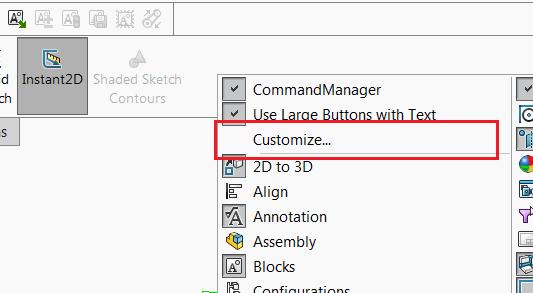
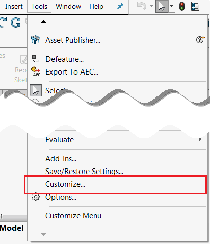
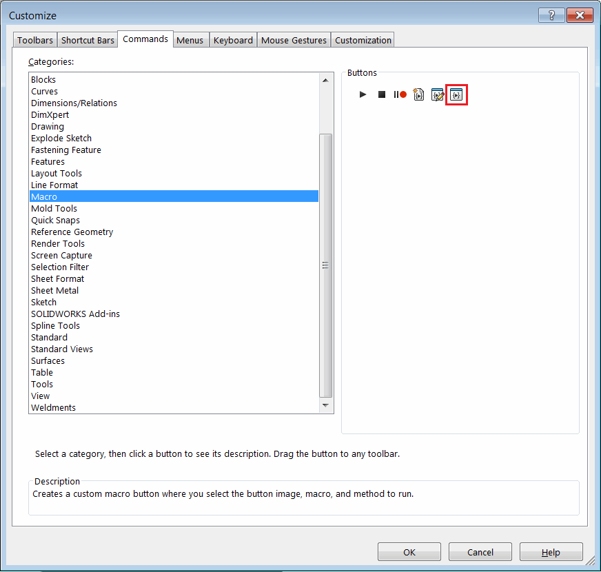
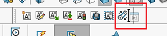
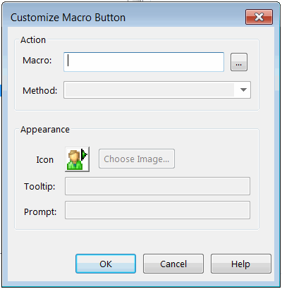
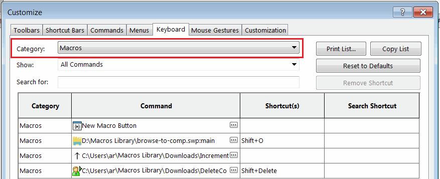
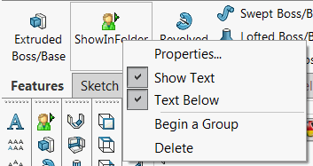

  <iframe allow="autoplay; encrypted-media" allowfullscreen="" frameborder="0"
    width="560" height="315" src="https://www.youtube.com/embed/4CznIatoWUU">
  </iframe>

可以将宏分配给自定义按钮，并将其放置在现有的工具栏或命令选项卡框中。这样可以增强用户体验，因为可以通过点击按钮来访问宏，而不需要通过“运行宏”例程。

要将宏与按钮关联起来，请从上下文菜单中调用“自定义...”命令

{ width=250 }

或从“工具”菜单中调用

{ width=250 }

> 注意：如果在SOLIDWORKS中没有打开任何文档，则此命令将被禁用。

导航到“命令”选项卡，然后选择“宏”组。该组中的最后一个按钮是“新建宏按钮”模板。

{ width=350 }

拖放此按钮并将其放置在命令管理器中的任何现有工具栏或命令选项卡框中

一旦放置，将弹出以下对话框：

{ width=250 }

使用相应的数据填写表单

* 指定宏的完整路径
* 选择入口点（方法和函数名称）。列表中只包含宏中的无参数函数。通常，*main*函数是入口点
* 可选择指定图标。对于SOLIDWORKS 2015或更早版本，请使用16x16位图；对于所有更新版本，请使用20x20位图。使用白色作为透明键。
* 可选择指定工具提示和提示文本。

工具栏中的按钮位置将在SOLIDWORKS会话之间保持不变。可以使用[SOLIDWORKS复制设置向导](https://help.solidworks.com/2013/english/solidworks/sldworks/c_copy_settings_wizard.htm)导出和恢复这些按钮。

宏按钮的功能与其他标准按钮相同。可以为宏按钮分配键盘快捷键。

在“自定义...”对话框的“键盘”选项卡上的“宏”类别中找到所需的命令，并分配快捷键。

{ width=350 }

要编辑宏按钮的属性，以及重新排序按钮或删除按钮，需要激活“自定义...”菜单命令。

在“自定义”对话框处于活动状态时，可以重新排序按钮。

要更改宏按钮的属性，请在宏按钮上方单击鼠标右键，然后打开“自定义宏按钮”对话框。

要删除按钮，请将其从工具栏上拖动，直到鼠标指针上出现带有红色交叉的按钮，然后释放拖放。

如果宏按钮放置在命令选项卡框中，请使用以下上下文菜单更改属性或删除按钮：

{ width=250 }

如果要将宏按钮放置在自定义工具栏中，可以使用免费的[MyToolbar](https://cadplus.xarial.com/toolbar/)插件。