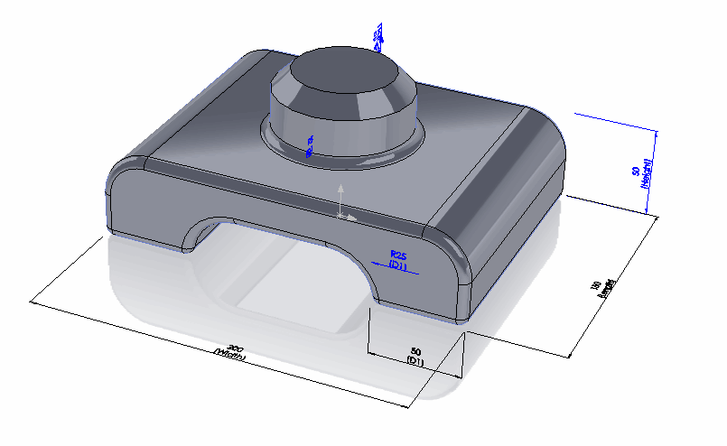
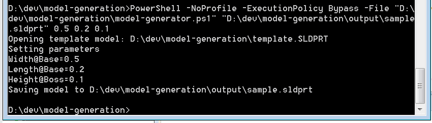

 使用SOLIDWORKS API根据指定参数生成模型的脚本
image: model-parameters.png
labels: [dimension, parameters, script]
---

This PowerShell script allows you to generate a model using the SOLIDWORKS API based on specified parameters and a template.

* Create two files and paste the code snippets below into them.

## model-generator.ps1
~~~ ps1
$curDir = Split-Path $script:MyInvocation.MyCommand.Path
$templateFilePath = $curDir + "\template.SLDPRT"

$outFilePath=$args[0]
$width=$args[1]
$length=$args[2]
$height=$args[3]

$Source = @"
Imports System
Imports System.Collections.Generic

Public Class ModelGenerator

    Public Shared Sub GenerateModelFromTemplate(templatePath as String, outFilePath As String, width As String, length As String, height As String)
        
        Dim swApp As Object = Activator.CreateInstance(Type.GetTypeFromProgID("SldWorks.Application"))
        swApp.CommandInProgress = True
        swApp.UserControlBackground = True
        
        If swApp Is Nothing Then
            Console.WriteLine("Failed to connect to SOLIDWORKS instance")
            Exit Sub
        End If

        Const PARAM_WIDTH As String = "Width@Base"
        Const PARAM_LENGTH As String = "Length@Base"
        Const PARAM_HEIGHT As String = "Height@Boss"

        Dim openDocSpec As Object
        Console.WriteLine("Opening template model: " + templatePath)
        openDocSpec = swApp.GetOpenDocSpec(templatePath)
        openDocSpec.Silent = True
        openDocSpec.ReadOnly = True
        
        Dim model As Object = swApp.OpenDoc7(openDocSpec)

        If model IsNot Nothing Then

            Try
                Console.WriteLine("Setting parameters")

                Dim parameters As New Dictionary(Of String, Double)
                parameters.Add(PARAM_WIDTH, Double.Parse(width))
                parameters.Add(PARAM_LENGTH, Double.Parse(length))
                parameters.Add(PARAM_HEIGHT, Double.Parse(height))

                For Each paramData As KeyValuePair(Of String, Double) In parameters

                    Dim paramName As String = paramData.Key
                    Dim param As Object = model.Parameter(paramName)

                    If param IsNot Nothing Then

                        Const swSetValue_InAllConfigurations As Integer = 2
                        Const swSetValue_Successful As Integer = 0

                        Dim paramValue As Double = paramData.Value

                        If param.SetSystemValue3(paramValue, swSetValue_InAllConfigurations, Nothing) = swSetValue_Successful Then
                            Console.WriteLine(String.Format("{0}={1}", paramName, paramValue))
                        Else
                            Throw New Exception(String.Format("Failed to set parameter {0} to {1}", paramName, paramValue))
                        End If
                    Else
                        Throw New Exception("Parameter not found: " + paramName)
                    End If

                Next

                Console.WriteLine("Saving the model to " + outFilePath)

                Const swSaveAsCurrentVersion As Integer = 0
                Const swSaveAsOptions_Silent As Integer = 1
                Const swSaveAsOptions_Copy As Integer = 2

                model.ForceRebuild3(False)

                If model.Extension.GetWhatsWrongCount() > 0 Then
                    Console.WriteLine("Model has rebuild errors")
                End If

                Dim err As Integer = model.SaveAs3(outFilePath, swSaveAsCurrentVersion, swSaveAsOptions_Silent + swSaveAsOptions_Copy)
                
                If err <> 0  Then
                    Throw New Exception(String.Format("Failed to save the document to {0}. Error code: {1}", outFilePath, err))
                End If

            Catch ex As Exception
                Console.WriteLine("Error: " & ex.Message)
            Finally
                swApp.CommandInProgress = False
                Dim modelTitle As String = model.GetTitle()
                System.Runtime.InteropServices.Marshal.ReleaseComObject(model)
                model = Nothing
                GC.Collect()
                swApp.CloseDoc(modelTitle)
            End Try
        Else
            Console.WriteLine("Failed to open template model " + templatePath)
        End If
        
    End Sub

End Class
"@

Add-Type -TypeDefinition $Source -Language VisualBasic

[ModelGenerator]::GenerateModelFromTemplate($templateFilePath, $outFilePath, $width, $length, $height)

~~~

## model-generator.cmd
~~~ cmd
SET inputFilePath=%1
SET outFilePath=%2

SET outFilePath=%1
SET width=%2
SET length=%3
SET height=%4

PowerShell -NoProfile -ExecutionPolicy Bypass -File "%~dp0model-generator.ps1" %outFilePath% %width% %length% %height%
~~~

Download the [template model](template.SLDPRT) and save it in the same folder as the above two scripts.

This is a template model with 3 driving parameters (width, height, and length).

{ width=350 }

The script will modify it and save it as a new file.

* Launch the command prompt and execute the following command:

~~~ bat
[path to model-generator.cmd] [full path to the output SOLIDWORKS file] [width] [length] [height]
~~~

The result will generate the file and display the process log directly in the console:

{ width=450 }

The template file will not be modified, and the generated model will be saved with the updated parameters.

{ width=350 }