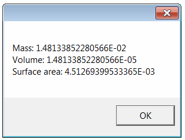

该示例演示了如何使用vbScript通过SOLIDWORKS API从指定的文件中提取质量属性。

- 创建一个文本文件并将其命名为*get-mass-prps.vbs*
- 将以下代码复制粘贴到文件中

```vbs
Dim swApp
Set swApp = CreateObject("SldWorks.Application")

Dim filePath
filePath = InputBox("指定零件文件的路径")

Dim docSpec
Set docSpec = swApp.GetOpenDocSpec(filePath)
docSpec.ReadOnly = True
docSpec.Silent = True

Dim swModel
Set swModel = swApp.OpenDoc7(docSpec)

Dim swMassPrps
Set swMassPrps = swModel.Extension.CreateMassProperty()

MsgBox "质量: " & swMassPrps.Mass & vbLf & "体积: " & swMassPrps.Volume & vbLf & "表面积: " & swMassPrps.SurfaceArea

swApp.CloseDoc swModel.GetTitle()
```

- 保存文件
- 双击运行脚本
- 在显示的输入框中指定SOLIDWORKS文件（零件或装配）的完整路径
- 结果将在消息框中显示指定模型的质量属性值

{ width=250 }