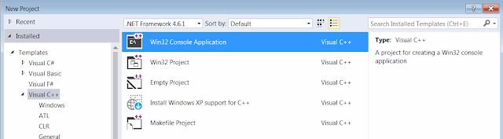
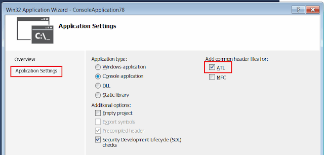
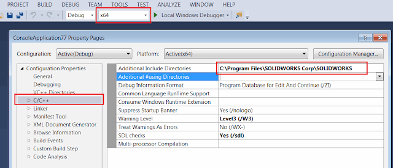

 使用 C++ 和 Microsoft Visual Studio 从外部进程 (即独立应用程序，如 MFC、Win32 控制台应用程序) 连接到 SOLIDWORKS 应用程序的指南
sidebar_position: 3
image: proj-templ.png
labels: [c++, CoCreateInstance, create instance, example, getobject, rot, sdk, solidworks api, tlb, type library]
redirect-from:
  - /2018/03/create-c-stand-alone-application-for_5.html
---
在本教程中，我将演示如何使用 C++ 和 Microsoft Visual Studio 从外部进程 (即独立应用程序，如 MFC、Win32 控制台应用程序) 连接到 SOLIDWORKS 应用程序。

有关本文中讨论的方法的更详细说明，请参阅[从独立应用程序连接到 SOLIDWORKS](/docs/codestack/solidworks-api/getting-started/stand-alone/)文章。

## 创建新项目

我将使用 Microsoft Visual Studio 开发环境。您可以使用任何版本的 Visual Studio。
相同的代码将适用于专业版、Express 版或社区版。请访问此链接下载[Visual Studio](https://www.visualstudio.com/vs/community/)

* 打开 Visual Studio
* 开始新项目：

{ width=400 }

* 选择项目模板。我建议从 Win32 控制台应用程序项目模板开始，因为它包含最少的预生成代码：

{ width=640 }

* 在项目向导中选择 ATL 选项

{ width=640 }

* 链接 SOLIDWORKS 类型库所在的目录。
这是 SOLIDWORKS 的安装目录（转到项目属性，选择 C/C++，在“附加包含目录”字段中浏览路径）：

{ width=640 }

现在我们可以添加连接到 SOLIDWORKS 实例的代码。

## 创建或连接实例

连接到 COM 服务器的最常见和快速的方法是使用 [CoCreateInstance](https://msdn.microsoft.com/en-us/library/windows/desktop/ms686615(v=vs.85).aspx) 函数。

~~~ cpp
#include "stdafx.h"
#import "sldworks.tlb"
#include <iostream>

int main()
{
    ::CoInitialize(NULL);
    CComPtr<SldWorks::ISldWorks> pSwApp;

    if (SUCCEEDED(pSwApp.CoCreateInstance(
        __uuidof(SldWorks::SldWorks), NULL, CLSCTX_LOCAL_SERVER)))
    {
        pSwApp->Visible = TRUE;
        _bstr_t revNmb = pSwApp->RevisionNumber();

        std::cout << revNmb;
    }

    pSwApp = NULL;
    ::CoUninitialize();

    // 等待输入（不要关闭控制台以查看结果）
    std::cin.get();

    return 0;
}

~~~

## 通过 ROT 获取正在运行的实例

为了连接到已经运行的特定的 SOLIDWORKS 会话或能够创建多个会话，您可以使用 Running Object Table (ROT) API。
有关此方法的更多详细信息，请阅读[从独立应用程序连接到 SOLIDWORKS](/docs/codestack/solidworks-api/getting-started/stand-alone#method-b---running-object-table-rot)文章。

~~~ cpp
#include "stdafx.h"
#import "sldworks.tlb"
#include <iostream>
#include <windows.h>
#include <string>
#include <chrono>
#include <thread>

HRESULT StartSwProcess(LPCWSTR appPath, int& prcId)
{
    prcId = -1;

    STARTUPINFO si;
    PROCESS_INFORMATION pi;

    ZeroMemory(&si, sizeof(si));

    HRESULT res = E_FAIL;
    
    if(CreateProcess(L"C:\\Program Files\\SOLIDWORKS Corp\\SOLIDWORKS\\SLDWORKS.exe",
        L"", NULL, NULL, FALSE, 0,
        NULL, NULL, &si, &pi))
    {
        CloseHandle(pi.hProcess);
        CloseHandle(pi.hThread);

        prcId = pi.dwProcessId;

        res = S_OK;
    }
    
    return res;
}

HRESULT GetSwAppFromProcess(int prcId, SldWorks::ISldWorks** pSwApp)
{
    HRESULT res = E_FAIL;

    CComPtr<IRunningObjectTable> pRot;
    CComPtr<IBindCtx> pBindingContext;

    if (SUCCEEDED(CreateBindCtx(0, &pBindingContext)))
    {
        if (GetRunningObjectTable(0, &pRot) == S_OK)
        {
            CComPtr<IEnumMoniker> pEnumMoniker;
            if (SUCCEEDED(pRot->EnumRunning(&pEnumMoniker)))
            {
                WCHAR szMonikerName[30];
                swprintf_s(szMonikerName, 30, L"SolidWorks_PID_%d", prcId);

                ULONG fetched;
                CComPtr<IMoniker> pMon;

                while (pEnumMoniker->Next(1, &pMon, &fetched) == S_OK)
                {
                    LPOLESTR pName;
                    pMon->GetDisplayName(pBindingContext, NULL, &pName);

                    if (wcscmp(pName, szMonikerName) == 0)
                    {
                        CComPtr<IUnknown> pUnk;

                        if (SUCCEEDED(pRot->GetObjectW(pMon, &pUnk)))
                        {
                            if (SUCCEEDED(pUnk->QueryInterface(_uuidof(SldWorks::ISldWorks), (void**)pSwApp)))
                            {    
                                res = S_OK;
                                break;
                            }
                        }
                    }

                    pMon = NULL;
                }
            }
        }
    }

    pRot = NULL;
    pBindingContext = NULL;

    return res;
}

HRESULT ConnectToSwApp(LPCWSTR appPath, SldWorks::ISldWorks** pSwApp, int timeoutSec) 
{
    HRESULT res = E_FAIL;

    int prcId;

    if (SUCCEEDED(StartSwProcess(appPath, prcId)))
    {
        auto start = std::chrono::high_resolution_clock::now();
        
        while (FAILED(GetSwAppFromProcess(prcId, pSwApp)))
        {
            std::this_thread::sleep_for(std::chrono::milliseconds(200));
            auto end = std::chrono::high_resolution_clock::now();
            std::chrono::duration<double, std::milli> elapsed = end - start;

            if (elapsed.count() > timeoutSec * 1000)
            {
                throw std::runtime_error("Timeout");
            }
        }

        res = S_OK;
    }

    return res;
}

int main()
{
    ::CoInitialize(NULL);
    
    CComPtr<SldWorks::ISldWorks> pSwApp;

    try 
    {
        if (SUCCEEDED(ConnectToSwApp(L"C:\\Program Files\\SOLIDWORKS Corp\\SOLIDWORKS (2)\\SLDWORKS.exe", 
            &pSwApp, 10))) 
        {
            _bstr_t revNmb = pSwApp->RevisionNumber();
            std::cout << revNmb;
        }
    }
    catch (std::runtime_error& e) 
    {
        std::cout << e.what() << std::endl;
    }

    pSwApp = NULL;
    
    ::CoUninitialize();

    // 等待输入（不要关闭控制台以查看结果）
    std::cin.get();
    
    return 0;
}

~~~

在上面的示例中，通过从 SOLIDWORKS 应用程序安装路径启动新进程来启动 SOLIDWORKS 的新会话。
*ConnectToSwApp* 函数需要第一个参数为 **sldworks.exe** 的完整路径，第二个参数为超时时间（以秒为单位）。
超时时间将确保应用程序在进程启动失败的情况下不会被锁定。