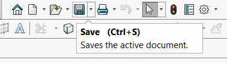

这个VBA宏使用SOLIDWORKS API处理活动文档（零件、装配或绘图）的保存事件（包括全部保存和另存为），并运行自定义代码。

宏在后台运行，需要在每个会话中运行一次以开始监视。

## 配置

* 创建新的宏
* 将代码从[宏模块](#宏模块)复制到默认模块中
* 将需要在每次保存时执行的代码添加到*OnSaveDocument*函数中

~~~ vb
Sub OnSaveDocument(Optional dummy As Variant = Empty)
    'TODO: 在此处放置在文档保存时运行的代码
    MsgBox "已保存"
End Sub
~~~

* 为了简化这个函数，你可以调用另一个宏而不需要显式地复制代码。参考[运行一组宏](/docs/codestack/solidworks-api/application/frame/run-macros-group/)示例。

* 添加新的类模块并将其命名为*SaveEventsHandler*。将代码从[SaveEventsHandler类模块](#saveeventshandler类模块)复制到其中。

* 可以自动在每个SOLIDWORKS会话中运行此宏可能会很有用。参考[在SOLIDWORKS启动时自动运行宏](/docs/codestack/solidworks-api/getting-started/macros/run-macro-on-solidworks-start/)了解更多信息。

## 宏模块

入口点，用于启动事件监视并处理一次保存事件到达时需要运行的代码。

~~~ vb
Dim swFileSaveHandler As SaveEventsHandler

Sub main()
    
    Set swFileSaveHandler = New SaveEventsHandler
    
    While True
        DoEvents
    Wend
    
End Sub

Sub OnSaveDocument(Optional dummy As Variant = Empty)
    'TODO: 在此处放置在文档保存时运行的代码
    MsgBox "已保存"
End Sub
~~~

## SaveEventsHandler类模块

处理SOLIDWORKS API保存通知的类。

~~~ vb
Dim WithEvents swApp As SldWorks.SldWorks

Private Sub Class_Initialize()
    Set swApp = Application.SldWorks
End Sub

Private Function swApp_CommandCloseNotify(ByVal Command As Long, ByVal reason As Long) As Long
    
    Const swCommands_Save As Long = 2
    Const swCommands_SaveAll As Long = 19
    Const swCommands_SaveAs As Long = 620
    
    If Command = swCommands_Save Or Command = swCommands_SaveAll Or Command = swCommands_SaveAs Then
        OnSaveDocument
    End If
    
End Function

~~~