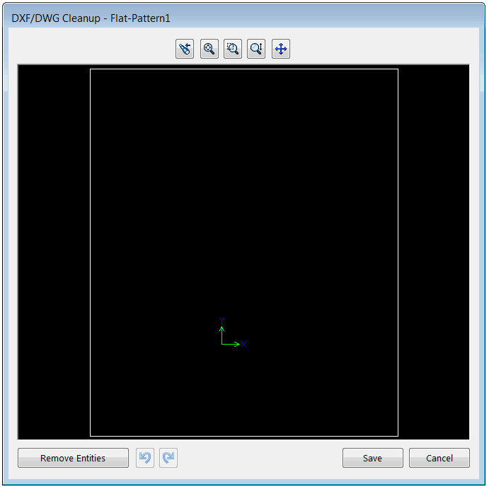

 VBA示例演示了如何将指定的展开图案导出为DXF/DWG并显示清理对话框
image: cleanup-page.png
labels: [dxf,dwg,cleanup,flat pattern,export]
---
[SOLIDWORKS API方法IPartDoc::ExportToDwg2](https://help.solidworks.com/2014/english/api/sldworksapi/SolidWorks.Interop.sldworks~SolidWorks.Interop.sldworks.IPartDoc~ExportToDWG2.html)允许将选择的展开图案导出为DXF/DWG格式。但是，该API不允许在导出之前显示内置的清理对话框以修改DXF/DWG。

{ width=350 }

下面的代码提供了解决此问题的方法。

> 请注意，此代码不允许设置导出的设置（使用默认选项）。需要使用Windows API来修改选项和复选框。

## 配置

如下所示指定宏参数：

~~~vb
Const FLAT_PATTERN_FEAT_NAME As String = "Flat-Pattern1" '要导出的展开图案特征的名称
Const OUT_FILE_NAME As String = "D:\sample.dxf" '导出的文件名
~~~

## 宏模块

~~~ vb
#If VBA7 Then
     Private Declare PtrSafe Function SendMessage Lib "User32" Alias "SendMessageA" (ByVal hWnd As Long, ByVal wMsg As Long, ByVal wParam As Long, lParam As Any) As Long
#Else
     Private Declare Function SendMessage Lib "User32" Alias "SendMessageA" (ByVal hWnd As Long, ByVal wMsg As Long, ByVal wParam As Long, lParam As Any) As Long
#End If

Const FLAT_PATTERN_FEAT_NAME As String = "Flat-Pattern1"
Const OUT_FILE_NAME As String = "D:\sample.dxf"

Dim swApp As SldWorks.SldWorks

Sub main()

    Set swApp = Application.SldWorks
    
    Dim swPart As SldWorks.PartDoc
    Set swPart = swApp.ActiveDoc
    
    If Not swPart Is Nothing Then
        
        Dim swFeat As SldWorks.Feature
        Set swFeat = swPart.FeatureByName(FLAT_PATTERN_FEAT_NAME)
        
        If Not swFeat Is Nothing Then
            ExportFlatPattern swPart, swFeat, OUT_FILE_NAME
        Else
            MsgBox "未找到展开图案特征"
        End If
        
    Else
        MsgBox "请打开零件文档"
    End If
        
End Sub

Sub ExportFlatPattern(Part As SldWorks.PartDoc, feat As SldWorks.Feature, fileName As String)
                    
    Dim swEvListener As ExportEventsListener
    Set swEvListener = New ExportEventsListener
    
    '设置导出的DXF/DWG文件的文件名
    Set swEvListener.Part = Part
    swEvListener.FilePath = fileName
    
    feat.Select2 False, 0
    
    '调用导出命令
    Const WM_COMMAND As Long = &H111
    Const CMD_ExportFlatPattern As Long = 54244
    SendMessage swApp.Frame().GetHWnd(), WM_COMMAND, CMD_ExportFlatPattern, 0
    
    '等待属性页显示
    Dim isActive As Boolean
    
    Do
        swApp.GetRunningCommandInfo -1, "", isActive
        DoEvents
    Loop While Not isActive
    
    Set swEvListener.Part = Nothing

    'TODO: 调用Windows API在属性页中设置所需的选项
    
    '关闭属性页
    Const swCommands_PmOK As Long = -2
    swApp.RunCommand swCommands_PmOK, ""
    
End Sub
~~~

## ExportEventsListener 类模块

创建名为**ExportEventsListener**的新[类模块](/docs/codestack/visual-basic/classes/)并添加以下代码

~~~ vb
Public WithEvents Part As SldWorks.PartDoc
Public FilePath As String

Private Function Part_FileSaveAsNotify2(ByVal fileName As String) As Long
    
    Dim swModel As SldWorks.ModelDoc2
    Set swModel = Part
    
    swModel.SetSaveAsFileName FilePath
    Part_FileSaveAsNotify2 = 1
    
End Function
~~~