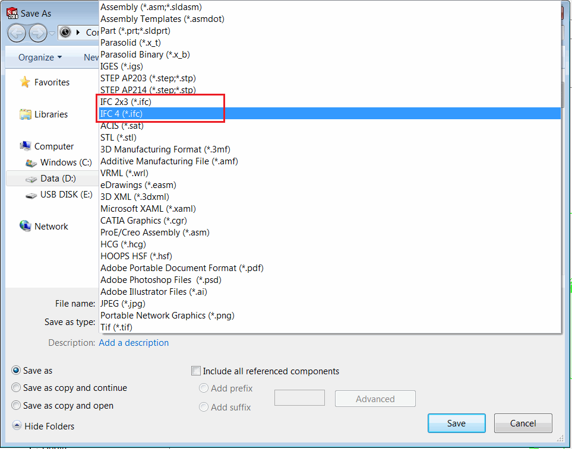

This example demonstrates how to export active assembly or part document into IFC format using SOLIDWORKS API.

{ width=450 }

Currently SOLIDWORKS supports 2 schemas for IFC format

* IFC 2x3
* IFC 4

The schema can be validated in the output IFC file when opened in text editor.

{ width=450 }

This VBA macro demonstrates how to export file to both IFC schemas. Change the value of the *IfcFormat_e* enumeration to change the format:

~~~ vb
ExportIfc swModel, OUT_FILE_PATH, IfcFormat_e.Ifc4 'Export to IFC 4
ExportIfc swModel, OUT_FILE_PATH, IfcFormat_e.Ifc2x3 'Export to IFC 2x3
~~~

Change the value of *OUT_FILE_PATH* constant to specify the output file location

~~~ vb
Const OUT_FILE_PATH As String = "C:\Output\Building.ifc"
~~~

~~~ vb
Enum IfcFormat_e
    Ifc2x3 = 23
    Ifc4 = 4
End Enum

Const OUT_FILE_PATH As String = "C:\Engine.ifc"

Dim swApp As SldWorks.SldWorks

Sub main()

    Set swApp = Application.SldWorks
    
    Dim swModel As SldWorks.ModelDoc2
    Set swModel = swApp.ActiveDoc
    
    If Not swModel Is Nothing Then
        
        ExportIfc swModel, OUT_FILE_PATH, IfcFormat_e.Ifc4
        
    Else
        MsgBox "Please open the model"
    End If
    
End Sub

Sub ExportIfc(model As SldWorks.ModelDoc2, path As String, format As IfcFormat_e)
    
    Dim curIfcFormat As Integer
    curIfcFormat = swApp.GetUserPreferenceIntegerValue(swUserPreferenceIntegerValue_e.swSaveIFCFormat)

    swApp.SetUserPreferenceIntegerValue swUserPreferenceIntegerValue_e.swSaveIFCFormat, format
    
    Dim errors As Long
    Dim warnings As Long
    
    If False = model.Extension.SaveAs(path, swSaveAsVersion_e.swSaveAsCurrentVersion, swSaveAsOptions_e.swSaveAsOptions_Silent, Nothing, errors, warnings) Then
        Err.Raise vbError, "", "Failed to export file. Error code: " & errors
    End If
    
    swApp.SetUserPreferenceIntegerValue swUserPreferenceIntegerValue_e.swSaveIFCFormat, curIfcFormat
        
End Sub
~~~

