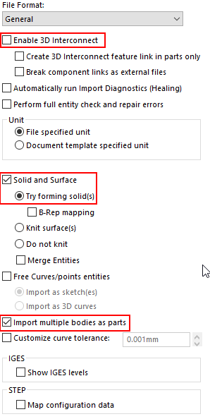

Author: [Eddy Alleman](https://www.linkedin.com/in/eddyalleman/) ([EDAL Solutions](https://www.edalsolutions.be/index.php/en/))

{ width=400 }

## Context situation: 

Suppose we have hundreds of STEP files, all in the same folder from our supplier. 
We want to build a library out of them to reuse again and again in our designs.
To keep the files well separated one from another, we want each STEP file exported in a separate folder per type.

## SOLIDWORKS has a tool for this: Task scheduler

{ width=350 }

But all step files will end up in the same folder, unless we put the STEP files in separate folders first and then the exported Solidworks files to those subfolders.
This is a lot of manual work.

Also we don't know for sure if there are duplicate files and if those files have different level of detail.
We want to be able to choose the best ones after importing and not just overwrite already processed ones.

So how can we automate this and avoid making all those subfolders manually?

## Batch+ with simple macro

Batch+ is a free tool, that is part of CAD+ and it handles a lot of the peculiarities when batch processing files.
We will choose this option because of the easy setup and full control over the process.

The following macro determines if the step is an assembly or a part file.
If it is an assembly then the components will be saved as separate part files (depending on system options, see image above).

The macro creates a subfolder in the same location as and with the same name as the step file.
This helps in separating the files that belong together from other imports.
If you don't put them in a new folder every time, you could get the same file twice
and the last save overwrites the previous ones. Be sure that they are the same in that case.

## PREREQUISITES

(1) make sure you don't have system option set to:
    Prompt user to select document template
    Use instead : "Always use these default document templates"
Otherwise SolidWorks keeps asking to select a document template.

(2) Set system options > import > Enable 3D interconnect OFF
    Documentation about 3D interconnect :
    Insert proprietary CAD data directly into a SOLIDWORKS assembly without converting it to a SOLIDWORKS file.
    And converting is exactly what we want. 3D interconnect just makes a link to the STEP file and updates if needed.

{ width=800 }

~~~ vb
Option Explicit

'Overwrites if solidworks files already exist in case they have been processed before.
Const OVERWRITE As Boolean = False

'set the path you want to save to
Const DESTINATION_PATH As String = "C:\temp"

Sub main()

try_:

    'Uncomment the following line if you want to debug into this code during running Batch+
    'Debug.Assert False
    
    On Error GoTo catch_
    
    'test if DESTINATION PATH exists
    If FolderExists(DESTINATION_PATH) Then

        Dim swApp As SldWorks.SldWorks
        Set swApp = Application.SldWorks
        
        'You have to open a step file first, without saving it if you want to test without Batch+
        Dim swModel As SldWorks.ModelDoc2
        Set swModel = swApp.ActiveDoc
        
        If Not swModel Is Nothing Then
                    
             '--- Get file name without extension and path
             'only get the document name (which is displayed in the title bar of SolidWorks)
             Dim swxFilenaam As String
             swxFilenaam = swModel.GetTitle
             
             '--- Get file extension
             'Determine if the step file was an assembly or a part file to set the file extension correctly
             Dim Extension As String
             Select Case swModel.GetType
                
                Case swDocPART:
                    Extension = ".SLDPRT"
                
                Case swDocASSEMBLY:
                    Extension = ".SLDASM"
                    
             End Select
            
            '--- Get path
             Dim newPath As String
             newPath = DESTINATION_PATH
          
             
            'Add the name of the subfolder
             Dim subfoldername As String            
             subfoldername = "\" + swxFilenaam + "\"
             newPath = DESTINATION_PATH + subfoldername    
            
            '--- if folder doesn't exist already create it
             CreateFolderIfNotExisting (newPath)
            
            '--- Create the name of the file to save to
            swxFilenaam = newPath + swxFilenaam + Extension
            
            '--- if swxFilenaam exists already and OVERWRITE = False
            If FileExists(swxFilenaam) And OVERWRITE = False Then
                'do nothing
            Else
        
                ' make sure nothing is selected, otherwise only selected entities are saved
                swModel.ClearSelection2 False
        
        '--- save the step file
                Dim lErrors As Long
                Dim lWarnings As Long
                Dim boolstatus As Boolean
                boolstatus = swModel.Extension.SaveAs(swxFilenaam, 0, swSaveAsOptions_e.swSaveAsOptions_Silent, Nothing, lErrors, lWarnings)
                Debug.Assert boolstatus
                                      
                'swApp.CloseDoc (swxFilenaam)'don't use it , let Batch+ handle it
             
             End If 'File exists already
             
        Else
            
            MsgBox "No document open"
            
        End If 'swModel Nothing
    
    Else
    
        MsgBox DESTINATION_PATH + "doesn't exist"
        
    End If 'DESTINATION_PATH exists
    
catch_:

    Debug.Print "Error: " & Err.Number & ":" & Err.source & ":" & Err.Description
    GoTo finally_
    
finally_:
    Debug.Print "FINISHED MACRO ImportStep"
    
End Sub

Function CreateFolderIfNotExisting(newPath As String)

    If FolderExists(newPath) Then
         'do nothing
    Else
        MkDir (newPath)
        Debug.Print "Path created : " + newPath
    End If

End Function

Function FolderExists(newPath As String) As Boolean

    If Dir(newPath, vbDirectory) = "" Then
        Debug.Print "Path doesn't exist : " + newPath
        FolderExists = False
    Else
        Debug.Print "Path exists : " + newPath
        FolderExists = True
    End If

End Function

Function FileExists(newPath As String) As Boolean

    If Dir(newPath) = "" Then
        Debug.Print "File doesn't exist : " + newPath
        FileExists = False
    Else
        Debug.Print "File exists : " + newPath
        FileExists = True
    End If

End Function

~~~

