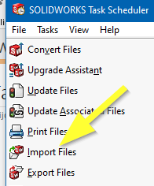

作者：[Eddy Alleman](https://www.linkedin.com/in/eddyalleman/) ([EDAL Solutions](https://www.edalsolutions.be/index.php/en/))

{ width=400 }

## 上下文情景：

假设我们有数百个STEP文件，都存储在供应商的同一个文件夹中。
我们想要将它们构建成一个库，以便在设计中反复重用。
为了将文件彼此分开，我们希望每个STEP文件都导出到一个相应类型的单独子文件夹中。

## SOLIDWORKS中有一个工具可以实现这一点：任务计划程序

{ width=350 }

但是，除非我们首先将STEP文件放入单独的文件夹中，然后将导出的SOLIDWORKS文件保存到这些子文件夹中，否则所有的STEP文件都将最终放在同一个文件夹中。
这需要大量的手动工作。

而且，我们不确定是否存在重复文件以及这些文件是否具有不同的详细级别。
我们希望在导入后能够选择最佳文件，而不仅仅是覆盖已处理的文件。

那么，我们如何自动化这个过程，避免手动创建所有这些子文件夹呢？

## 使用简单宏的批处理+

批处理+是CAD+的一部分，是一个免费工具，它处理了批处理文件时的许多特殊情况。
我们选择这个选项是因为它易于设置并且对过程具有完全控制。

以下宏确定了STEP文件是装配体还是零件文件。
如果是装配体，则组件将保存为单独的零件文件（取决于系统选项，请参见上面的图像）。

该宏在与STEP文件相同的位置创建一个具有相同名称的子文件夹。
这有助于将属于同一组的文件与其他导入文件分开。
如果您不每次都将它们放在新文件夹中，可能会得到相同的文件两次，并且最后一次保存将覆盖之前的文件。在这种情况下，请确保它们是相同的。

## 先决条件

（1）确保您没有设置系统选项为：
    提示用户选择文档模板
    使用这些默认文档模板
否则，SolidWorks会一直要求选择文档模板。

（2）设置系统选项 > 导入 > 启用3D互连 关闭
    关于3D互连的文档：
    直接将专有CAD数据插入SOLIDWORKS装配体中，而无需将其转换为SOLIDWORKS文件。
    而我们想要的正是转换。3D互连只是创建了一个指向STEP文件的链接，并在需要时进行更新。

{ width=800 }

~~~ vb
Option Explicit

'如果已经存在Solidworks文件，则覆盖。
Const OVERWRITE As Boolean = False

'设置要保存到的路径
Const DESTINATION_PATH As String = "C:\temp"

Sub main()

try_:

    '如果要在运行Batch+时调试此代码，请取消下面一行的注释
    'Debug.Assert False
    
    On Error GoTo catch_
    
    '测试DESTINATION PATH是否存在
    If FolderExists(DESTINATION_PATH) Then

        Dim swApp As SldWorks.SldWorks
        Set swApp = Application.SldWorks
        
        '如果要在没有保存的情况下测试，请先打开一个step文件
        Dim swModel As SldWorks.ModelDoc2
        Set swModel = swApp.ActiveDoc
        
        If Not swModel Is Nothing Then
                    
             '--- 获取不带扩展名和路径的文件名
             '只获取文档名称（在SolidWorks的标题栏中显示）
             Dim swxFilenaam As String
             swxFilenaam = swModel.GetTitle
             
             '--- 获取文件扩展名
             '确定step文件是装配体还是零件文件，以正确设置文件扩展名
             Dim Extension As String
             Select Case swModel.GetType
                
                Case swDocPART:
                    Extension = ".SLDPRT"
                
                Case swDocASSEMBLY:
                    Extension = ".SLDASM"
                    
             End Select
            
            '--- 获取路径
             Dim newPath As String
             newPath = DESTINATION_PATH
          
             
            '添加子文件夹的名称
             Dim subfoldername As String            
             subfoldername = "\" + swxFilenaam + "\"
             newPath = DESTINATION_PATH + subfoldername    
            
            '--- 如果文件夹不存在，则创建它
             CreateFolderIfNotExisting (newPath)
            
            '--- 创建要保存到的文件名
            swxFilenaam = newPath + swxFilenaam + Extension
            
            '--- 如果swxFilenaam已经存在且OVERWRITE = False
            If FileExists(swxFilenaam) And OVERWRITE = False Then
                '什么都不做
            Else
        
                '确保没有选中任何内容，否则只保存选中的实体
                swModel.ClearSelection2 False
        
        '--- 保存step文件
                Dim lErrors As Long
                Dim lWarnings As Long
                Dim boolstatus As Boolean
                boolstatus = swModel.Extension.SaveAs(swxFilenaam, 0, swSaveAsOptions_e.swSaveAsOptions_Silent, Nothing, lErrors, lWarnings)
                Debug.Assert boolstatus
                                      
                'swApp.CloseDoc (swxFilenaam)'不要使用它，让Batch+处理它
             
             End If '文件已经存在
             
        Else
            
            MsgBox "没有打开的文档"
            
        End If 'swModel为空
    
    Else
    
        MsgBox DESTINATION_PATH + "不存在"
        
    End If 'DESTINATION_PATH存在
    
catch_:

    Debug.Print "错误：" & Err.Number & "：" & Err.source & "：" & Err.Description
    GoTo finally_
    
finally_:
    Debug.Print "完成宏ImportStep"
    
End Sub

Function CreateFolderIfNotExisting(newPath As String)

    If FolderExists(newPath) Then
         '什么都不做
    Else
        MkDir (newPath)
        Debug.Print "已创建路径：" + newPath
    End If

End Function

Function FolderExists(newPath As String) As Boolean

    If Dir(newPath, vbDirectory) = "" Then
        Debug.Print "路径不存在：" + newPath
        FolderExists = False
    Else
        Debug.Print "路径存在：" + newPath
        FolderExists = True
    End If

End Function

Function FileExists(newPath As String) As Boolean

    If Dir(newPath) = "" Then
        Debug.Print "文件不存在：" + newPath
        FileExists = False
    Else
        Debug.Print "文件存在：" + newPath
        FileExists = True
    End If

End Function

~~~