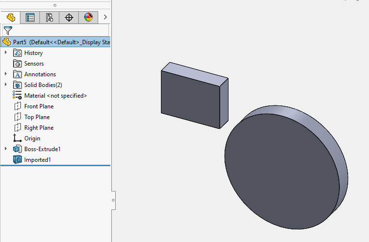

这个VBA宏演示了如何将带有实体的外部文件（例如parasolid、step、iges等）直接导入到活动零件文档中。

在**INPUT_FILE**常量中更改导入文件的路径。

此宏仅支持作为零件文档导入的外部文件。

~~~ vb
Const INPUT_FILE As String = "D:\Model.x_t"

Dim swApp As SldWorks.SldWorks

Sub main()

    Set swApp = Application.SldWorks
    
try_:
    
    On Error GoTo catch_
    
    Dim swModel As SldWorks.ModelDoc2
    
    Set swModel = swApp.ActiveDoc
    
    swApp.DocumentVisible False, swDocumentTypes_e.swDocPART

    Dim swImpPart As SldWorks.PartDoc
    
    Dim errs As Long
    Set swImpPart = swApp.LoadFile4(INPUT_FILE, "", Nothing, errs)
    
    Dim vBodies As Variant
    vBodies = swImpPart.GetBodies2(swBodyType_e.swAllBodies, True)
    
    Dim i As Integer
    
    For i = 0 To UBound(vBodies)
        
        Dim swBody As SldWorks.Body2
        Set swBody = vBodies(i)
        Set swBody = swBody.Copy
        
        Dim swBodyFeat As SldWorks.Feature
        Set swFeat = swModel.CreateFeatureFromBody3(swBody, False, swCreateFeatureBodyOpts_e.swCreateFeatureBodySimplify)
        
        If swFeat Is Nothing Then
            Err.Raise vbError, "", "无法从实体创建特征"
        End If
        
    Next
    
    swApp.CloseDoc swImpPart.GetTitle
    
    GoTo finally_
    
catch_:
    Debug.Print "错误：" & Err.Number & "：" & Err.Source & "：" & Err.Description
    GoTo finally_
    
finally_:

    swApp.DocumentVisible True, swDocumentTypes_e.swDocPART
    
End Sub
~~~