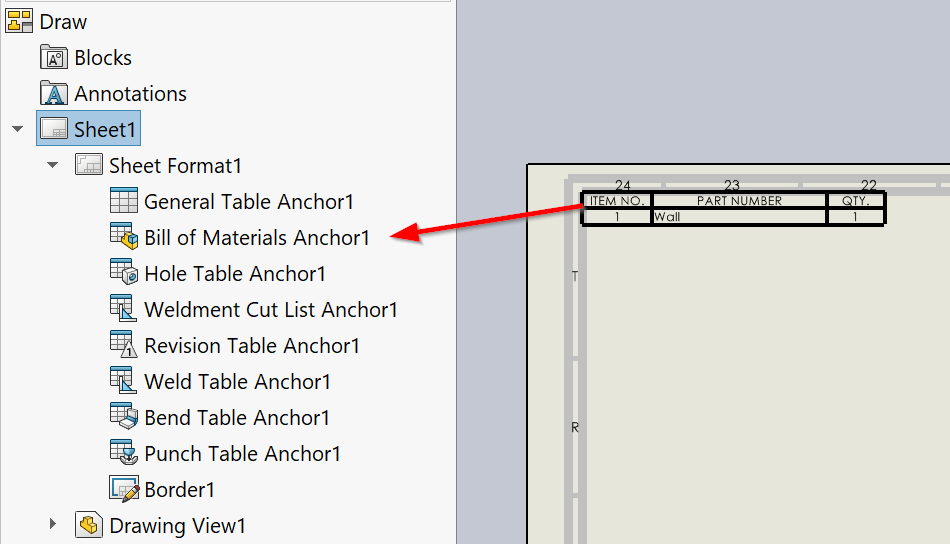

 SOLIDWORKS VBA macro to insert Bill Of Materials (BOM) table into active or all sheets with the specified parameters and attach to the anchor point
image: bom-table-anchor.png
---
{ width=600 }

This VBA macro inserts Bill Of Materials (BOM) table into all or active sheet of the active SOLIDWORKS drawing. First drawing view of the sheet is used as the source

BOM table is attached to the BOM anchor point

Modify the constants in the macro to configure the BOM table options

~~~ vb
Const ANCHOR_TYPE As Integer = swBOMConfigurationAnchorType_e.swBOMConfigurationAnchor_TopLeft 'anchor type: swBOMConfigurationAnchor_BottomLeft, swBOMConfigurationAnchor_BottomRight, swBOMConfigurationAnchor_TopLeft, swBOMConfigurationAnchor_TopRight
Const BOM_TYPE As Integer = swBomType_e.swBomType_PartsOnly 'bom type: swBomType_Indented, swBomType_PartsOnly, swBomType_TopLevelOnly
Const TABLE_TEMPLATE As String = "" 'full path to BOM template *.sldbomtbt or empty string for the default template
Const INDENTED_NUMBERING_TYPE As Integer = swNumberingType_e.swNumberingType_Flat 'numbering type (if BOM_TYPE is swBomType_Indented): swIndentedBOMNotSet, swNumberingType_Detailed, swNumberingType_Flat, swNumberingType_None
Const DETAILED_CUT_LIST As Boolean = False 'detailed cut-list (if BOM_TYPE is swBomType_Indented)
Const FOLLOW_ASSEMBLY_ORDER As Boolean = True 'true to check the Follow Assembly Order option

Const ALL_SHEETS As Boolean = True 'True to process all sheets, False to process active sheet only
~~~

~~~ vb
Const ANCHOR_TYPE As Integer = swBOMConfigurationAnchorType_e.swBOMConfigurationAnchor_TopLeft
Const BOM_TYPE As Integer = swBomType_e.swBomType_PartsOnly
Const TABLE_TEMPLATE As String = ""
Const INDENTED_NUMBERING_TYPE As Integer = swNumberingType_e.swNumberingType_Flat
Const DETAILED_CUT_LIST As Boolean = False
Const FOLLOW_ASSEMBLY_ORDER As Boolean = True

Const ALL_SHEETS As Boolean = True

Dim swApp As SldWorks.SldWorks

Sub main()

    Set swApp = Application.SldWorks
    
    Dim swDraw As SldWorks.DrawingDoc
    
    Set swDraw = swApp.ActiveDoc
    
    If ALL_SHEETS Then
    
        Dim vSheetNames As Variant
        vSheetNames = swDraw.GetSheetNames
        
        Dim activeSheetName As String
        activeSheetName = swDraw.GetCurrentSheet().GetName
        
        Dim i As Integer
        
        For i = 0 To UBound(vSheetNames)
            Dim swSheet As SldWorks.sheet
            Set swSheet = swDraw.sheet(CStr(vSheetNames(i)))
            InsertBomTable swDraw, swSheet
        Next
        
        swDraw.ActivateSheet activeSheetName
        
    Else
        InsertBomTable swDraw, swDraw.GetCurrentSheet
    End If
    
End Sub

Sub InsertBomTable(draw As SldWorks.DrawingDoc, sheet As SldWorks.sheet)
    
    If False = draw.ActivateSheet(sheet.GetName()) Then
        Err.Raise vbError, "", "Failed to activate sheet " & sheet.GetName
    End If
    
    Dim vViews As Variant
    vViews = sheet.GetViews
    
    Dim swView As SldWorks.View
    
    Set swView = vViews(0)
    
    Dim swBomTableAnn As SldWorks.BomTableAnnotation
    
    Set swBomTableAnn = swView.InsertBomTable4(True, 0, 0, ANCHOR_TYPE, BOM_TYPE, "", TABLE_TEMPLATE, False, INDENTED_NUMBERING_TYPE, DETAILED_CUT_LIST)
        
    If Not swBomTableAnn Is Nothing Then
        swBomTableAnn.BomFeature.FollowAssemblyOrder2 = FOLLOW_ASSEMBLY_ORDER
    Else
        Err.Raise vbError, "", "Failed to insert BOM table into " & swView.Name
    End If
    
End Sub
~~~

