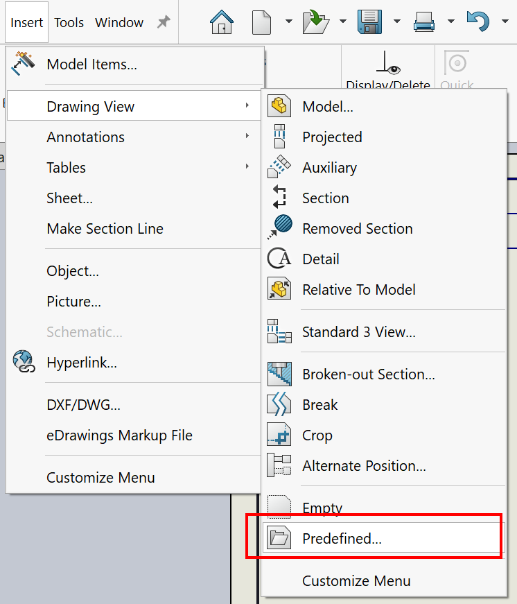

 VBA macro allows to insert SOLIDWORKS model into all or selected predefined views of the active drawing document
image: predefined-views.png
---
{ width = 400 }

This VBA macro allows to insert SOLIDWORKS part or assembly into the predefined views of the active drawing or drawing template

Select the predefined drawing views to insert model to. If no views are selected, all predefined views will be filled.

Macro will show the file browse dialog to select model to insert.

~~~ vb
Dim swApp As SldWorks.SldWorks

Sub main()

    Set swApp = Application.SldWorks
    
    Dim swDraw As SldWorks.DrawingDoc
    
    Set swDraw = swApp.ActiveDoc
        
    Dim filePath As String
    filePath = swApp.GetOpenFileName("Select model to insert into a predefined views", "", _
        "SOLIDWORKS Model Files (*.sldprt; *.sldasm)|*.sldprt;*.sldasm|All Files (*.*)|*.*|", 0, "", "")
    
    If filePath <> "" Then
    
        If False = swDraw.InsertModelInPredefinedView(filePath) Then
            Err.Raise vbError, "", "Failed to insert model into predefined views"
        End If
    
    End If
    
End Sub
~~~

