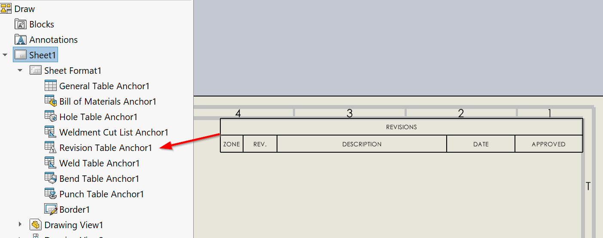

{ width=600 }

这个VBA宏将修订表插入到活动的SOLIDWORKS图纸的所有或活动工作表中。

修订表附加到修订锚点。

修改宏中的常量以配置修订表选项。

~~~ vb
Const ANCHOR_TYPE As Integer = swBOMConfigurationAnchorType_e.swBOMConfigurationAnchor_TopLeft '锚点类型：swBOMConfigurationAnchor_BottomLeft、swBOMConfigurationAnchor_BottomRight、swBOMConfigurationAnchor_TopLeft、swBOMConfigurationAnchor_TopRight
Const TABLE_TEMPLATE As String = "" '修订模板*.sldrevtbt的完整路径，或空字符串使用默认模板
Const SHAPE As Integer = swRevisionTableSymbolShape_e.swRevisionTable_CircleSymbol '符号形状：swRevisionTable_CircleSymbol、swRevisionTable_HexagonSymbol、swRevisionTable_SquareSymbol、swRevisionTable_TriangleSymbol
Const AUTO_UPDATE_ZONE_CELLS As Boolean = True 'True表示自动更新区域单元格

Const ALL_SHEETS As Boolean = True 'True表示处理所有工作表，False表示仅处理活动工作表
~~~

~~~ vb
Const ANCHOR_TYPE As Integer = swBOMConfigurationAnchorType_e.swBOMConfigurationAnchor_TopRight
Const TABLE_TEMPLATE As String = ""
Const SHAPE As Integer = swRevisionTableSymbolShape_e.swRevisionTable_CircleSymbol
Const AUTO_UPDATE_ZONE_CELLS As Boolean = True

Const ALL_SHEETS As Boolean = True

Dim swApp As SldWorks.SldWorks

Sub main()

    Set swApp = Application.SldWorks
    
    Dim swDraw As SldWorks.DrawingDoc
    
    Set swDraw = swApp.ActiveDoc
    
    If ALL_SHEETS Then
    
        Dim vSheetNames As Variant
        vSheetNames = swDraw.GetSheetNames
        
        Dim activeSheetName As String
        activeSheetName = swDraw.GetCurrentSheet().GetName
        
        Dim i As Integer
        
        For i = 0 To UBound(vSheetNames)
            Dim swSheet As SldWorks.sheet
            Set swSheet = swDraw.sheet(CStr(vSheetNames(i)))
            InsertRevisionTable swDraw, swSheet
        Next
        
        swDraw.ActivateSheet activeSheetName
        
    Else
        InsertRevisionTable swDraw, swDraw.GetCurrentSheet
    End If
    
End Sub

Sub InsertRevisionTable(draw As SldWorks.DrawingDoc, sheet As SldWorks.sheet)
    
    If False = draw.ActivateSheet(sheet.GetName()) Then
        Err.Raise vbError, "", "激活工作表" & sheet.GetName & "失败"
    End If
    
    Dim swRevTableAnn As SldWorks.RevisionTableAnnotation
    
    Set swRevTableAnn = sheet.InsertRevisionTable2(True, 0, 0, ANCHOR_TYPE, TABLE_TEMPLATE, SHAPE, AUTO_UPDATE_ZONE_CELLS)
    
    If swRevTableAnn Is Nothing Then
        Err.Raise vbError, "", "在" & sheet.GetName & "中插入修订表失败"
    End If
    
End Sub
~~~