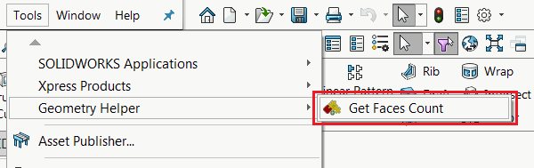

This articles provides detailed step-by-step instructions of how to call the functions of the SOLIDWORKS add-in from stand-alone applications or scripts via Running Object Table (ROT). This could be considered as enabling the Application Programming Interface (API) in the add-in itself.

This approach allows to connect to API Object by extracting it from the Running Object Table (ROT) by process id. One of the main benefits of this approach is an ability to control add-in API without directly using any SOLIDWORKS API commands or even adding SOLIDWORKS type libraries or interops.

In this example SOLIDWORKS add-in allows to count faces of the selected body. It provides a menu for user to click.

{ width=350 }

The result is displayed in the message box.

{ width=450 }

Add-in also provides an API object for 3rd parties to call. API extends the functionality of the UI and allows to pass the parameter to filter the minimum area of the faces.

Both API method and User Interface command handler are calling the same function.

This is a solution tree of the add-in and API object. The GeometryHelperApiObject compiles to dll and contains the definitions of add-in interfaces. It doesn't contain any implementation and is not referencing any SOLIDWORKS interops. This dll is referenced in the SOLIDWORKS add-in project which implements the API object and will be also referenced by all third party applications to access the API. So none of the third party applications need to reference the main add-in dll which enables the level of abstractions.

{ width=450 }

Explore the source code and explanation below for more details of how to implement this framework.

## GeometryHelperApiObject Project

This project contains the definitions (signatures) of API methods and interfaces which should be exposed by the add-in.

### GeometryHelperApiObjectFactory.cs

This is a helper COM object which will simplify the access to the instance of the add-in API object. It is responsible for retrieving the instance of API object from the process by its ID.

~~~ cs
using System;
using System.Linq;
using System.Runtime.InteropServices;
using System.Runtime.InteropServices.ComTypes;

namespace CodeStack.GeometryHelper
{
    [ComVisible(true)]
    public interface IGeometryHelperApiObjectFactory
    {
        string GetName(int prcId);
        IGeometryHelperApiObject GetInstance(int prcId);
    }

    [ComVisible(true)]
    [ProgId("GeometryHelper.ApiObjectFactory")]
    public class GeometryHelperApiObjectFactory : IGeometryHelperApiObjectFactory
    {
        [DllImport("ole32.dll")]
        private static extern int CreateBindCtx(uint reserved, out IBindCtx ppbc);

        public string GetName(int prcId)
        {
            return $"GeometryHelperApiObjectFactory_PID_{prcId}";
        }

        public IGeometryHelperApiObject GetInstance(int prcId)
        {
            return FindObjectByMonikerName<IGeometryHelperApiObject>($"!{GetName(prcId)}");
        }

        private T FindObjectByMonikerName<T>(string monikerName)
            where T : class
        {
            IBindCtx context = null;
            IRunningObjectTable rot = null;
            IEnumMoniker monikers = null;

            try
            {
                CreateBindCtx(0, out context);

                context.GetRunningObjectTable(out rot);

                rot.EnumRunning(out monikers);

                var moniker = new IMoniker[1];

                while (monikers.Next(1, moniker, IntPtr.Zero) == 0)
                {
                    var curMoniker = moniker.First();

                    string name = null;

                    if (curMoniker != null)
                    {
                        try
                        {
                            curMoniker.GetDisplayName(context, null, out name);
                        }
                        catch (UnauthorizedAccessException)
                        {
                        }
                    }

                    if (string.Equals(monikerName,
                        name, StringComparison.CurrentCultureIgnoreCase))
                    {
                        object app;
                        rot.GetObject(curMoniker, out app);
                        return (T)app;
                    }
                }
            }
            finally
            {
                if (monikers != null)
                {
                    Marshal.ReleaseComObject(monikers);
                }

                if (rot != null)
                {
                    Marshal.ReleaseComObject(rot);
                }

                if (context != null)
                {
                    Marshal.ReleaseComObject(context);
                }
            }

            return null;
        }
    }
}

~~~

### IGeometryHelperApiObject.cs

This is an interface of the API exposed to 3rd party applications. In this example the function will return the number of faces based on the area filter.

~~~ cs
using System.Runtime.InteropServices;

namespace CodeStack.GeometryHelper
{
    [ComVisible(true)]
    public interface IGeometryHelperApiObject
    {
        int GetFacesCount(double minArea);
    }
}

~~~

## GeometryHelperAddIn Project

This project is a SOLIDWORKS add-in. In this example it is developed using the [SwEx.AddIn Framework](/docs/codestack/labs/solidworks/swex/add-in/), but any other frameworks or SDK would be supported.

### GeometryHelperService.cs

Helper class within add-in which is invoking SOLIDWORKS API for calculating the number of faces from the selected body based on the minimum area.

~~~ cs
using SolidWorks.Interop.sldworks;
using System;
using System.Linq;

namespace CodeStack.GeometryHelper
{
    internal class GeometryHelperService
    {
        private readonly ISldWorks m_App;

        internal GeometryHelperService(ISldWorks app)
        {
            m_App = app;
        }

        internal int GetFacesCountFromSelectedBody(double minArea)
        {
            var model = m_App.IActiveDoc2;

            if (model != null)
            {
                var body = model.ISelectionManager.GetSelectedObject6(1, -1) as IBody2;

                if (body != null)
                {
                    var faces = body.GetFaces() as object[];

                    if (faces != null)
                    {
                        return faces.Count(f => (f as IFace2).GetArea() >= minArea);
                    }
                    else
                    {
                        throw new NullReferenceException("No faces in the body");
                    }
                }
                else
                {
                    throw new NullReferenceException("Body is not selected");
                }
            }
            else
            {
                throw new NullReferenceException("Model is not opened");
            }
        }
    }
}

~~~

Add-in must implement the functionality of API object. There are 2 general approaches for this.

* By directly implementing the functionality in the inherited class as shown below

### GeometryHelperApiObject.cs

API object implementation is using the SOLIDWORKS API directly within its class to handle the request and provide response to API call.

~~~ cs
using System.Runtime.InteropServices;

namespace CodeStack.GeometryHelper
{
    [ComVisible(true)]
    public class GeometryHelperApiObject : IGeometryHelperApiObject
    {
        private readonly GeometryHelperService m_GeomSvc;

        internal GeometryHelperApiObject(GeometryHelperService geomSvc)
        {
            m_GeomSvc = geomSvc;
        }

        public int GetFacesCount(double minArea)
        {
            return m_GeomSvc.GetFacesCountFromSelectedBody(minArea);
        }
    }
}

~~~

### MainAddIn.cs

This is the implementation of main SOLIDWORKS add-in class. The service to handle the functionality is passed directly to API object implementation and called from there to handle the API call.

~~~ cs
using CodeStack.SwEx.AddIn;
using CodeStack.SwEx.AddIn.Attributes;
using SolidWorks.Interop.swconst;
using System;
using System.Runtime.InteropServices;

namespace CodeStack.GeometryHelper
{
    [AutoRegister("GeometryHelperSwAddIn")]
    [ComVisible(true), Guid("2ACE1951-6182-496C-A643-B5FA6CFDFFD8")]
    public class MainAddIn : SwAddInEx
    {
        private IGeometryHelperApiObject m_ApiObject;
        private GeometryHelperService m_GeometryService;

        [SwEx.Common.Attributes.Title("Geometry Helper")]
        public enum Commands_e
        {
            [SwEx.Common.Attributes.Title("Get Faces Count")]
            GetFacesCount
        }

        public override bool OnConnect()
        {
            m_GeometryService = new GeometryHelperService(App);

            m_ApiObject = new GeometryHelperApiObject(m_GeometryService);

            RotHelper.Register(m_ApiObject, new GeometryHelperApiObjectFactory().GetName(App.GetProcessID()));

            this.AddCommandGroup<Commands_e>(OnButtonClick);

            return true;
        }

        private void OnButtonClick(Commands_e cmd)
        {
            switch (cmd)
            {
                case Commands_e.GetFacesCount:
                    try
                    {
                        var count = GetFacesCount(0);
                        App.SendMsgToUser2($"Selected body contains: {count} face(s)",
                            (int)swMessageBoxIcon_e.swMbInformation,
                            (int)swMessageBoxBtn_e.swMbOk);
                    }
                    catch(Exception ex)
                    {
                        App.SendMsgToUser2(ex.Message,
                            (int)swMessageBoxIcon_e.swMbStop,
                            (int)swMessageBoxBtn_e.swMbOk);
                    }
                    break;
            }
        }

        private int GetFacesCount(double minArea)
        {
            return m_GeometryService.GetFacesCountFromSelectedBody(minArea);
        }
    }
}

~~~

* By implementing the proxy API object. This approach may be considered more beneficial and secure as it doesn't expose any internal objects in its structure. All of the requests are handled outside of the proxy class.

### GeometryHelperApiObjectProxy.cs

Proxy object doesn't contain any references to any objects of the add-in. Instead it will generate the request event, handled and processed by the add-in.

~~~ cs
using System;
using System.Runtime.InteropServices;

namespace CodeStack.GeometryHelper
{
    [ComVisible(true)]
    public class GeometryHelperApiObjectProxy : IGeometryHelperApiObject
    {
        internal event Func<double, int> GetFacesCountRequested;

        public int GetFacesCount(double minArea)
        {
            if (GetFacesCountRequested != null)
            {
                return GetFacesCountRequested.Invoke(minArea);
            }
            else
            {
                throw new Exception("API object not connected");
            }
        }
    }
}

~~~

### MainAddIn.cs with proxy API object

Handling of the event in the add-in and providing results.

~~~ cs
public override bool OnConnect()
{
	m_GeometryService = new GeometryHelperService(App);

	var proxy = new GeometryHelperApiObjectProxy();
	proxy.GetFacesCountRequested += OnGetFacesCountRequested;
	m_ApiObject = proxy;
	
	RotHelper.Register(m_ApiObject, new GeometryHelperApiObjectFactory().GetName(App.GetProcessID()));

	this.AddCommandGroup<Commands_e>(OnButtonClick);

	return true;
}

private int OnGetFacesCountRequested(double minArea)
{
	return GetFacesCount(minArea);
}

~~~

### RotHelper.cs

In order for the API object to be available it is required to register it in the Running Objects Table (ROT). This helper class allows to register the object by name.

~~~ cs
using System.Runtime.InteropServices;
using System.Runtime.InteropServices.ComTypes;

namespace CodeStack.GeometryHelper
{
    public static class RotHelper
    {   
        [DllImport("ole32.dll", ExactSpelling = true, PreserveSig = false)]
        private static extern IRunningObjectTable GetRunningObjectTable(
            int reserved);

        [DllImport("ole32.dll", CharSet = CharSet.Unicode,
             ExactSpelling = true, PreserveSig = false)]
        private static extern IMoniker CreateItemMoniker(
            [In] string lpszDelim, [In] string lpszItem);

        public static void Register(object obj, string name)
        {
            IRunningObjectTable rot = null;
            IMoniker moniker = null;

            try
            {
                rot = GetRunningObjectTable(0);

                moniker = CreateItemMoniker("!", name);

                const int ROTFLAGS_REGISTRATIONKEEPSALIVE = 1;
                var cookie = rot.Register(ROTFLAGS_REGISTRATIONKEEPSALIVE, obj, moniker);
            }
            finally
            {
                if (moniker != null)
                {
                    Marshal.ReleaseComObject(moniker);
                }
                if (rot != null)
                {
                    Marshal.ReleaseComObject(rot);
                }
            }
        }
    }
}

~~~

## Calling the API from stand-alone applications

Now the add-in API can be called form any COM-compatible programming language.

### VBA Macro

Example of calling the API from the Excel VBA macro.

{ width=450 }

Add the reference to Type Library to enable [early binding](/docs/codestack/visual-basic/variables/declaration#early-binding-and-late-binding) for the calls.

{ width=450 }

Macro creates and instance of Factory object by its prog id and retrieves the instance of the API object by process id.

~~~ vb
Function GetFacesCount() As Integer
    
    Dim geomObjFactory As Object
    Set geomObjFactory = CreateObject("GeometryHelper.ApiObjectFactory")
    Dim geomHelper As Object
    
    Set geomHelper = geomObjFactory.GetInstance(13004)
    GetFacesCount = geomHelper.GetFacesCount(0)
    
End Function
~~~

### C# Console Application

Example of calling the API from the C# Console application.

As shown below it is only required to add the reference to the API Object dll which contain the definitions of interfaces. There is no need to add any other references (including add-in dll or any SOLIDWORKS interops)

{ width=450 }

The result of the API call is printed into the console window.

{ width=450 }

~~~ cs
using CodeStack.GeometryHelper;
using System;
using System.Diagnostics;
using System.Linq;

namespace StandAlone
{
    class Program
    {
        static void Main(string[] args)
        {
            try
            {
                var minArea = double.Parse(args[0]);

                var swPrcId = Process.GetProcessesByName("SLDWORKS").First().Id;

                var geomHelperFactory = new GeometryHelperApiObjectFactory();

                var geomHelperApi = geomHelperFactory.GetInstance(swPrcId);

                var count = geomHelperApi.GetFacesCount(minArea);

                Console.WriteLine($"Selected body contains {count} faces of area more or equal to {minArea}");
            }
            catch(Exception ex)
            {
                Console.ForegroundColor = ConsoleColor.Red;
                Console.Write(ex.Message);
                Console.ResetColor();
            }
        }
    }
}

~~~

> The most common reason of object cannot be retrieved from the Running Object Table (i.e. null is returned) is difference in accounts levels running SOLIDWORKS and the stand-alone application. For example SOLIDWORKS is run as administrator while the stand-alone is not or vice-versa. This is a Windows limitation and it is required to run both applications on the same permissions level to enable the communication.

Download the source code at [GitHub](https://github.com/codestackdev/solidworks-api-examples/tree/master/swex/add-in/geometry-helper-api-rot)
