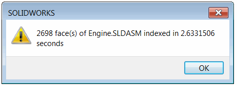

独立自动化 COM 基于应用程序自动化（包括 SOLIDWORKS）的主要限制之一是性能。

当需要从外部进程应用程序调用数百个 API 调用时，性能可能会下降数百甚至数千倍，与进程内调用相比。

在以下任何一种方法中调用插件 API 时，都会出现完全相同的限制：[通过插件对象](/docs/codestack/solidworks-api/getting-started/inter-process-communication/invoke-add-in-functions/via-add-in-object/)，[通过运行对象表](/docs/codestack/solidworks-api/getting-started/inter-process-communication/invoke-add-in-functions/via-rot/)等。

可以错误地认为插件内部的所有 SOLIDWORKS API 调用都是以进程内调用的，因为只有一个 API 函数从独立应用程序中调用。但实际上，SOLIDWORKS 插件中的所有 SOLIDWORKS API 调用都是作为外部进程调用的。这意味着调用插件 API 将导致与调用独立应用程序相同的性能损失。

然而，有一种方法可以最大化性能并通过从外部进程应用程序调用此方法获得与进程内调用相同的结果。

以下插件示例实现了一个函数来索引活动装配文档的所有面。

插件使用 [SwEx.AddIn Framework](/docs/codestack/labs/solidworks/swex/add-in/) 开发，但相同的技术也适用于使用不同方法构建的插件。

它遍历所有组件、所有实体和所有面，并在跟踪窗口中输出有关面的一些信息。

插件具有一个菜单命令，允许在进程内调用其函数。

{ width=350 }

完成后，将显示带有结果的消息框。

{ width=300 }

## FaceIndexer 插件
这是一个实现 SOLIDWORKS 插件和 API 对象接口的主要项目。

### FaceIndexerAddIn.cs

插件类

~~~ cs
using CodeStack.SwEx.AddIn;
using CodeStack.SwEx.AddIn.Attributes;
using SolidWorks.Interop.sldworks;
using SolidWorks.Interop.swconst;
using System;
using System.Collections.Generic;
using System.Diagnostics;
using System.Runtime.InteropServices;

namespace CodeStack.FaceIndexer
{
    [AutoRegister("FaceIndexer")]
    [ComVisible(true)]
    [Guid("D85E0EEB-87AA-48BE-8C8A-DFD71CF12525")]
    [ProgId("CodeStack.FaceIndexer")]
    public class FaceIndexerAddIn : SwAddInEx, IFaceIndexerAddIn
    {
        private readonly List<KeyValuePair<IAssemblyDoc, IFaceIndexerCallback>> m_ProcessingQueue
            = new List<KeyValuePair<IAssemblyDoc, IFaceIndexerCallback>>();

        [SwEx.Common.Attributes.Title("Face Indexer")]
        public enum Commands_e
        {
            [CommandItemInfo(SwEx.AddIn.Enums.swWorkspaceTypes_e.Assembly)]
            IndexFaces
        }
        
        public override bool OnConnect()
        {
            AddCommandGroup<Commands_e>(OnButtonClick);
            (App as SldWorks).OnIdleNotify += OnIdleNotify;
            return true;
        }

        public void BeginIndexFaces(IAssemblyDoc assm, IFaceIndexerCallback callback)
        {
            m_ProcessingQueue.Add(new KeyValuePair<IAssemblyDoc, IFaceIndexerCallback>(assm, callback));
        }

        private void OnButtonClick(Commands_e cmd)
        {
            switch (cmd)
            {
                case Commands_e.IndexFaces:        
                    IndexFaces(App.IActiveDoc2 as IAssemblyDoc);
                    break;
            }
        }

        public int IndexFaces(IAssemblyDoc assm)
        {
            var count = 0;

            var start = DateTime.Now;
            {
                var comps = assm.GetComponents(false) as object[];

                if (comps != null)
                {
                    foreach (IComponent2 comp in comps)
                    {
                        object bodyInfo;
                        var bodies = comp.GetBodies3((int)swBodyType_e.swAllBodies, out bodyInfo) as object[];

                        if (bodies != null)
                        {
                            foreach (IBody2 body in bodies)
                            {
                                var faces = body.GetFaces() as object[];

                                if (faces != null)
                                {
                                    foreach (IFace2 face in faces)
                                    {
                                        var surf = face.IGetSurface();
                                        var type = (swSurfaceTypes_e)surf.Identity();
                                        count++;

                                        Trace.WriteLine($"Area: {face.GetArea()}. Type: {type}");
                                    }
                                }
                            }
                        }
                    }
                }
            }
            App.SendMsgToUser($"{count} face(s) of {(assm as IModelDoc2).GetTitle()} indexed in {DateTime.Now.Subtract(start).TotalSeconds} seconds");

            return count;
        }

        private int OnIdleNotify()
        {
            const int S_OK = 0;

            foreach (var assmInQueue in m_ProcessingQueue)
            {
                var count = IndexFaces(assmInQueue.Key);

                assmInQueue.Value?.IndexFacesCompleted(assmInQueue.Key, count);
            }

            m_ProcessingQueue.Clear();

            return S_OK;
        }
    }
}

~~~

### FaceIndexerAddInApi.cs

API 对象定义。

~~~ cs
using SolidWorks.Interop.sldworks;
using System.Runtime.InteropServices;

namespace CodeStack.FaceIndexer
{
    [ComVisible(true)]
    public interface IFaceIndexerCallback
    {
        void IndexFacesCompleted(IAssemblyDoc assm, int count);
    }

    [ComVisible(true)]
    public interface IFaceIndexerAddIn
    {
        void BeginIndexFaces(IAssemblyDoc assm, IFaceIndexerCallback callback);
        int IndexFaces(IAssemblyDoc assm);
    }
}

~~~

此插件向第三方公开 API。*IndexFaces* 方法是一个外部进程 API 调用，可以使用以下代码片段：

~~~ cs
var count = addIn.IndexFaces(assm);
Console.WriteLine($"已索引 {count} 个面");
~~~

结果性能几乎下降了一百倍：

{ width=300 }

使用 [ISldWorks::CommandInProgress](https://help.solidworks.com/2016/English/api/sldworksapi/SolidWorks.Interop.sldworks~SolidWorks.Interop.sldworks.ISldWorks~CommandInProgress.html) SOLIDWORKS API 属性可以稍微改善性能，但与基准结果相比，性能仍然下降了超过 10 倍。

~~~ cs
app.CommandInProgress = true;
var count = addIn.IndexFaces(assm);
app.CommandInProgress = false;
Console.WriteLine($"已索引 {count} 个面");
~~~

下表是结果的比较表。结果可能会因装配的大小和使用的 API 调用而有所不同。

| 环境                           | 结果（秒） | 比率（%） |
|---------------------------------|-----------------|----------|
| 插件进程内调用               | 2.63            | 1        |
| 独立应用程序                     | 241.95          | 92       |
| 独立应用程序命令进行中 | 36.14           | 13.74    |
| VBA 宏                       | 2.57            | 0.98     |
| VBA 宏进程内调用   | 2.20            | 0.84     |
| 独立应用程序进程内调用 | 1.77            | 0.67     |

当从独立应用程序以进程内调用的方式调用插件 API 时，可以获得最佳性能。通过提供延迟调用来索引面，可以实现此功能。此调用将请求放入队列并立即返回控制权。然后在插件中处理请求。可以使用 [OnIdle](https://help.solidworks.com/2018/english/api/sldworksapi/solidworks.interop.sldworks~solidworks.interop.sldworks.dsldworksevents_onidlenotifyeventhandler.html) SOLIDWORKS API 通知来处理队列。由于此事件在进程内处理，实际的 API 调用也将在进程内处理。

还重要的是注册回调函数，插件可以调用该函数通知独立应用程序操作已完成。

以下是一个示例，展示了独立应用程序如何以进程内调用的方式调用插件 API。

## 独立应用程序

调用插件函数的 C# 应用程序。

### FaceIndexerCallback.cs

在进程内调用完成时通知独立应用程序的回调函数。这必须注册为 COM 对象。

~~~ cs
using CodeStack.FaceIndexer;
using SolidWorks.Interop.sldworks;
using System;
using System.Runtime.InteropServices;

namespace StandAlone
{
    [ComVisible(true)]
    public class FaceIndexerCallback : IFaceIndexerCallback
    {
        public void IndexFacesCompleted(IAssemblyDoc assm, int count)
        {
            Console.WriteLine($"已在独立应用程序中为 '{(assm as IModelDoc2).GetTitle()}' 完成索引，共 {count} 个面");
        }
    }
}

~~~

### Program.cs

调用进程内调用插件 API 并在回调函数中等待结果的控制台应用程序。

~~~ cs
using CodeStack.FaceIndexer;
using SolidWorks.Interop.sldworks;
using System;
using System.Diagnostics;
using System.Linq;
using System.Runtime.InteropServices;
using System.Runtime.InteropServices.ComTypes;

namespace StandAlone
{
    class Program
    {
        [DllImport("ole32.dll")]
        private static extern int CreateBindCtx(uint reserved, out IBindCtx ppbc);
        
        static void Main(string[] args)
        {
            var app = GetSwAppFromProcess(Process.GetProcessesByName("SLDWORKS").First().Id);

            var addIn = app.GetAddInObject("CodeStack.FaceIndexer") as IFaceIndexerAddIn;

            var assm = app.IActiveDoc2 as IAssemblyDoc;
            
            addIn.BeginIndexFaces(app.IActiveDoc2 as IAssemblyDoc, new FaceIndexerCallback());
            
            Console.ReadLine();
        }

        private static ISldWorks GetSwAppFromProcess(int processId)
        {
            var monikerName = "SolidWorks_PID_" + processId.ToString();

            IBindCtx context = null;
            IRunningObjectTable rot = null;
            IEnumMoniker monikers = null;

            try
            {
                CreateBindCtx(0, out context);

                context.GetRunningObjectTable(out rot);
                rot.EnumRunning(out monikers);

                var moniker = new IMoniker[1];

                while (monikers.Next(1, moniker, IntPtr.Zero) == 0)
                {
                    var curMoniker = moniker.First();

                    string name = null;

                    if (curMoniker != null)
                    {
                        try
                        {
                            curMoniker.GetDisplayName(context, null, out name);
                        }
                        catch (UnauthorizedAccessException)
                        {
                        }
                    }

                    if (string.Equals(monikerName,
                        name, StringComparison.CurrentCultureIgnoreCase))
                    {
                        object app;
                        rot.GetObject(curMoniker, out app);
                        return app as ISldWorks;
                    }
                }
            }
            finally
            {
                if (monikers != null)
                {
                    Marshal.ReleaseComObject(monikers);
                }

                if (rot != null)
                {
                    Marshal.ReleaseComObject(rot);
                }

                if (context != null)
                {
                    Marshal.ReleaseComObject(context);
                }
            }

            return null;
        }
    }
}

~~~

它也可以从宏或任何其他类型的应用程序中调用。

## VBA 宏

调用插件 API 的 VBA 宏。在此示例中，使用用户窗体使宏保持运行，直到调用回调函数。

{ width=250 }

### 宏模块

启动用户窗体的主模块

~~~ vb
Sub main()

    UserForm1.Show vbModeless
    
End Sub

~~~

### FaceIndexerCallback 类模块

接收完成通知的回调类的实现

~~~ vb
Implements IFaceIndexerCallback

Private Sub IFaceIndexerCallback_IndexFacesCompleted(ByVal assm As SldWorks.IAssemblyDoc, ByVal count As Long)
    Debug.Print "已完成 " & count & " 个面的索引"
End Sub
~~~

### Form1 窗体

连接到插件并调用其 API 的用户窗体

~~~ vb
Dim swFaceIndexer As IFaceIndexerAddIn

Private Sub UserForm_Initialize()
    
    Dim swApp As SldWorks.SldWorks
    
    Set swApp = Application.SldWorks
    Set swFaceIndexer = swApp.GetAddInObject("CodeStack.FaceIndexer")
    
    Dim swAssy As SldWorks.AssemblyDoc
    Set swAssy = swApp.ActiveDoc
    
    swFaceIndexer.BeginIndexFaces swAssy, New FaceIndexerCallback
    
End Sub
~~~

源代码可从 [GitHub](https://github.com/codestackdev/solidworks-api-examples/tree/master/swex/add-in/face-indexer) 下载