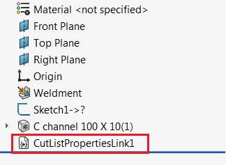

{ width=450 }

这个VBA宏使用SOLIDWORKS API将宏特征插入到零件文件中，允许将指定的切割清单自定义属性动态链接到文件的通用自定义属性。

{ width=250 }

当父级焊接特征（例如结构成员特征）发生更改时，宏特征会自动重建。再生方法处理后更新通知，从而可以读取切割清单自定义属性的最新值。

> 直接从swmRebuild函数中读取自定义属性将不会返回最新值，因为在再生时，尚未评估所有属性。

宏特征插入到特征树中，可以抑制或删除。

与直接使用表达式链接属性（例如`"LENGTH@@@Al I BEAM STD 4x3.28<1>@Part1.SLDPRT"`）相比，这种方法有几个优点：

* 链接不依赖于名称，即使切割清单重命名（例如当结构成员剖面发生更改时），属性仍然保持链接
* 宏将适用于旧版的钣金零件结构。使用表达式链接对于在旧版本的SOLIDWORKS中构建的钣金零件无效

{ width=250 }

## 指示

* 创建新的宏并复制下面的代码

~~~ vb
Const BASE_NAME As String = "CutListPropertiesLink"

Dim swPostGenList As PostRegenerateListener

Sub main()

    Dim swApp As SldWorks.SldWorks
    Set swApp = Application.SldWorks
    
    Dim swModel As SldWorks.ModelDoc2
    
    Set swModel = swApp.ActiveDoc
    
    If Not swModel Is Nothing Then
        
        If swModel.GetType() = swDocumentTypes_e.swDocPART Then
        
            Dim swWeldFeat As SldWorks.Feature
            Set swWeldFeat = TryGetSelectedFeatureAtIndex(swModel.SelectionManager, 1)
            
            Dim swCutListFeat As SldWorks.Feature
            
            If Not swWeldFeat Is Nothing Then
                Set swCutListFeat = GetCutListFromWeldmentFeature(swModel, swWeldFeat)
            End If
    
            If Not swCutListFeat Is Nothing Then
                
                Dim curMacroPath As String
                curMacroPath = swApp.GetCurrentMacroPathName
                
                Dim vMethods(8) As String
                Dim moduleName As String
                
                GetMacroEntryPoint swApp, curMacroPath, moduleName, ""
                
                vMethods(0) = curMacroPath: vMethods(1) = moduleName: vMethods(2) = "swmRebuild"
                vMethods(3) = curMacroPath: vMethods(4) = moduleName: vMethods(5) = "swmEditDefinition"
                vMethods(6) = curMacroPath: vMethods(7) = moduleName: vMethods(8) = "swmSecurity"
                
                Dim swFeat As SldWorks.Feature
                Set swFeat = swModel.FeatureManager.InsertMacroFeature3(BASE_NAME, "", vMethods, _
                    Empty, Empty, Empty, Empty, Empty, Empty, _
                    Empty, swMacroFeatureOptions_e.swMacroFeatureEmbedMacroFile)
                
                If swFeat Is Nothing Then
                    MsgBox "Failed to create cut-list proeprties linker"
                End If
            
            Else
                MsgBox "Select weldment feature (e.g. Structural Member)"
            End If
            
        Else
            MsgBox "Only part documents are supported"
        End If
        
    Else
        MsgBox "Please open model"
    End If
    
End Sub

Function TryGetSelectedFeatureAtIndex(selMgr As SldWorks.SelectionMgr, index As Integer) As SldWorks.Feature
    On Error Resume Next
    Set TryGetSelectedFeatureAtIndex = selMgr.GetSelectedObject6(index, -1)
End Function

Sub GetMacroEntryPoint(app As SldWorks.SldWorks, macroPath As String, ByRef moduleName As String, ByRef procName As String)
        
    Dim vMethods As Variant
    vMethods = app.GetMacroMethods(macroPath, swMacroMethods_e.swMethodsWithoutArguments)
    
    Dim i As Integer
    
    If Not IsEmpty(vMethods) Then
    
        For i = 0 To UBound(vMethods)
            Dim vData As Variant
            vData = Split(vMethods(i), ".")
            
            If i = 0 Or LCase(vData(1)) = "main" Then
                moduleName = vData(0)
                procName = vData(1)
            End If
        Next
        
    End If
    
End Sub

Function swmRebuild(varApp As Variant, varDoc As Variant, varFeat As Variant) As Variant

    Dim swApp As SldWorks.SldWorks
    Dim swModel As SldWorks.ModelDoc2
    Dim swFeat As SldWorks.Feature
    
    Set swApp = varApp
    Set swModel = varDoc
    Set swFeat = varFeat
    
    Dim swMacroFeat As SldWorks.MacroFeatureData
    Set swMacroFeat = swFeat.GetDefinition()
    
    Dim vObjects As Variant
    swMacroFeat.GetSelections3 vObjects, Empty, Empty, Empty, Empty
    
    Dim swWeldFeat As SldWorks.Feature
    Set swWeldFeat = vObjects(0)
    
    If swWeldFeat Is Nothing Then
        swmRebuild = "Linked weldment feature is missing"
        Exit Function
    End If
        
    Dim swCutListFeat As SldWorks.Feature
    Set swCutListFeat = GetCutListFromWeldmentFeature(swModel, swWeldFeat)
        
    If Not swCutListFeat Is Nothing Then
    
        If swPostGenList Is Nothing Then
            Set swPostGenList = New PostRegenerateListener
        End If
        
        swPostGenList.Init swApp, swModel, swCutListFeat
    
    Else
        swmRebuild = "Cannot get cut-list from the linked feature"
    End If
End Function

Function swmEditDefinition(varApp As Variant, varDoc As Variant, varFeat As Variant) As Variant
    swmEditDefinition = True
End Function

Function swmSecurity(varApp As Variant, varDoc As Variant, varFeat As Variant) As Variant
    swmSecurity = SwConst.swMacroFeatureSecurityOptions_e.swMacroFeatureSecurityByDefault
End Function

Function GetCutListFromWeldmentFeature(model As SldWorks.ModelDoc2, weldFeat As SldWorks.Feature) As SldWorks.Feature
    
    On Error Resume Next
    
    Dim swApp As SldWorks.SldWorks
    Set swApp = Application.SldWorks
    
    Dim swWeldFeatCutListBody As SldWorks.Body2
    Set swWeldFeatCutListBody = weldFeat.GetFaces()(0).GetBody
        
    Dim swFeat As SldWorks.Feature
    Dim swBodyFolder As SldWorks.BodyFolder
    
    Set swFeat = model.FirstFeature
    
    Do While Not swFeat Is Nothing
        
        If swFeat.GetTypeName2 = "CutListFolder" Then
            
            Set swBodyFolder = swFeat.GetSpecificFeature2
            
            Dim vBodies As Variant
            
            vBodies = swBodyFolder.GetBodies
            
            Dim i As Integer
            
            If Not IsEmpty(vBodies) Then
                For i = 0 To UBound(vBodies)
                    
                    Dim swCutListBody As SldWorks.Body2
                    Set swCutListBody = vBodies(i)
                    
                    If swApp.IsSame(swCutListBody, swWeldFeatCutListBody) = swObjectEquality.swObjectSame Then
                        Set GetCutListFromWeldmentFeature = swFeat
                        Exit Function
                    End If
                    
                Next
            End If
            
        End If
        
        Set swFeat = swFeat.GetNextFeature
        
    Loop

End Function
~~~

* 添加新的类模块到宏中，并将其命名为*PostRegenerateListener*。将下面的代码放入类模块中

~~~ vb
Dim WithEvents swApp As SldWorks.SldWorks

Dim swCutListFeat As SldWorks.Feature
Dim swModel As SldWorks.ModelDoc2
Dim LinkedProperties As Variant

Private Sub Class_Initialize()
    LinkedProperties = Array("DESCRIPTION", "LENGTH", "QUANTITY")
End Sub

Sub Init(app As SldWorks.SldWorks, model As SldWorks.ModelDoc2, cutListFeat As SldWorks.Feature)
    
    Set swApp = app
    
    Set swModel = model
    Set swCutListFeat = cutListFeat
    
End Sub

Private Function swApp_OnIdleNotify() As Long
    CopyProperties
    Set swApp = Nothing 'unsubscribe from the event
End Function

Sub CopyProperties()
    
    Dim i As Integer
    
    Dim swSrcPrpMgr As SldWorks.CustomPropertyManager
    Set swSrcPrpMgr = swCutListFeat.CustomPropertyManager
    
    Dim swDestPrpMgr As SldWorks.CustomPropertyManager
    Set swDestPrpMgr = swModel.Extension.CustomPropertyManager("")
    
    For i = 0 To UBound(LinkedProperties)
    
        Dim prpName As String
        prpName = CStr(LinkedProperties(i))
        
        Dim prpVal As String

        swSrcPrpMgr.Get2 prpName, "", prpVal
        
        swDestPrpMgr.Add2 prpName, swCustomInfoType_e.swCustomInfoText, prpVal
        swDestPrpMgr.Set prpName, prpVal
        
    Next
    
End Sub
~~~

* 在*PostRegenerateListener*的*Class_Initialize*函数中配置需要链接的属性

~~~ vb
Private Sub Class_Initialize()
    LinkedProperties = Array("DESCRIPTION", "LENGTH", "QUANTITY", "Another Property", "...")
End Sub
~~~

* 选择焊接特征（例如结构成员）并运行宏。宏特征被插入并嵌入到模型中。您可以关闭和重新打开模型和SOLIDWORKS会话 - 特征将自动重建。模型可以与其他用户共享，行为将被保留。