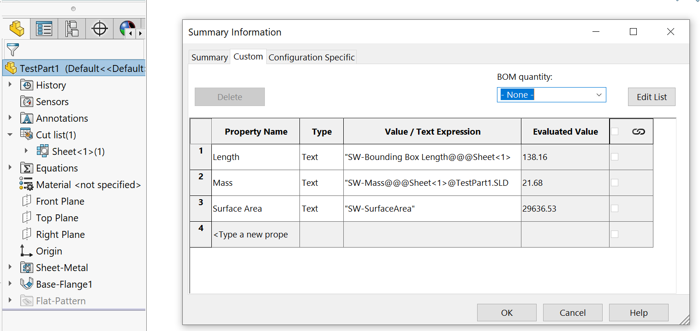

{ width=800 }

This VBA macro allows to link specified cut-list custom properties from sheet metal parts to the custom properties of the SOLIDWORKS file.

Custom properties will be linked by formula and will be automatically updated if the geometry of sheet metal is changed.

It is possible to specify a fallback value which will be written to custom property if the source part is not a sheet metal document.

In order to customize the properties map, add remove the map values within the **Init** function as shown below.

When specifying expressions in the last parameter (**fallback value**) it is required to escape the **"** (quote) with other **"** (quote). For example formula for SOLIDWORKS mass is **"SW-Mass"** if this needs to be set as the fallback value, the third parameter should be **"""SW-Mass"""** where the outer quotes are quotes indicating the [VBA string value](/docs/codestack/visual-basic/variables/standard-types#string)

~~~ vb
Sub Init(Optional dummy As Variant = Empty)
    
    Set Map = New Collection
    
    Map.Add CreateMapValue("Part Number", "", "") 'Add empty 'Part Number' custom property
    Map.Add CreateMapValue("Width", "Bounding Box Width", "") 'Add custom property 'Width' from the 'Bounding Box Width' of the sheet metal or empty if not sheet metal part
    Map.Add CreateMapValue("Material", "", """SW-Material""") 'Add custom property 'Material' and set to the 'SW-Material' formula regardless if this is a sheet metal part or not
        
End Sub
~~~

## Notes And Limitations

* Only single cut-list files are supported (error is thrown if more than one cut list is available)
* Macro will set **Create Cut List Automatically** and **Updated Automatically** options on the cut-list folders
* Only part documents are supported
* Cut-list custom properties are linked by expressions and cut-list name. If cut-list is renamed property will not be updated and it will be required to rerun the macro. However should the cut-list keep the original name all properties will be dynamically updated without the need to rerun the macro.

~~~ vb
Dim swApp As SldWorks.SldWorks

Dim Map As Collection

Sub Init(Optional dummy As Variant = Empty)
    
    Set Map = New Collection
    
    Map.Add CreateMapValue("Length", "Bounding Box Length", """D1@Boss-Extrude1""")
    Map.Add CreateMapValue("Mass", "Mass", """SW-Mass""")
    Map.Add CreateMapValue("Surface Area", "", """SW-SurfaceArea""")
        
End Sub

Function CreateMapValue(targetPrpName As String, srcCutListPrpName As String, Optional fallbackValue As String = "") As Variant
    
    CreateMapValue = Array(targetPrpName, srcCutListPrpName, fallbackValue)
    
End Function

Sub main()

    Set swApp = Application.SldWorks
    
    Dim swPart As SldWorks.ModelDoc2
    
    Set swPart = swApp.ActiveDoc
    
    If swPart Is Nothing Then
        Err.Raise vbError, "", "Open part document"
    End If
    
    If swPart.GetType() <> swDocumentTypes_e.swDocPART Then
        Err.Raise vbError, "", "Active document is not a part"
    End If
    
    Init
    
    Dim vCutLists As Variant
    vCutLists = GetCutLists(swPart)
    
    Dim swCutListCustomPrpMgr As SldWorks.CustomPropertyManager
    
    If Not IsEmpty(vCutLists) Then
        
        If UBound(vCutLists) > 0 Then
            Err.Raise vbError, "", "Only single cut list item is supported"
        End If
        
        Dim swCutList As SldWorks.Feature
        
        Set swCutList = vCutLists(0)
        
        Dim swCutListFolder As SldWorks.BodyFolder
        Set swCutListFolder = swCutList.GetSpecificFeature2
        
        Dim swBody As SldWorks.Body2
        Set swBody = swCutListFolder.GetBodies()(0)
        
        If False <> swBody.IsSheetMetal() Then
            Set swCutListCustomPrpMgr = swCutList.CustomPropertyManager
        End If
        
    End If
    
    Dim swTargetCustPrpMgr As SldWorks.CustomPropertyManager
    Set swTargetCustPrpMgr = swPart.Extension.CustomPropertyManager("")
    
    Dim i As Integer
    
    For i = 1 To Map.Count
    
        Dim targetPrpName As String
        Dim srcCutListPrpName As String
        Dim fallbackValue As String
        
        targetPrpName = CStr(Map.item(i)(0))
        srcCutListPrpName = CStr(Map.item(i)(1))
        fallbackValue = CStr(Map.item(i)(2))
        
        CopyProperty swCutListCustomPrpMgr, swTargetCustPrpMgr, targetPrpName, srcCutListPrpName, fallbackValue
    Next
    
End Sub

Function GetCutLists(model As SldWorks.ModelDoc2) As Variant

    Dim swFeat As SldWorks.Feature
    
    Dim swCutLists() As SldWorks.Feature
    
    Set swFeat = model.FirstFeature
    
    While Not swFeat Is Nothing
        
        If swFeat.GetTypeName2 <> "HistoryFolder" Then
        
            ProcessFeature swFeat, swCutLists
            
            TraverseSubFeatures swFeat, swCutLists
        
        End If
        
        Set swFeat = swFeat.GetNextFeature
        
    Wend
    
    If (Not swCutLists) = -1 Then
        GetCutLists = Empty
    Else
        GetCutLists = swCutLists
    End If
    
End Function

Sub TraverseSubFeatures(parentFeat As SldWorks.Feature, cutLists() As SldWorks.Feature)
    
    Dim swChildFeat As SldWorks.Feature
    Set swChildFeat = parentFeat.GetFirstSubFeature
    
    While Not swChildFeat Is Nothing
        ProcessFeature swChildFeat, cutLists
        Set swChildFeat = swChildFeat.GetNextSubFeature()
    Wend
    
End Sub

Sub ProcessFeature(feat As SldWorks.Feature, cutLists() As SldWorks.Feature)
    
    If feat.GetTypeName2() = "SolidBodyFolder" Then
        
        Dim swBodyFolder As SldWorks.BodyFolder
        Set swBodyFolder = feat.GetSpecificFeature2
        
        swBodyFolder.SetAutomaticCutList True
        swBodyFolder.SetAutomaticUpdate True
        swBodyFolder.UpdateCutList
        
    ElseIf feat.GetTypeName2() = "CutListFolder" Then
        
        If Not Contains(cutLists, feat) Then
            If (Not cutLists) = -1 Then
                ReDim cutLists(0)
            Else
                ReDim Preserve cutLists(UBound(cutLists) + 1)
            End If
            
            Set cutLists(UBound(cutLists)) = feat
        End If
        
    End If
    
End Sub

Function Contains(arr As Variant, item As Object) As Boolean
    
    Dim i As Integer
    
    For i = 0 To UBound(arr)
        If arr(i) Is item Then
            Contains = True
            Exit Function
        End If
    Next
    
    Contains = False
    
End Function

Sub CopyProperty(srcPrpMgr As SldWorks.CustomPropertyManager, targPrpMgr As SldWorks.CustomPropertyManager, targetPrpName As String, srcCutListPrpName As String, fallbackValue As String)

    Dim prpVal As String
    
    If Not srcPrpMgr Is Nothing And srcCutListPrpName <> "" Then
    
        Dim prpResVal As String
                    
        srcPrpMgr.Get5 srcCutListPrpName, False, prpVal, prpResVal, False
    Else
        prpVal = fallbackValue
    End If
    
    targPrpMgr.Add2 targetPrpName, swCustomInfoType_e.swCustomInfoText, prpVal
    targPrpMgr.Set targetPrpName, prpVal
    
End Sub
~~~

