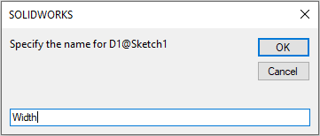
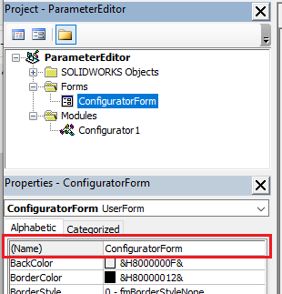

此VBA宏利用宏特征的功能为指定的尺寸创建自定义模型配置器。



宏将为指定的尺寸构建动态用户界面，并直接将**配置器**特征插入到特征管理器树中。

可以通过单击**编辑特征**命令随时修改设计。

还可以在装配上下文中编辑特征。

要插入该特征，请预先选择要配置的尺寸，然后运行宏。

对于每个选择的尺寸，请指定用户友好的标题（这将显示在表单上）：

插入后，编辑特征定义以更新模型。

配置器特征可以插入到零件或装配体中（包括插入到在装配上下文中编辑的组件中）。

尺寸将在活动配置或组件的引用配置中进行修改（如果在上下文中进行编辑）。

在将配置器特征添加到装配体时，可以修改任何子组件的尺寸。

## 配置

用户可以修改下面的常量以更改一些参数。

* **BASE_NAME** 常量定义配置器特征的默认名称
* **EMBED_MACRO_FEATURE** 允许将代码直接嵌入到模型中，因此不再与原始宏链接。可以与任何人共享此模型，并且无需提供原始宏即可进行编辑

~~~ vb
Public Const BASE_NAME As String = "MyConfigurator" '配置特征的默认名称

Const EMBED_MACRO_FEATURE As Boolean = True' 将宏特征嵌入到模型中
~~~

## 优势比较

下表演示了与其他流行的设计自动化方法和工具相比，此方法的优势。

> 注意，下表仅显示此宏与其他方法相比的优势。其他方法具有更多的优势和功能，此宏未涵盖这些优势，因此未包含在下表中

| 功能  | 此宏 | 方程式  | 设计表格  | DriveWorks |
|---|---|---|---|---|
| 设置简单  | &check;  | &check;  | &check;  | &cross;  |
| 输入方法简单  | &check;  | &cross;  | &cross;  | &check;  |
| 性能  | &check;  | &check;  | &cross;  | &cross;  |
| 按需编辑  | &check;  | &check;  | &check;  | &cross;  |
| 支持子组件  | &check;  | &cross;  | &cross;  | &check;  |
| 上下文编辑  | &check;  | &cross;  | &cross;  | N/A  |
| 可扩展性  | &check;  | &cross;  | &cross;  | &check;  |

### 设置简单

此标准定义了配置器可以快速创建的速度。DriveWorks需要特定的技能和规则引擎来创建配置器，而此宏只需要预先选择尺寸。

### 输入方法简单

此标准定义了根据配置器输入参数应用和更改尺寸的简易程度。此宏和DriveWorks都将使用自定义表单简化输入，而方程式和设计表格没有特定的输入表单，需要在其他方程式和定义列表中搜索特定的输入。

### 性能

此标准定义了执行性能（应用参数之前需要多长时间）。此宏直接将参数应用于尺寸，因此参数立即应用。设计表格需要加载Excel实例并打开文件以重新计算和应用值。DriveWorks将始终基于规格输入生成新模型。

### 按需编辑

此标准定义了是否可以更改现有设计的参数。DriveWorks会生成新模型，而不会修改现有模型。

### 支持子组件

此标准定义了是否可以修改子组件的参数。虽然可以为组件定义方程式，但这些方程式不是配置特定的，即不可能具有具有不同配置和不同方程式值的两个组件实例。

### 上下文编辑

此标准定义了是否可以使用装配的顶层装配上下文更改组件的配置。除此宏之外的所有方法都要求将目标组件在其自己的窗口中打开以进行编辑，而此宏允许上下文编辑。

### 可扩展性

此标准定义了超出开箱即用功能的扩展功能的可能性。方程式和设计表格是内置功能。DriveWorks提供API并可扩展。此宏是开源的，可以使用SOLIDWORKS API进行扩展。

## 宏设置

* 创建新宏并复制下面的代码：

~~~ vb
Public Const MARGIN As Integer = 10
Public Const MAX_FORM_HEIGHT = 200
Public Const TEXT_BOX_WIDTH As Integer = 50
Public Const BASE_NAME As String = "Configurator"

Const EMBED_MACRO_FEATURE As Boolean = False

Public ActiveModel As SldWorks.ModelDoc2
Public Model As SldWorks.ModelDoc2
Public FeatureName As String
Public DimensionNames As Variant
Public DimensionTitles As Variant
Public ConfigName As String

Sub main()

    Dim swApp As SldWorks.SldWorks
    Set swApp = Application.SldWorks
    
    Dim swModel As SldWorks.ModelDoc2
    
    Set swModel = swApp.ActiveDoc
    
    If Not swModel Is Nothing Then
        
        If Not TypeOf swModel Is PartDoc And Not TypeOf swModel Is AssemblyDoc Then
            Err.Raise vbError, "", "Only part and assembly documents are supported"
        End If
        
        Dim vParamNames As Variant
        Dim vParamTypes As Variant
        Dim vParamValues As Variant
        
        If Not CollectParameters(swModel, vParamNames, vParamTypes, vParamValues) Then
            Err.Raise vbError, "", "Please select dimensions to configure"
        End If
        
        Dim curMacroPath As String
        curMacroPath = swApp.GetCurrentMacroPathName
        
        Dim vMethods(8) As String
        Dim moduleName As String
        
        GetMacroEntryPoint swApp, curMacroPath, moduleName, ""
        
        vMethods(0) = curMacroPath: vMethods(1) = moduleName: vMethods(2) = "swmRebuild"
        vMethods(3) = curMacroPath: vMethods(4) = moduleName: vMethods(5) = "swmEditDefinition"
        vMethods(6) = curMacroPath: vMethods(7) = moduleName: vMethods(8) = "swmSecurity"
        
        Dim opts As swMacroFeatureOptions_e
        
        If EMBED_MACRO_FEATURE Then
            opts = swMacroFeatureOptions_e.swMacroFeatureEmbedMacroFile
        Else
            opts = swMacroFeatureOptions_e.swMacroFeatureByDefault
        End If
        
        Dim swFeat As SldWorks.Feature
        Set swFeat = swModel.FeatureManager.InsertMacroFeature3(BASE_NAME, "", vMethods, _
            vParamNames, vParamTypes, vParamValues, Empty, Empty, Empty, _
            Empty, opts)
        
        If swFeat Is Nothing Then
            Err.Raise vbError, "", "Failed to create box feature"
        End If
        
    Else
        MsgBox "Please open model"
    End If
    
End Sub

Function CollectParameters(Model As SldWorks.ModelDoc2, ByRef vParamNames As Variant, ByRef vParamTypes As Variant, ByRef vParamValues As Variant) As Boolean

    Dim paramNames() As String
    Dim paramTypes() As Long
    Dim paramValues() As String

    Dim swSelMgr As SldWorks.SelectionMgr
    Set swSelMgr = Model.SelectionManager

    Dim i As Integer
    
    For i = 1 To swSelMgr.GetSelectedObjectCount2(-1)
        If swSelMgr.GetSelectedObjectType3(i, -1) = swSelectType_e.swSelDIMENSIONS Then
            
            Dim swDispDim As SldWorks.DisplayDimension
            Set swDispDim = swSelMgr.GetSelectedObject6(i, -1)
            
            Dim swComp As SldWorks.Component2
            Set swComp = swSelMgr.GetSelectedObjectsComponent3(i, -1)
                        
            If (Not paramNames) = -1 Then
                ReDim paramNames(0)
                ReDim paramTypes(0)
                ReDim paramValues(0)
            Else
                ReDim Preserve paramNames(UBound(paramNames) + 1)
                ReDim Preserve paramTypes(UBound(paramTypes) + 1)
                ReDim Preserve paramValues(UBound(paramValues) + 1)
            End If
            
            Dim paramName As String
            paramName = ""
            
            If Not swComp Is Nothing Then
                
                paramName = swComp.Name2
                
                Dim swAssy As SldWorks.AssemblyDoc
                Set swAssy = Model
                
                Dim swEditTargetComp As SldWorks.Component2
                Set swEditTargetComp = swAssy.GetEditTargetComponent
                
                If Not swEditTargetComp Is Nothing Then
                    If Not swEditTargetComp.GetModelDoc2() Is swAssy Then
                        If Left(paramName, Len(swEditTargetComp.Name2)) <> swEditTargetComp.Name2 Then
                            Err.Raise vbError, "", "Dimension must belong to the current edit target"
                        End If
                        If LCase(paramName) = LCase(swEditTargetComp.Name2) Then
                            paramName = ""
                        Else
                            paramName = Right(paramName, Len(paramName) - Len(swEditTargetComp.Name2) - 1)
                        End If
                    End If
                End If
                
            End If
            
            paramName = paramName & IIf(paramName <> "", "/", "") & swDispDim.GetNameForSelection
            
            paramNames(UBound(paramNames)) = paramName
            paramValues(UBound(paramValues)) = InputBox("Specify the name for " & paramName, "Configurator", paramName)
            paramTypes(UBound(paramTypes)) = swMacroFeatureParamType_e.swMacroFeatureParamTypeString
            
        End If
    Next
    
    vParamNames = paramNames
    vParamTypes = paramTypes
    vParamValues = paramValues
    
    CollectParameters = (Not paramNames) <> -1
    
End Function

Sub GetMacroEntryPoint(app As SldWorks.SldWorks, macroPath As String, ByRef moduleName As String, ByRef procName As String)
        
    Dim vMethods As Variant
    vMethods = app.GetMacroMethods(macroPath, swMacroMethods_e.swMethodsWithoutArguments)
    
    Dim i As Integer
    
    If Not IsEmpty(vMethods) Then
    
        For i = 0 To UBound(vMethods)
            Dim vData As Variant
            vData = Split(vMethods(i), ".")
            
            If i = 0 Or LCase(vData(1)) = "main" Then
                moduleName = vData(0)
                procName = vData(1)
            End If
        Next
        
    End If
    
End Sub

Function swmRebuild(varApp As Variant, varDoc As Variant, varFeat As Variant) As Variant
    swmRebuild = True
End Function

Function swmEditDefinition(varApp As Variant, varDoc As Variant, varFeat As Variant) As Variant
    
    Dim swFeat As SldWorks.Feature
    Set swFeat = varFeat
    
    Dim swMacroFeat As SldWorks.MacroFeatureData
    Set swMacroFeat = swFeat.GetDefinition
    
    ConfigName = swMacroFeat.CurrentConfiguration.name
    
    Dim vParamNames As Variant
    Dim vParamValues As Variant
    
    swMacroFeat.GetParameters vParamNames, Empty, vParamValues
    
    DimensionNames = vParamNames
    DimensionTitles = vParamValues
    FeatureName = swFeat.name
    
    Set ActiveModel = varDoc
    Set Model = varDoc
    
    If Model.GetType() = swDocumentTypes_e.swDocASSEMBLY Then
        Dim swAssy As SldWorks.AssemblyDoc
        Set swAssy = Model
        Set Model = swAssy.GetEditTarget
    End If
    
    ConfiguratorForm.Show vbModal
    
    swmEditDefinition = True
    
End Function

Function swmSecurity(varApp As Variant, varDoc As Variant, varFeat As Variant) As Variant
    swmSecurity = SwConst.swMacroFeatureSecurityOptions_e.swMacroFeatureSecurityByDefault
End Function
~~~

添加新的[用户表单](/docs/codestack/visual-basic/user-forms/)并将下面的代码放入表单的代码后面

~~~ vb
Dim lblParamName() As Label
Dim txtParamValue() As TextBox

Dim WithEvents btnApply As CommandButton

Private Sub UserForm_Initialize()

    Me.Caption = "Edit " & FeatureName
    
    If UBound(DimensionNames) <> UBound(DimensionTitles) Then
        Err.Raise vbError, "", "Parameter names and dimensions must be of the same size"
    End If

    Dim i As Integer
    
    Dim maxWidth As Integer
    
    ReDim lblParamName(UBound(DimensionTitles))
    ReDim txtParamValue(UBound(DimensionTitles))
    
    Dim nextPosY As Integer
    nextPosY = MARGIN
    
    For i = 0 To UBound(DimensionTitles)
    
        Set lblParamName(i) = Me.Controls.Add("Forms.Label.1")
        lblParamName(i).Caption = CStr(DimensionTitles(i)) & ":"
        lblParamName(i).name = "lblLabel" & (i + 1)
        lblParamName(i).AutoSize = True
        
        lblParamName(i).Left = MARGIN
        lblParamName(i).Top = nextPosY
        
        If lblParamName(i).Width > maxWidth Then
            maxWidth = lblParamName(i).Width
        End If
        
        Set txtParamValue(i) = Me.Controls.Add("Forms.TextBox.1")
        txtParamValue(i).Width = TEXT_BOX_WIDTH
        txtParamValue(i).name = "txtVal" & (i + 1)
        txtParamValue(i).Top = nextPosY
                
        nextPosY = nextPosY + MARGIN + lblParamName(i).height
        
    Next
    
    For i = 0 To UBound(txtParamValue)
        txtParamValue(i).Left = maxWidth + MARGIN * 2
    Next
    
    Set btnApply = Me.Controls.Add("Forms.CommandButton.1")
    btnApply.Caption = "Apply"
    btnApply.name = "btnApply"
    btnApply.Top = nextPosY + MARGIN
    btnApply.Left = (maxWidth + MARGIN + TEXT_BOX_WIDTH) / 2 - btnApply.Width / 2 + MARGIN
    
    Dim height As Integer
    height = btnApply.Top + btnApply.height + MARGIN
    
    Me.StartUpPosition = 1 'center owner
    Me.ScrollBars = IIf(height > MAX_FORM_HEIGHT, fmScrollBarsVertical, fmScrollBarsNone)
    Me.ScrollHeight = height
    Me.Width = (maxWidth + MARGIN + TEXT_BOX_WIDTH) + MARGIN * 2 + 20
    Me.height = IIf(height > MAX_FORM_HEIGHT, MAX_FORM_HEIGHT + 25, height + 25) 'including header height
    
    LoadDimensionValues
    
End Sub

Private Sub LoadDimensionValues()
    
    Dim i As Integer
        
    For i = 0 To UBound(DimensionNames)
        
        Dim swDim As SldWorks.Dimension
        
        Dim dimName As String
        dimName = CStr(DimensionNames(i))
        
        Set swDim = GetDimension(dimName)
        
        If Not swDim Is Nothing Then
            Dim dimVal As Double
            Dim confNames(0) As String
            confNames(0) = ConfigName
            dimVal = swDim.GetValue3(swInConfigurationOpts_e.swSpecifyConfiguration, confNames)(0)
            txtParamValue(i).Text = dimVal
        Else
            Err.Raise vbError, "", dimName & " does not exist"
        End If
    Next
    
End Sub

Private Sub btnApply_Click()
    
    Dim i As Integer
        
    For i = 0 To UBound(DimensionNames)
        
        Dim swDim As SldWorks.Dimension
        
        Dim dimName As String
        dimName = CStr(DimensionNames(i))
        
        Set swDim = GetDimension(dimName)
        
        If Not swDim Is Nothing Then
            Dim dimVal As Double
            
            If IsNumeric(txtParamValue(i).Text) Then
                dimVal = CDbl(txtParamValue(i).Text)
            Else
                Err.Raise vbError, "", "Specified value for " & DimensionTitles(i) & " is not numeric"
            End If
            Dim confNames(0) As String
            confNames(0) = ConfigName
            swDim.SetValue3 dimVal, swInConfigurationOpts_e.swSpecifyConfiguration, confNames
        Else
            Err.Raise vbError, "", dimName & " does not exist"
        End If
    Next
    
    ActiveModel.ForceRebuild3 False
    
End Sub

Function GetDimension(name As String) As SldWorks.Dimension
    
    Dim dimParts As Variant
    dimParts = Split(name, "/")
    
    Dim i As Integer
    
    Dim swTargetModel As SldWorks.ModelDoc2
    Set swTargetModel = Model
    
    Dim swCurComp As SldWorks.Component2
    
    For i = 0 To UBound(dimParts) - 1
        Dim swAssy As SldWorks.AssemblyDoc
        Set swAssy = swTargetModel
        Set swCurComp = swAssy.GetComponentByName(dimParts(i))
        Set swTargetModel = swCurComp.GetModelDoc2()
    Next
    
    Set GetDimension = swTargetModel.Parameter(dimParts(UBound(dimParts)))
    
End Function
~~~

为表单指定名称为**ConfiguratorForm**。结果，在VBA中的解决方案树将如下所示：

