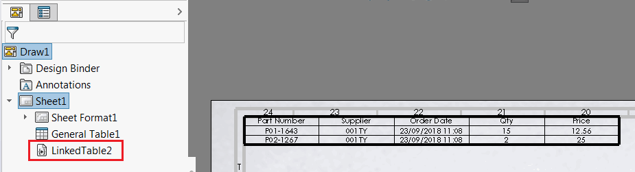

{ width=350 }

该宏允许在零件、装配和绘图中创建通用表格，并使用SOLIDWORKS API将其链接到外部Excel或文本/CSV文件。该宏实现为嵌入式宏功能，这意味着一旦重新构建模型，表格将自动更新。

* 运行宏
* 在第一个提示对话框中指定Excel（*.xls或*.xlsx）或逗号分隔的文本文件（*.csv或*.txt）的完整路径
* 可选择指定要从中读取数据的电子表格的名称。如果指定空字符串，则使用第一个电子表格

宏将使用来自外部文件的数据插入表格和宏功能到特征树中。修改文件或通用表格并重新构建模型-表格将被更新。

## 注意事项和限制

* 仅支持简单的CSV文件（即简单的逗号分隔值，不支持换行符或值中的逗号）
* 使用CSV文件时不需要Excel
* 使用CSV文件具有显着的性能优势，因为无需启动Excel和加载文档即可获取数据。在适用的情况下使用此选项
* Excel以不可见方式显示，并且会缓存会话以获得更好的性能优势
* 如果将CSV或Excel文件保存为相对于模型的路径-将维护相对路径。这意味着SOLIDWORKS文件可以与Excel/CSV一起移动，链接不会中断
* 如果在插入新特征时选择了通用表格-将使用此表格而不是创建新表格
* 目前无法更改外部Excel文件的路径。请删除宏功能，然后通过选择通用表格重新插入它（参见上一点）
* 宏功能嵌入到模型中，这意味着即使此宏不可用，表格也将在任何其他工作站上更新。

~~~ vb
Const BASE_NAME As String = "LinkedTable"

Const PARAM_EXCEL_PATH As String = "ExcelPath"
Const PARAM_SHEET_NAME As String = "SheetName"

Sub main()

    Dim swApp As SldWorks.SldWorks
    Set swApp = Application.SldWorks
    
    Dim swModel As SldWorks.ModelDoc2
    
    Set swModel = swApp.ActiveDoc
    
    If Not swModel Is Nothing Then
        
        Dim excelFilePath As String
        Dim excelSheetName As String

        excelFilePath = InputBox("在第一个提示对话框中指定Excel或文本/CSV文件的完整路径")
        excelSheetName = InputBox("为Excel文件指定工作表名称（对于第一个工作表指定空字符串）")
        
        If excelFilePath = "" Then
            Exit Sub
        End If
        
        excelFilePath = UpdateRelativePath(swModel, excelFilePath)
        
        Dim curMacroPath As String
        curMacroPath = swApp.GetCurrentMacroPathName
        Dim vMethods(8) As String
        Dim moduleName As String
        
        GetMacroEntryPoint swApp, curMacroPath, moduleName, ""
        
        vMethods(0) = curMacroPath: vMethods(1) = moduleName: vMethods(2) = "swmRebuild"
        vMethods(3) = curMacroPath: vMethods(4) = moduleName: vMethods(5) = "swmEditDefinition"
        vMethods(6) = curMacroPath: vMethods(7) = moduleName: vMethods(8) = "swmSecurity"
        
        Dim vParamNames(1) As String
        vParamNames(0) = PARAM_EXCEL_PATH
        vParamNames(1) = PARAM_SHEET_NAME

        Dim vParamTypes(1) As Long
        vParamTypes(0) = swMacroFeatureParamType_e.swMacroFeatureParamTypeString
        vParamTypes(1) = swMacroFeatureParamType_e.swMacroFeatureParamTypeString

        Dim vParamValues(1) As String

        vParamValues(0) = excelFilePath
        vParamValues(1) = excelSheetName

        Dim swTable As SldWorks.TableAnnotation
        Set swTable = TryGetSelectedTable(swModel)
        If swTable Is Nothing Then
            Dim emptyTable(2, 2) As String
            Set swTable = CreateTableFromArray(swModel, emptyTable)
        End If
        
        swTable.GetAnnotation().Select3 False, Nothing
        
        Dim swFeat As SldWorks.Feature
        Set swFeat = swModel.FeatureManager.InsertMacroFeature3(BASE_NAME, "", vMethods, _
            vParamNames, vParamTypes, vParamValues, Empty, Empty, Empty, _
            Empty, swMacroFeatureOptions_e.swMacroFeatureEmbedMacroFile + swMacroFeatureOptions_e.swMacroFeatureAlwaysAtEnd)
        
        If swFeat Is Nothing Then
            MsgBox "无法创建宏运行程序"
        End If
        
    Else
        MsgBox "请打开模型"
    End If
    
End Sub

Function UpdateRelativePath(model As SldWorks.ModelDoc2, path As String) As String
    
    Dim modelPath As String
    modelPath = model.GetPathName
    
    UpdateRelativePath = path
    
    If modelPath <> "" Then
        Dim modelDir As String
        modelDir = Left(modelPath, InStrRev(modelPath, "\"))
        
        If LCase(path) Like LCase(modelDir) & "*" Then
            UpdateRelativePath = Right(path, Len(path) - Len(modelDir) + 1)
        End If
        
    End If
    
End Function

Function GetFullPath(model As SldWorks.ModelDoc2, path As String)
    
    GetFullPath = path
    
    Dim isRelative As Boolean
    isRelative = Left(path, 1) = "\"
    
    If isRelative Then
        
        Dim modelPath As String
        Dim modelDir As String
        
        modelPath = model.GetPathName
        
        modelDir = Left(modelPath, InStrRev(modelPath, "\") - 1)
        
        GetFullPath = modelDir & path
        
    End If
    
End Function

Function TryGetSelectedTable(model As SldWorks.ModelDoc2) As SldWorks.TableAnnotation
    
    On Error Resume Next
    
    Dim swTable As SldWorks.TableAnnotation
    Set swTable = model.SelectionManager.GetSelectedObject6(1, -1)
    
    If swTable Is Nothing Then
        
        Dim swTableFeat As SldWorks.GeneralTableFeature
        Set swTableFeat = swModel.SelectionManager.GetSelectedObject6(1, -1)
        
        If Not swTableFeat Is Nothing Then
            Set swTable = swTableFeat.GetTableAnnotations()(0)
        End If
        
    End If
    
    Set TryGetSelectedTable = swTable
    
End Function

Function CreateTableFromArray(model As SldWorks.ModelDoc2, vTableData As Variant) As SldWorks.TableAnnotation
    
    Dim swTable As SldWorks.TableAnnotation
    Set swTable = model.Extension.InsertGeneralTableAnnotation(True, 0, 0, swBOMConfigurationAnchorType_e.swBOMConfigurationAnchor_BottomLeft, "", UBound(vTableData, 1), UBound(vTableData, 2))
    
    FillTable swTable, vTableData
    
    Set CreateTableFromArray = swTable
    
End Function

Sub FillTable(table As SldWorks.TableAnnotation, vTableData As Variant)
    
    Dim rowIndex As Integer
    Dim columnIndex As Integer
    
    Dim rowsCount As Integer
    Dim colsCount As Integer
    Dim i As Integer
    
    rowsCount = UBound(vTableData, 1)
    colsCount = UBound(vTableData, 2)
    
    If table.columnCount > colsCount Then
        For i = colsCount To table.columnCount - 1
            table.DeleteColumn2 table.columnCount - 1, True
        Next
    ElseIf table.columnCount < colsCount Then
        For i = table.columnCount To colsCount - 1
            table.InsertColumn2 swTableItemInsertPosition_e.swTableItemInsertPosition_Last, -1, "", swInsertTableColumnWidthStyle_e.swInsertColumn_DefaultWidth
        Next
    End If
    
    If table.rowCount > rowsCount Then
        For i = rowsCount To table.rowCount - 1
            table.DeleteRow2 table.rowCount - 1, True
        Next
    ElseIf table.rowCount < rowsCount Then
        For i = table.rowCount To rowsCount - 1
            table.InsertRow swTableItemInsertPosition_e.swTableItemInsertPosition_Last, -1
        Next
    End If
    
    For rowIndex = 0 To UBound(vTableData, 1)
        For columnIndex = 0 To UBound(vTableData, 2)
            table.Text(rowIndex, columnIndex) = vTableData(rowIndex, columnIndex)
        Next
    Next
    
End Sub

Sub GetMacroEntryPoint(app As SldWorks.SldWorks, macroPath As String, ByRef moduleName As String, ByRef procName As String)
        
    Dim vMethods As Variant
    vMethods = app.GetMacroMethods(macroPath, swMacroMethods_e.swMethodsWithoutArguments)
    
    Dim i As Integer
    
    If Not IsEmpty(vMethods) Then
    
        For i = 0 To UBound(vMethods)
            Dim vData As Variant
            vData = Split(vMethods(i), ".")
            
            If i = 0 Or LCase(vData(1)) = "main" Then
                moduleName = vData(0)
                procName = vData(1)
            End If
        Next
        
    End If
    
End Sub

Function GetArrayFromExcel(filePath As String, sheetName As String) As Variant
    
    Dim xlApp As Object
    
    Dim tableData() As String
    
    Set xlApp = GetObject("", "Excel.Application")
        
    Dim xlWorkbook As Object
    Dim xlWorksheet As Object

    Dim closeWorkbook As Boolean
    closeWorkbook = Not IsWorkbookOpen(xlApp, filePath)
    
    Set xlWorkbook = xlApp.Workbooks.Open(filePath)
    
    If sheetName <> "" Then
        Set xlWorksheet = xlWorkbook.Sheets(sheetName)
    Else
        Set xlWorksheet = xlWorkbook.Sheets(1)
    End If
    
    Dim rowIndex As Integer
    Dim columnIndex As Integer
    
    ReDim tableData(xlWorksheet.UsedRange.rows.Count, xlWorksheet.UsedRange.Columns.Count)
    
    For rowIndex = 1 To xlWorksheet.UsedRange.rows.Count
        For columnIndex = 1 To xlWorksheet.UsedRange.Columns.Count
            Dim cellVal As String
            cellVal = xlWorksheet.Cells(rowIndex, columnIndex).Value
            tableData(rowIndex - 1, columnIndex - 1) = cellVal
        Next
    Next
    
    GetArrayFromExcel = tableData
    
    If closeWorkbook Then
        xlWorkbook.Close SaveChanges:=False
    End If
    
End Function

Function GetArrayFromCsv(filePath As String) As Variant
    
    Dim fileNo As Integer

    fileNo = FreeFile
    
    Dim rows As Collection
    Set rows = New Collection
    
    Open filePath For Input As #fileNo
    
    Do While Not EOF(fileNo)
        
        Dim tableRow As String
        
        Line Input #fileNo, tableRow
            
        Dim vCells As Variant
        vCells = Split(tableRow, ",")
        rows.Add vCells
    
    Loop
    
    Close #fileNo
    
    Dim tableData() As String

    Dim rowCount As Integer
    Dim columnCount As Integer
    rowCount = rows.Count
    columnCount = UBound(rows(1)) + 1
    
    Dim rowIndex As Integer
    Dim columnIndex As Integer
    
    ReDim tableData(rowCount, columnCount)
    
    For rowIndex = 1 To rowCount
        Dim vRow As Variant
        vRow = rows.Item(rowIndex)
        
        For columnIndex = 1 To columnCount
            Dim cellVal As String
            cellVal = vRow(columnIndex - 1)
            tableData(rowIndex - 1, columnIndex - 1) = cellVal
        Next
    Next
    
    GetArrayFromCsv = tableData
    
End Function

Function IsWorkbookOpen(xlApp As Object, filePath As String) As Boolean
    
    Dim i As Integer
    
    For i = 1 To xlApp.Workbooks.Count
        If LCase(xlApp.Workbooks(i).FullName) = LCase(filePath) Then
            IsWorkbookOpen = True
            Exit Function
        End If
    Next
    
    IsWorkbookOpen = False
    
End Function

Function swmRebuild(varApp As Variant, varDoc As Variant, varFeat As Variant) As Variant

    Dim swApp As SldWorks.SldWorks
    Dim swModel As SldWorks.ModelDoc2
    Dim swFeat As SldWorks.Feature
    
    Set swApp = varApp
    Set swModel = varDoc
    Set swFeat = varFeat
    
    Dim swMacroFeat As SldWorks.MacroFeatureData
    Set swMacroFeat = swFeat.GetDefinition()
    
    Dim excelFileName As String
    Dim excelSheetName As String
    
    swMacroFeat.GetStringByName PARAM_EXCEL_PATH, excelFileName
    swMacroFeat.GetStringByName PARAM_SHEET_NAME, excelSheetName
    
    Dim vObjects As Variant
    swMacroFeat.GetSelections3 vObjects, Empty, Empty, Empty, Empty
    
    Dim swTable As SldWorks.TableAnnotation
    Set swTable = vObjects(0)
    
    If swTable Is Nothing Then
        swmRebuild = "缺少链接的通用表格"
        Exit Function
    End If
    
    excelFileName = GetFullPath(swModel, excelFileName)
    
    If Dir(excelFileName) = "" Then
        swmRebuild = "缺少链接的Excel文件：" & excelFileName
        Exit Function
    End If
    
    Dim vTable As Variant
    
    Dim fileExt As String
    fileExt = Right(excelFileName, Len(excelFileName) - InStrRev(excelFileName, "."))
    
    Dim isExcel As Boolean
    isExcel = LCase(fileExt) = "xls" Or LCase(fileExt) = "xlsx"
    
    If isExcel Then
        vTable = GetArrayFromExcel(excelFileName, excelSheetName)
    Else
        vTable = GetArrayFromCsv(excelFileName)
    End If
    
    FillTable swTable, vTable
    
End Function

Function swmEditDefinition(varApp As Variant, varDoc As Variant, varFeat As Variant) As Variant
    swmEditDefinition = True
End Function

Function swmSecurity(varApp As Variant, varDoc As Variant, varFeat As Variant) As Variant
    swmSecurity = SwConst.swMacroFeatureSecurityOptions_e.swMacroFeatureSecurityByDefault
End Function
~~~