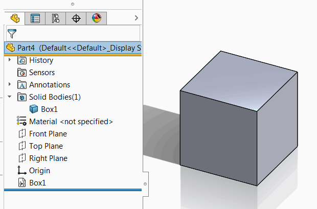
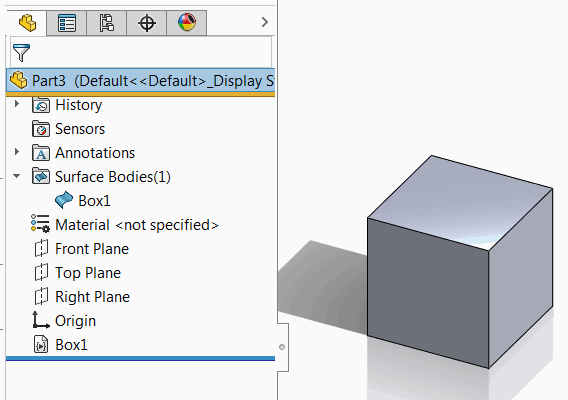
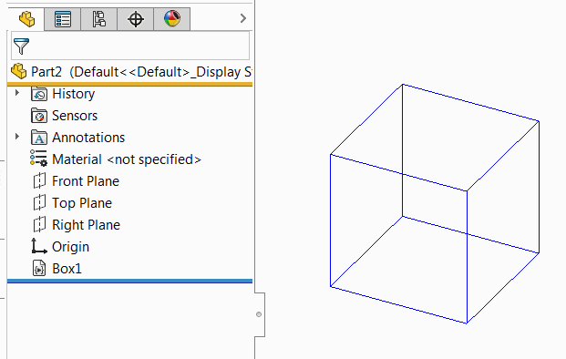

 使用SOLIDWORKS API创建VBA宏特征的示例，可以生成不同类型的盒子几何体（实体、面、线）。
image: solid-body.png
labels: [宏特征,几何体,盒子,实体,面,线]
---

这个VBA示例演示了如何创建一个生成自定义几何体的宏特征。

打开零件文档并运行宏。新的特征将插入到特征管理器树中，并生成盒子几何体，可以是实体、面或线。

## 配置

### 嵌入

将*EMBED_MACRO_FEATURE*常量的值设置为指定是否将宏特征嵌入到文件中。如果将此选项设置为*True*，则可以在任何其他计算机上打开零件文档，而无需复制宏即可使用几何体。

### 盒子尺寸

可以通过更改*WIDTH*、*LENGTH*和*HEIGHT*常量来配置盒子的尺寸：

~~~ vb
Const WIDTH As Double = 0.01
Const LENGTH As Double = 0.01
Const HEIGHT As Double = 0.01
~~~

### 几何体类型

可以通过将值分配给*BODY_TYPE*常量来设置生成的几何体类型。

#### swBodyType_e.swSolidBody

创建一个实体几何体的盒子。

{ width=350 }

#### swBodyType_e.swSheetBody

通过缝合盒子的面创建一个单个面体。

{ width=350 }

#### swBodyType_e.swWireBody

从盒子几何体的所有边创建线体。线体是边缘，不在体文件夹中显示。标准特征树中使用的线体示例是曲线（复合、通过XYZ、投影等）。

{ width=350 }

~~~ vb
Const BODY_TYPE As Integer = swBodyType_e.swSolidBody
Const EMBED_MACRO_FEATURE As Boolean = False
Const BASE_NAME As String = "Box"

Const WIDTH As Double = 0.01
Const LENGTH As Double = 0.01
Const HEIGHT As Double = 0.01

Sub main()

    Dim swApp As SldWorks.SldWorks
    Set swApp = Application.SldWorks
    
    Dim swModel As SldWorks.ModelDoc2
    
    Set swModel = swApp.ActiveDoc
    
    If Not swModel Is Nothing Then
        
        Dim curMacroPath As String
        curMacroPath = swApp.GetCurrentMacroPathName
        
        Dim vMethods(8) As String
        Dim moduleName As String
        
        GetMacroEntryPoint swApp, curMacroPath, moduleName, ""
        
        vMethods(0) = curMacroPath: vMethods(1) = moduleName: vMethods(2) = "swmRebuild"
        vMethods(3) = curMacroPath: vMethods(4) = moduleName: vMethods(5) = "swmEditDefinition"
        vMethods(6) = curMacroPath: vMethods(7) = moduleName: vMethods(8) = "swmSecurity"
        
        Dim opts As swMacroFeatureOptions_e
        
        If EMBED_MACRO_FEATURE Then
            opts = swMacroFeatureOptions_e.swMacroFeatureEmbedMacroFile
        Else
            opts = swMacroFeatureOptions_e.swMacroFeatureByDefault
        End If
        
        Dim swFeat As SldWorks.Feature
        Set swFeat = swModel.FeatureManager.InsertMacroFeature3(BASE_NAME, "", vMethods, _
            Empty, Empty, Empty, Empty, Empty, Empty, _
            Empty, opts)
        
        If swFeat Is Nothing Then
            MsgBox "Failed to create box feature"
        End If
        
    Else
        MsgBox "Please open model"
    End If
    
End Sub

Sub GetMacroEntryPoint(app As SldWorks.SldWorks, macroPath As String, ByRef moduleName As String, ByRef procName As String)
        
    Dim vMethods As Variant
    vMethods = app.GetMacroMethods(macroPath, swMacroMethods_e.swMethodsWithoutArguments)
    
    Dim i As Integer
    
    If Not IsEmpty(vMethods) Then
    
        For i = 0 To UBound(vMethods)
            Dim vData As Variant
            vData = Split(vMethods(i), ".")
            
            If i = 0 Or LCase(vData(1)) = "main" Then
                moduleName = vData(0)
                procName = vData(1)
            End If
        Next
        
    End If
    
End Sub

Function swmRebuild(varApp As Variant, varDoc As Variant, varFeat As Variant) As Variant
    
    Dim swApp As SldWorks.SldWorks
    Dim swModeler As SldWorks.Modeler
    
    Set swApp = varApp
    Set swModeler = swApp.GetModeler
    
    Dim swTemplateBody As SldWorks.Body2

    Dim dCenter(2) As Double
    dCenter(0) = 0: dCenter(1) = 0: dCenter(2) = 0
    
    Dim dAxis(2) As Double
    dAxis(0) = 0: dAxis(1) = 0: dAxis(2) = 1
                    
    Dim dBoxData(8) As Double
    dBoxData(0) = dCenter(0): dBoxData(1) = dCenter(1): dBoxData(2) = dCenter(2)
    dBoxData(3) = dAxis(0): dBoxData(4) = dAxis(1): dBoxData(5) = dAxis(2)
    dBoxData(6) = WIDTH: dBoxData(7) = LENGTH: dBoxData(8) = HEIGHT
        
    Set swTemplateBody = swModeler.CreateBodyFromBox3(dBoxData)
    
    Dim swBoxBody() As SldWorks.Body2
    
    Dim i As Integer
    
    Dim isInit As Boolean
    isInit = False
    
    Select Case BODY_TYPE
        Case swBodyType_e.swSolidBody
            isInit = True
            ReDim swBoxBody(0) As SldWorks.Body2
            Set swBoxBody(0) = swTemplateBody
        Case swBodyType_e.swSheetBody
            isInit = True
            ReDim swBoxBody(0) As SldWorks.Body2
            Set swBoxBody(0) = swModeler.CreateSheetFromFaces(swTemplateBody.GetFaces())
        Case swBodyType_e.swWireBody
            isInit = True
            
            Dim vEdges As Variant
            
            vEdges = swTemplateBody.GetEdges()
            
            ReDim swBoxBody(UBound(vEdges)) As SldWorks.Body2
            
            For i = 0 To swTemplateBody.GetEdgeCount() - 1
                Dim swEdge(0) As SldWorks.Edge
                Set swEdge(0) = vEdges(i)
                Set swBoxBody(i) = swModeler.CreateWireBody(swEdge, swCreateWireBodyOptions_e.swCreateWireBodyByDefault)
            Next
    End Select
    
    If isInit Then
        
        Dim swFeat As SldWorks.Feature
        Set swFeat = varFeat
        
        Dim swMacroFeatData As SldWorks.MacroFeatureData
        Set swMacroFeatData = swFeat.GetDefinition
        
        For i = 0 To UBound(swBoxBody)
            AssignUserIds swBoxBody(i), swMacroFeatData
        Next
        
        swMacroFeatData.EnableMultiBodyConsume = UBound(swBoxBody) > 0
        swmRebuild = swBoxBody
        
    Else
        swmRebuild = "无效的几何体类型。仅支持实体、面和线几何体"
    End If
    
End Function

Sub AssignUserIds(body As SldWorks.Body2, featData As SldWorks.MacroFeatureData)
    
    Dim vFaces As Variant
    Dim vEdges As Variant
    Dim i As Integer
    
    featData.GetEntitiesNeedUserId body, vFaces, vEdges
    
    If Not IsEmpty(vFaces) Then
        For i = 0 To UBound(vFaces)
            Dim swFace As SldWorks.Face2
            Set swFace = vFaces(i)
            featData.SetFaceUserId swFace, 0, i
        Next
    End If
    
    If Not IsEmpty(vEdges) Then
        For i = 0 To UBound(vEdges)
            Dim swEdge As SldWorks.Edge
            Set swEdge = vEdges(i)
            featData.SetEdgeUserId swEdge, 0, i
        Next
    End If
    
End Sub

Function swmEditDefinition(varApp As Variant, varDoc As Variant, varFeat As Variant) As Variant
    swmEditDefinition = True
End Function

Function swmSecurity(varApp As Variant, varDoc As Variant, varFeat As Variant) As Variant
    swmSecurity = SwConst.swMacroFeatureSecurityOptions_e.swMacroFeatureSecurityByDefault
End Function
~~~