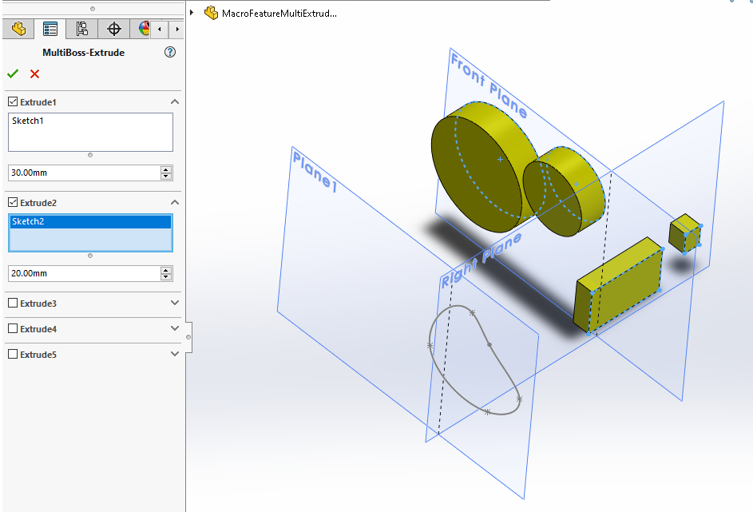
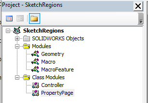
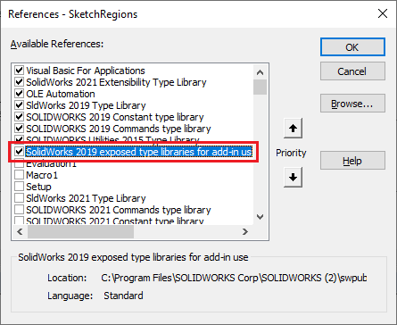

## 创建 MultiBoss-Extrude 宏特征

 { width=500 }

这个 VBA 宏演示了如何使用 VBA 创建一个参数化的 SOLIDWORKS 宏特征，以从多个草图创建单个拉伸特征。

观看下面的视频，演示了该宏的使用方法以及如何构建和使用该宏。



创建以下宏结构，并将代码片段复制到相应的模块和类中。

属性管理器页面在 **SolidWorks {{Version}} exposed type library for add-in use** 类型库中定义。因此，需要将其添加到 VBA 宏的引用中。

为了添加自定义图标，请下载 [Icons](Icons.zip) 文件并解压缩到宏特征文件旁边的 **Icons** 子文件夹中。

## 宏模块

宏的入口点。使用此模块插入新的宏特征。

~~~ vb
Dim swController As Controller

Sub main()

    Set swApp = Application.SldWorks
    
    Dim swModel As SldWorks.ModelDoc2
    
    Set swModel = swApp.ActiveDoc
    
    If Not swModel Is Nothing Then
        
        Set swController = New Controller
        swController.InsertExtrude
        
    Else
        MsgBox "请打开模型"
    End If
    
End Sub
~~~

## 几何模块

该模块包含用于从输入草图构建拉伸的临时几何体的辅助函数。

~~~ vb
Dim swApp As SldWorks.SldWorks

Function CreateBodiesFromSketches(vSketches As Variant, vDepths As Variant) As Variant
    
    Dim swBodies() As SldWorks.Body2
    
    If Not IsEmpty(vSketches) Then
            
        For i = 0 To UBound(vSketches)
            
            Dim swSketchFeat As SldWorks.Feature
            Set swSketchFeat = vSketches(i)
            
            Dim depth As Double
            depth = vDepths(i)
            
            Dim swSketch As SldWorks.sketch
            Set swSketch = swSketchFeat.GetSpecificFeature2
            
            Dim vSkRegs As Variant
            vSkRegs = swSketch.GetSketchRegions
            
            If Not IsEmpty(vSkRegs) Then
                
                Dim j As Integer
                
                For j = 0 To UBound(vSkRegs)
                
                    Dim swSkReg As SldWorks.SketchRegion
                    Set swSkReg = vSkRegs(j)
                    Dim swBody As SldWorks.Body2
                    Set swBody = Geometry.ExtrudeRegion(swSkReg, depth)
                    
                    If (Not swBodies) = -1 Then
                        ReDim swBodies(0)
                    Else
                        ReDim Preserve swBodies(UBound(swBodies) + 1)
                    End If
                    
                    Set swBodies(UBound(swBodies)) = swBody
                    
                Next
                
            End If
            
        Next
            
    End If
    
    If (Not swBodies) <> -1 Then
        CreateBodiesFromSketches = swBodies
    Else
        CreateBodiesFromSketches = Empty
    End If
    
End Function

Private Function ExtrudeRegion(swSkRegion As SldWorks.SketchRegion, depth As Double) As SldWorks.Body2
    
    Dim swBody As SldWorks.Body2
    Set swBody = CreateBodyFromRegion(swSkRegion)
    
    Set swApp = Application.SldWorks
    
    Dim swModeler As SldWorks.Modeler
    Set swModeler = swApp.GetModeler
    
    Dim swFace As SldWorks.Face2
    Set swFace = swBody.GetFaces()(0)
    Dim swDir As SldWorks.MathVector
    
    Dim swMathUtils As SldWorks.MathUtility
    Set swMathUtils = swApp.GetMathUtility
    
    Set swDir = swMathUtils.CreateVector(swFace.Normal)
    
    Set ExtrudeRegion = swModeler.CreateExtrudedBody(swBody, swDir, depth)
    
End Function

Private Function CreateBodyFromRegion(swSkRegion As SldWorks.SketchRegion) As SldWorks.Body2
            
    Set swApp = Application.SldWorks
    
    Dim vCurves As Variant
    vCurves = GetCurvesFromRegion(swSkRegion)
    
    Dim swSketch As SldWorks.sketch
    Set swSketch = swSkRegion.sketch
    
    Dim swSurf As SldWorks.Surface
    Set swSurf = CreatePlanarSurfaceFromSketch(swSketch)
    
    Dim swBody As SldWorks.Body2
    Set swBody = swSurf.CreateTrimmedSheet5(vCurves, True, 0.00001)
    
    Set CreateBodyFromRegion = swBody
    
End Function

Private Function GetCurvesFromRegion(skReg As SldWorks.SketchRegion) As Variant
    
    Dim swCurves() As SldWorks.Curve
    
    Dim swLoop As SldWorks.Loop2
    Set swLoop = skReg.GetFirstLoop()
    
    While Not swLoop Is Nothing
                
        Dim vLoopEdges As Variant
        vLoopEdges = swLoop.GetEdges
        
        If (Not swCurves) = -1 Then
            ReDim swCurves(UBound(vLoopEdges))
        Else
            If UBound(swCurves) = -1 Then
                ReDim swCurves(UBound(vLoopEdges))
            Else
                ReDim Preserve swCurves(UBound(swCurves) + UBound(vLoopEdges) + 2)
            End If
        End If
        
        Dim i As Integer
        
        For i = UBound(vLoopEdges) To 0 Step -1
            
            Dim swLoopEdge As SldWorks.Edge
            Set swLoopEdge = vLoopEdges(i)
            Dim swCurve As SldWorks.Curve
            Set swCurve = swLoopEdge.GetCurve().Copy
            Set swCurves(UBound(swCurves) - UBound(vLoopEdges) + i) = swCurve
            
        Next
        
        Set swLoop = swLoop.GetNext
        
    Wend
    
    GetCurvesFromRegion = swCurves
    
End Function

Private Function CreatePlanarSurfaceFromSketch(sketch As SldWorks.sketch) As SldWorks.Surface
    
    Dim swMathUtils As SldWorks.MathUtility
    Set swMathUtils = swApp.GetMathUtility
    
    Dim dPt(2) As Double
    Dim dVec(2) As Double
    
    Dim swRootPt As SldWorks.MathPoint
    dPt(0) = 0: dPt(1) = 0: dPt(2) = 0
    Set swRootPt = swMathUtils.CreatePoint(dPt)
    
    Dim swNormVec As SldWorks.MathVector
    dVec(0) = 0: dVec(1) = 0: dVec(2) = 1
    Set swNormVec = swMathUtils.CreateVector(dVec)
    
    Dim swRefVec As SldWorks.MathVector
    dVec(0) = 1: dVec(1) = 0: dVec(2) = 0
    Set swRefVec = swMathUtils.CreateVector(dVec)
    
    Dim swSkTransform As SldWorks.MathTransform
    Set swSkTransform = sketch.ModelToSketchTransform.Inverse
    
    Set swRootPt = swRootPt.MultiplyTransform(swSkTransform)
    Set swNormVec = swNormVec.MultiplyTransform(swSkTransform)
    Set swRefVec = swRefVec.MultiplyTransform(swSkTransform)
    
    Dim swModeler As SldWorks.Modeler
    Set swModeler = swApp.GetModeler
    
    Dim swSurf As SldWorks.Surface
    
    Set swSurf = swModeler.CreatePlanarSurface2(swRootPt.ArrayData, swNormVec.ArrayData, swRefVec.ArrayData)
    
    Set CreatePlanarSurfaceFromSketch = swSurf
    
End Function
~~~

## MacroFeature 模块

实现宏特征的行为：重建和编辑

~~~ vb
Dim swController As Controller

Function swmRebuild(varApp As Variant, varDoc As Variant, varFeat As Variant) As Variant
    
    Dim swApp As SldWorks.SldWorks
    Dim swModel As SldWorks.ModelDoc2
    Dim swFeat As SldWorks.Feature
    Dim swMacroFeatData As SldWorks.MacroFeatureData
    
    Set swApp = varApp
    Set swModel = varDoc
    Set swFeat = varFeat
    
    Set swMacroFeatData = swFeat.GetDefinition
            
    Dim vSketches As Variant
    Dim vDepths As Variant
    
    swMacroFeatData.GetSelections3 vSketches, Empty, Empty, Empty, Empty
    swMacroFeatData.GetParameters Empty, Empty, vDepths
    
    Dim vBodies As Variant
    vBodies = Geometry.CreateBodiesFromSketches(vSketches, vDepths)
    
    Dim i As Integer
    
    For i = 0 To UBound(vBodies)
        Dim swBody As SldWorks.Body2
        Set swBody = vBodies(i)
        AssignUserIds swBody, swMacroFeatData
    Next
    
    swMacroFeatData.EnableMultiBodyConsume = True
    
    swmRebuild = vBodies
    
End Function

Sub AssignUserIds(body As SldWorks.Body2, featData As SldWorks.MacroFeatureData)
    
    Dim vFaces As Variant
    Dim vEdges As Variant
    Dim i As Integer
    
    featData.GetEntitiesNeedUserId body, vFaces, vEdges
    
    If Not IsEmpty(vFaces) Then
        For i = 0 To UBound(vFaces)
            Dim swFace As SldWorks.Face2
            Set swFace = vFaces(i)
            featData.SetFaceUserId swFace, 0, i
        Next
    End If
    
    If Not IsEmpty(vEdges) Then
        For i = 0 To UBound(vEdges)
            Dim swEdge As SldWorks.Edge
            Set swEdge = vEdges(i)
            featData.SetEdgeUserId swEdge, 0, i
        Next
    End If
    
End Sub

Function swmEditDefinition(varApp As Variant, varDoc As Variant, varFeat As Variant) As Variant
    
    If swController Is Nothing Then
        Set swController = New Controller
    End If
    
    Dim swFeat As SldWorks.Feature
    Set swFeat = varFeat
    
    swController.EditExtrude swFeat
    
    swmEditDefinition = True
    
End Function

Function swmSecurity(varApp As Variant, varDoc As Variant, varFeat As Variant) As Variant
    swmSecurity = swMacroFeatureSecurityOptions_e.swMacroFeatureSecurityByDefault
End Function
~~~

## PropertyPage 类模块

实现宏特征的属性管理器页面接口。

~~~ vb
Implements PropertyManagerPage2Handler9

Public Event Closed(mode As Integer, vSketches As Variant, vDepths As Variant, isCancelled As Boolean)
Public Event DataChanged(vSketches As Variant, vDepths As Variant)

Dim swPage As PropertyManagerPage2
Dim swGroupBox() As PropertyManagerPageGroup
Dim swSelectionBox() As PropertyManagerPageSelectionbox
Dim swNumberBox() As PropertyManagerPageNumberbox

Const EXTRUDES_COUNT As Integer = 5

Const GroupStartID As Long = 1
Const SelectionBoxStartID As Long = GroupStartID + EXTRUDES_COUNT
Const NumberBoxStartID As Long = SelectionBoxStartID + EXTRUDES_COUNT

Dim swApp As SldWorks.SldWorks
Dim swModel As SldWorks.ModelDoc2

Dim vSelSketches As Variant
Dim vDepthVals As Variant
Dim IsCancel As Boolean
Dim PageMode As Integer

Sub Show(Optional mode As Integer = -1, Optional vSketches As Variant = Empty, Optional vDepths As Variant = Empty)
        
    PageMode = mode
        
    Set swApp = Application.SldWorks
    
    CreatePage
    
    InitPageValues vSketches, vDepths
    
    Const swPropertyManagerPageShowOptions_Default As Integer = 0
    
    swPage.Show2 swPropertyManagerPageShowOptions_Default
    
    Set swModel = swApp.ActiveDoc
        
End Sub

Sub CreatePage()

    Dim errs As Long
    Set swPage = swApp.CreatePropertyManagerPage("MultiBoss-Extrude", _
        swPropertyManager_OkayButton + swPropertyManager_CancelButton, Me, errs)
    
    If Not swPage Is Nothing Then
        
        Dim i As Integer
            
        Dim selMark As Integer
        
        ReDim swGroupBox(EXTRUDES_COUNT - 1)
        ReDim swSelectionBox(EXTRUDES_COUNT - 1)
        ReDim swNumberBox(EXTRUDES_COUNT - 1)
        
        For i = 0 To EXTRUDES_COUNT - 1
            
            Dim grpOtps As Integer
            grpOtps = swAddGroupBoxOptions_e.swGroupBoxOptions_Visible + swAddGroupBoxOptions_e.swGroupBoxOptions_Checkbox
            
            If i = 0 Then
                grpOtps = grpOtps + swAddGroupBoxOptions_e.swGroupBoxOptions_Expanded
            End If
            
            Set swGroupBox(i) = swPage.AddGroupBox(GroupStartID + i, "Extrude" & i + 1, grpOtps)
            
            Set swSelectionBox(i) = swGroupBox(i).AddControl2(SelectionBoxStartID + i, _
                swPropertyManagerPageControlType_e.swControlType_Selectionbox, "Region", _
                swPropertyManagerPageControlLeftAlign_e.swControlAlign_LeftEdge, _
                swAddControlOptions_e.swControlOptions_Enabled + swAddControlOptions_e.swControlOptions_Visible, "Select region to extrude")
    
            Dim filters(0) As Long
            filters(0) = swSelectType_e.swSelSKETCHES
    
            swSelectionBox(i).SingleEntityOnly = True
            swSelectionBox(i).Height = 30
            swSelectionBox(i).SetSelectionFilters filters
            swSelectionBox(i).Mark = 2 ^ i
            
            Set swNumberBox(i) = swGroupBox(i).AddControl2(NumberBoxStartID + i, _
                  swPropertyManagerPageControlType_e.swControlType_Numberbox, "Extrude Depth", _
                  swPropertyManagerPageControlLeftAlign_e.swControlAlign_LeftEdge, _
                  swAddControlOptions_e.swControlOptions_Enabled + swAddControlOptions_e.swControlOptions_Visible, "")
                  
            swNumberBox(i).SetRange2 swNumberboxUnitType_e.swNumberBox_Length, 0.00001, 1000, False, 0.01, 0.1, 0.001
            swNumberBox(i).Value = 0.01
            
        Next
        
    End If

End Sub

Sub InitPageValues(vSketches As Variant, vDepths As Variant)
    
    If Not IsEmpty(vSketches) Then
        
        Dim swModel As SldWorks.ModelDoc2
        Set swModel = swApp.ActiveDoc
        swModel.ClearSelection2 True
        
        Dim i As Integer
        
        For i = 0 To UBound(vSketches)
            Dim swSketchFeat As SldWorks.Feature
            Set swSketchFeat = vSketches(i)
            swSketchFeat.SelectByMark True, 2 ^ i
            swGroupBox(i).Checked = True
            swNumberBox(i).Value = CDbl(vDepths(i))
        Next
        
    End If
    
End Sub

Sub PropertyManagerPage2Handler9_AfterActivation()
End Sub

Sub PropertyManagerPage2Handler9_AfterClose()
    Set swPage = Nothing
    RaiseEvent Closed(PageMode, vSelSketches, vDepthVals, IsCancel)
End Sub

Function PropertyManagerPage2Handler9_OnActiveXControlCreated(ByVal Id As Long, ByVal Status As Boolean) As Long
    PropertyManagerPage2Handler9_OnActiveXControlCreated = 0
End Function

Sub PropertyManagerPage2Handler9_OnButtonPress(ByVal Id As Long)
End Sub

Sub PropertyManagerPage2Handler9_OnCheckboxCheck(ByVal Id As Long, ByVal Checked As Boolean)
End Sub

Sub PropertyManagerPage2Handler9_OnClose(ByVal Reason As Long)
    
    IsCancel = Reason = swPropertyManagerPageCloseReasons_e.swPropertyManagerPageClose_Cancel
        
    If Not IsCancel Then
        CollectData vSelSketches, vDepthVals
    End If
    
End Sub

Sub PropertyManagerPage2Handler9_OnComboboxEditChanged(ByVal Id As Long, ByVal Text As String)
End Sub

Sub PropertyManagerPage2Handler9_OnComboboxSelectionChanged(ByVal Id As Long, ByVal Item As Long)
End Sub
 
Sub PropertyManagerPage2Handler9_OnGroupCheck(ByVal Id As Long, ByVal Checked As Boolean)
    HandleDataChanged
End Sub

Sub PropertyManagerPage2Handler9_OnGroupExpand(ByVal Id As Long, ByVal Expanded As Boolean)
End Sub

Function PropertyManagerPage2Handler9_OnHelp() As Boolean
    PropertyManagerPage2Handler9_OnHelp = True
End Function

Function PropertyManagerPage2Handler9_OnKeystroke(ByVal Wparam As Long, ByVal Message As Long, ByVal Lparam As Long, ByVal Id As Long) As Boolean
End Function

Sub PropertyManagerPage2Handler9_OnListboxSelectionChanged(ByVal Id As Long, ByVal Item As Long)
End Sub

Function PropertyManagerPage2Handler9_OnNextPage() As Boolean
    PropertyManagerPage2Handler9_OnNextPage = True
End Function

Sub PropertyManagerPage2Handler9_OnNumberboxChanged(ByVal Id As Long, ByVal Value As Double)
    HandleDataChanged
End Sub

Sub PropertyManagerPage2Handler9_OnOptionCheck(ByVal Id As Long)
End Sub

Sub PropertyManagerPage2Handler9_OnPopupMenuItem(ByVal Id As Long)
End Sub

Sub PropertyManagerPage2Handler9_OnPopupMenuItemUpdate(ByVal Id As Long, retVal As Long)
End Sub

Function PropertyManagerPage2Handler9_OnPreview() As Boolean
    PropertyManagerPage2Handler9_OnPreview = True
End Function

Function PropertyManagerPage2Handler9_OnPreviousPage() As Boolean
    PropertyManagerPage2Handler9_OnPreviousPage = True
End Function

Sub PropertyManagerPage2Handler9_OnRedo()
End Sub

Sub PropertyManagerPage2Handler9_OnSelectionboxCalloutCreated(ByVal Id As Long)
End Sub

Sub PropertyManagerPage2Handler9_OnSelectionboxCalloutDestroyed(ByVal Id As Long)
End Sub

Sub PropertyManagerPage2Handler9_OnSelectionboxFocusChanged(ByVal Id As Long)
End Sub

Sub PropertyManagerPage2Handler9_OnSelectionboxListChanged(ByVal Id As Long, ByVal Count As Long)
    HandleDataChanged
End Sub

Sub PropertyManagerPage2Handler9_OnSliderPositionChanged(ByVal Id As Long, ByVal Value As Double)
End Sub

Sub PropertyManagerPage2Handler9_OnSliderTrackingCompleted(ByVal Id As Long, ByVal Value As Double)
End Sub

Function PropertyManagerPage2Handler9_OnSubmitSelection(ByVal Id As Long, ByVal Selection As Object, ByVal SelType As Long, ItemText As String) As Boolean
    PropertyManagerPage2Handler9_OnSubmitSelection = True
End Function

Function PropertyManagerPage2Handler9_OnTabClicked(ByVal Id As Long) As Boolean
    PropertyManagerPage2Handler9_OnTabClicked = True
End Function

Sub PropertyManagerPage2Handler9_OnTextboxChanged(ByVal Id As Long, ByVal Text As String)
End Sub

Sub PropertyManagerPage2Handler9_OnUndo()
End Sub

Sub PropertyManagerPage2Handler9_OnWhatsNew()
End Sub

Sub PropertyManagerPage2Handler9_OnLostFocus(ByVal Id As Long)
End Sub

Sub PropertyManagerPage2Handler9_OnGainedFocus(ByVal Id As Long)
End Sub

Sub PropertyManagerPage2Handler9_OnListBoxRMBUp(ByVal Id As Long, ByVal posX As Long, ByVal posY As Long)
End Sub

Function PropertyManagerPage2Handler9_OnWindowFromHandleControlCreated(ByVal Id As Long, ByVal Status As Boolean) As Long
    PropertyManagerPage2Handler9_OnWindowFromHandleControlCreated = 0
End Function

Sub PropertyManagerPage2Handler9_OnNumberboxTrackingCompleted(ByVal Id As Long, ByVal Value As Double)
End Sub

Sub HandleDataChanged()
    
    Dim vCurSketches As Variant
    Dim vCurDepths As Variant
    
    CollectData vCurSketches, vCurDepths
    
    RaiseEvent DataChanged(vCurSketches, vCurDepths)

End Sub

Sub CollectData(ByRef sketches As Variant, ByRef depths As Variant)
    
    Dim swSketches() As SldWorks.Feature
    Dim DepthVals() As Double
    
    Dim i As Integer
        
    For i = 0 To EXTRUDES_COUNT - 1
        
        If False <> swGroupBox(i).Checked Then
            If swSelectionBox(i).ItemCount > 0 Then
                
                Dim selInd As Integer
                selInd = swSelectionBox(i).SelectionIndex(0)
                
                Dim swSketch As SldWorks.Feature
                Set swSketch = swModel.SelectionManager.GetSelectedObject6(selInd, -1)
                
                If (Not swSketches) = -1 Then
                    ReDim swSketches(0)
                    ReDim DepthVals(0)
                Else
                    ReDim Preserve swSketches(UBound(swSketches) + 1)
                    ReDim Preserve DepthVals(UBound(DepthVals) + 1)
                End If
                
                Set swSketches(UBound(swSketches)) = swSketch
                DepthVals(UBound(DepthVals)) = swNumberBox(i).Value
                
            End If
        End If
        
    Next
    
    If (Not swSketches) <> -1 Then
        sketches = swSketches
        depths = DepthVals
    Else
        sketches = Empty
        depths = Empty
    End If
    
End Sub
~~~

## 控制器类模块

将属性管理器页面输入连接到相应的功能（即编辑或插入）

~~~ vb
Enum PageModes_e
    Insert
    Edit
End Enum

Const BASE_NAME As String = "MultiBoss-Extrude"

Dim swApp As SldWorks.SldWorks
Dim WithEvents swPage As PropertyPage
Dim swPreviewBodies As Variant

Dim swCurEditFeature As SldWorks.Feature
Dim swCurEditFeatureDef As SldWorks.MacroFeatureData

Private Sub Class_Initialize()
    Set swApp = Application.SldWorks
    Set swPage = New PropertyPage
End Sub

Public Sub InsertExtrude()
    swPage.Show PageModes_e.Insert
End Sub

Public Sub EditExtrude(feat As SldWorks.Feature)
    
    Set swCurEditFeature = feat
    Set swCurEditFeatureDef = feat.GetDefinition
    
    swCurEditFeatureDef.AccessSelections swApp.ActiveDoc, Nothing
    
    Dim vSelection As Variant
    swCurEditFeatureDef.GetSelections3 vSelection, Empty, Empty, Empty, Empty
    
    Dim vParamValues As Variant
    swCurEditFeatureDef.GetParameters Empty, Empty, vParamValues
    
    swPage.Show PageModes_e.Edit, vSelection, vParamValues
    
    Preview vSelection, vParamValues
    
End Sub
    
Private Sub swPage_Closed(mode As Integer, vSketches As Variant, vDepths As Variant, isCancelled As Boolean)
    
    HidePreview
    
    Select Case mode
        Case PageModes_e.Insert
            If Not isCancelled Then
                InsertMacroFeature vSketches, vDepths
            End If
        Case PageModes_e.Edit
            If Not isCancelled Then
                ModifyMacroFeature vSketches, vDepths
            Else
                swCurEditFeatureDef.ReleaseSelectionAccess
            End If
    End Select
    
End Sub

Sub InsertMacroFeature(vSketches As Variant, vDepths As Variant)
    
    Dim swModel As SldWorks.ModelDoc2
    Set swModel = swApp.ActiveDoc
    
    Dim curMacroPath As String
    curMacroPath = swApp.GetCurrentMacroPathName
    
    Dim vMethods(8) As String
                    
    Const MACRO_FEATURE_MODULE_NAME As String = "MacroFeature"
    
    vMethods(0) = curMacroPath: vMethods(1) = MACRO_FEATURE_MODULE_NAME: vMethods(2) = "swmRebuild"
    vMethods(3) = curMacroPath: vMethods(4) = MACRO_FEATURE_MODULE_NAME: vMethods(5) = "swmEditDefinition"
    vMethods(6) = curMacroPath: vMethods(7) = MACRO_FEATURE_MODULE_NAME: vMethods(8) = "swmSecurity"
    
    Dim iconsDir As String
    iconsDir = swApp.GetCurrentMacroPathFolder() & "\Icons\"
    
    Dim icons(8) As String
    icons(0) = iconsDir & "extrude_20x20.bmp"
    icons(1) = iconsDir & "extrude-suppressed_20x20.bmp"
    icons(2) = iconsDir & "extrude_20x20.bmp"
    
    icons(3) = iconsDir & "extrude_32x32.bmp"
    icons(4) = iconsDir & "extrude-suppressed_32x32.bmp"
    icons(5) = iconsDir & "extrude_32x32.bmp"
    
    icons(6) = iconsDir & "extrude_40x40.bmp"
    icons(7) = iconsDir & "extrude-suppressed_40x40.bmp"
    icons(8) = iconsDir & "extrude_40x40.bmp"

    Dim vParamNames As Variant
    Dim vParamTypes As Variant
    Dim vParamValues As Variant
    
    CreateParameters vDepths, vParamNames, vParamTypes, vParamValues
    
    Dim swFeat As SldWorks.Feature
    Set swFeat = swModel.FeatureManager.InsertMacroFeature3(BASE_NAME, "", vMethods, _
        vParamNames, vParamTypes, vParamValues, Empty, Empty, Empty, _
        icons, swMacroFeatureOptions_e.swMacroFeatureEmbedMacroFile)
    
    If swFeat Is Nothing Then
        MsgBox "创建特征失败"
    End If
    
End Sub

Sub ModifyMacroFeature(vSketches As Variant, vDepths As Variant)
    
    Dim vParamNames As Variant
    Dim vParamTypes As Variant
    Dim vParamValues As Variant
    
    CreateParameters vDepths, vParamNames, vParamTypes, vParamValues
    swCurEditFeatureDef.SetParameters vParamNames, vParamTypes, vParamValues
    
    Dim swSelMarks() As Long
    Dim swViews() As SldWorks.View
    
    ReDim swSelMarks(UBound(vSketches))
    ReDim swViews(UBound(vSketches))
    
    swCurEditFeatureDef.SetSelections2 vSketches, swSelMarks, swViews
    
    swCurEditFeature.ModifyDefinition swCurEditFeatureDef, swApp.ActiveDoc, Nothing
    
End Sub

Sub CreateParameters(vDepths As Variant, ByRef vParamNames As Variant, ByRef vParamTypes As Variant, ByRef vParamValues As Variant)
        
    Dim sParamNames() As String
    Dim iParamTypes() As Long
    Dim dParamValues() As String
        
    ReDim sParamNames(UBound(vDepths))
    ReDim iParamTypes(UBound(vDepths))
    ReDim dParamValues(UBound(vDepths))
    
    Dim i As Integer
    For i = 0 To UBound(vDepths)
        sParamNames(i) = "DEPTH" & i + 1
        iParamTypes(i) = swMacroFeatureParamType_e.swMacroFeatureParamTypeDouble
        dParamValues(i) = CStr(vDepths(i))
    Next
    
    vParamNames = sParamNames
    vParamTypes = iParamTypes
    vParamValues = dParamValues
    
End Sub

Private Sub swPage_DataChanged(vSketches As Variant, vDepths As Variant)
    Preview vSketches, vDepths
End Sub

Sub Preview(vSketches As Variant, vDepths As Variant)
    
    HidePreview
    
    swPreviewBodies = Geometry.CreateBodiesFromSketches(vSketches, vDepths)
    
    If Not IsEmpty(swPreviewBodies) Then
        
        Dim i As Integer
        
        For i = 0 To UBound(swPreviewBodies)
            Dim swBody As SldWorks.Body2
            Set swBody = swPreviewBodies(i)
            swBody.Display3 swApp.ActiveDoc, RGB(255, 255, 0), swTempBodySelectOptions_e.swTempBodySelectOptionNone
        Next
        
    End If
    
End Sub

Sub HidePreview()
    
    Dim i As Integer
    
    If Not IsEmpty(swPreviewBodies) Then
                
        For i = 0 To UBound(swPreviewBodies)
            Set swPreviewBodies(i) = Nothing
        Next
                
    End If
    
End Sub
~~~

[下载示例模型](MacroFeatureMultiExtrude.SLDPRT)