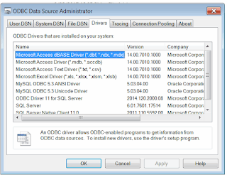

## 症状

SOLIDWORKS宏应该连接到数据库（如SQL、MySql、Oracle、MS Access等）或任何其他数据源（如MS Excel）。
宏无法读取/写入值或显示错误。

## 原因

在VBA宏中，连接到数据库或Excel的最常见方法是通过抽象层，如ADODB、ODBC、OLEDB。
为了连接到数据库，必须安装相应的驱动程序并提供有效的连接字符串。
驱动程序也是操作系统架构特定的（x32/x64）。

## 解决方法

* 查找使用的抽象层。通常会有类似以下代码的行。

~~~ vb
Set conn = CreateObject("ADODB.Connection")
Set records = CreateObject("ADODB.Recordset")
    
Dim xlsFilePath As String
xlsFilePath = swApp.GetCurrentMacroPathFolder() & "\" & EXCEL_FILE_NAME
    
conn.Open "Provider=Microsoft.ACE.OLEDB.12.0;" & _
        "Data Source=" & xlsFilePath & _
            ";Extended Properties=""Excel 8.0;HDR=Yes;"";"
~~~

* 确保安装了适当的驱动程序。对于SOLIDWORKS 2013及更高版本（检查x64系统的驱动程序）。
对于较旧的SOLIDWORKS版本，请检查x32版本）。通常可以从数据库供应商的网站或数据库安装包免费下载驱动程序。

{ width=320 height=245 }

* 根据需要修改连接字符串