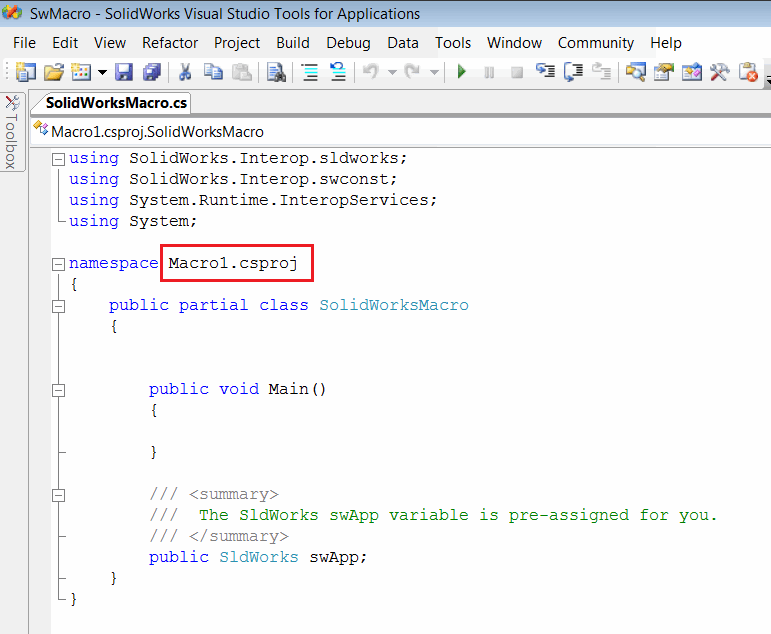
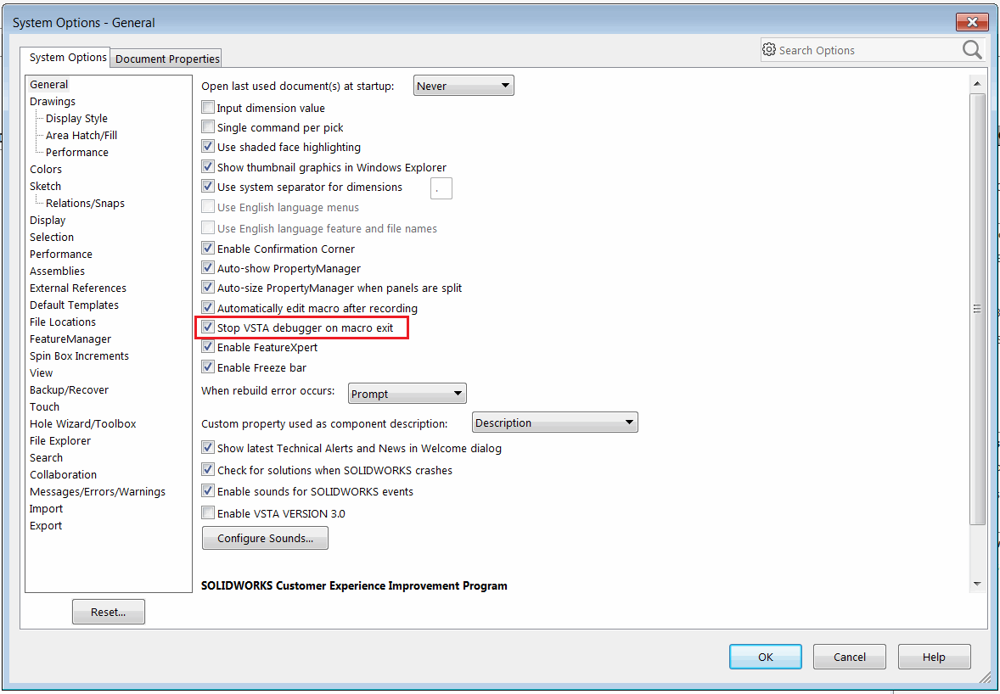

本文介绍如何从现有代码创建和运行VSTA宏（C#或VB.NET）

* 通过调用SOLIDWORKS菜单中的Tools->Macro->New命令创建新的宏
* 设置VSTA宏的过滤器（根据源代码选择.vbproj或.csproj）

{ width=450 }

* 复制或记住宏中的命名空间，如下图所示的*SolidWorksMacro.cs*文件中所示：

{ width=450 }

* 删除*SolidWorksMacro.cs*文件中的所有代码，并将新的源代码粘贴到其中

* 将命名空间修改为原始命名空间

> 如果不修改命名空间，将出现以下问题：[VSTA（C#或VB.NET）宏中的无效命名空间](/docs/codestack/solidworks-api/troubleshooting/macros/vsta-invalid-namespace/)

与VBA宏不同，VSTA宏必须编译为dll。在代码编辑器菜单中调用*Build->Compile*命令进行编译。您还可以直接点击绿色箭头按钮运行宏。一旦编译完成，dll将生成在宏的*bin\Release*文件夹中，并且完整路径将打印到*Output*窗口中，如下所示。

{ width=450 }

* 要运行VSTA宏，请从SOLIDWORKS菜单中打开*Tools->Macro->Run*命令，并选择VSTA宏（dll）的过滤器。

{ width=550 }

> 要运行宏，只需要二进制文件。因此，可以将*bin\Release*文件夹的内容复制到新位置或与其他用户共享。需要复制*bin\Release*文件夹的全部内容（而不仅仅是宏dll），以避免出现以下错误：[无法运行VSTA（C#或VB.NET）宏](/docs/codestack/solidworks-api/troubleshooting/macros/run-vsta-macro-error/)

### 保持VSTA宏运行

可以设置选项，在执行完成后继续运行VSTA宏。如果宏需要监视SOLIDWORKS事件并且在执行完成后不需要立即卸载，这将非常有用。要启用此行为，请在SOLIDWORKS菜单的*Tools->Options->System Options*对话框中取消选中*Stop VSTA debugger on macro exit*选项。

{ width=450 }