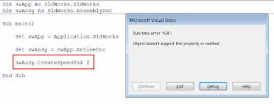
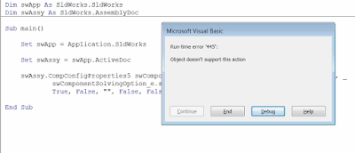
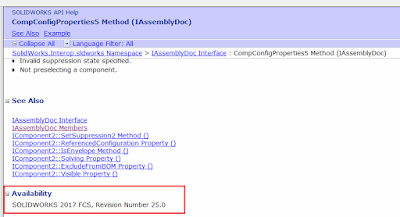
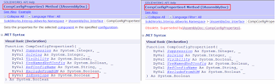

 修复在旧版本（非最新版本）SOLIDWORKS上运行时失败的宏，显示运行时错误'438' - 对象不支持此属性或方法或运行时错误'445' - 对象不支持此操作错误
image: object-doesnt-support-this-action.png
labels: [宏, 故障排除]
redirect-from:
  - /2018/04/macro-troubleshooting-macro-using-future-version-apis.html
---
## 症状

最近开发的SOLIDWORKS宏在旧版本（非最新版本）的SOLIDWORKS上运行。运行时，会显示*运行时错误'438'：对象不支持此属性或方法*。

{ width=400 height=151 }

或者可能显示*运行时错误'445'：对象不支持此操作*。

{ width=400 height=171 }

## 原因

SOLIDWORKS是[向后兼容](https://en.wikipedia.org/wiki/Backward_compatibility)的系统，这意味着旧版本的文件或API将与每个新版本兼容。但是SOLIDWORKS不是[向前兼容](https://en.wikipedia.org/wiki/Forward_compatibility)，这意味着不能在旧版本的软件中使用新的API。每个SOLIDWORKS版本都会向库中添加新的API，开发人员可以使用这些API编写宏。但是这些宏不能在旧版本的SOLIDWORKS中使用。

## 解决方法

* 检查SOLIDWORKS API帮助文档，查看错误中突出显示的方法的可访问性

{ width=400 height=216 }

* 如果最早可用版本较新，则需要用替代方法替换该方法

通常，SOLIDWORKS会使用索引命名方法，例如OpenDoc4、OpenDoc5、OpenDoc6，表示已废弃的版本。如果是这种情况，请尝试查看是否有旧版本的该方法可用。如果有，可以使用该方法。请注意，旧版本可能具有不同的参数集，因此仅更改版本号可能不足够。

{ width=400 height=122 }

* 如果没有旧方法可用，则需要使用替代方法重写宏的逻辑。
* 将SOLIDWORKS软件升级到最低支持的版本

以下是使用添加到SOLIDWORKS 2017的API的示例宏

~~~ vb
Dim swApp As SldWorks.SldWorks
Dim swAssy As SldWorks.AssemblyDoc

Sub main()

    Set swApp = Application.SldWorks
    
    Set swAssy = swApp.ActiveDoc
    
    swAssy.CompConfigProperties5 swComponentSuppressionState_e.swComponentSuppressed, _
            swComponentSolvingOption_e.swComponentRigidSolving, _
            True, False, "", False, False
    
End Sub

~~~

以下是使其与SOLIDWORKS 2005及更高版本兼容的修改后的宏

~~~ vb
Dim swApp As SldWorks.SldWorks
Dim swAssy As SldWorks.AssemblyDoc

Sub main()

    Set swApp = Application.SldWorks
    
    Set swAssy = swApp.ActiveDoc
    
    swAssy.CompConfigProperties4 swComponentSuppressionState_e.swComponentSuppressed, _
            swComponentSolvingOption_e.swComponentRigidSolving, _
            True, False, "", False
    
End Sub
~~~