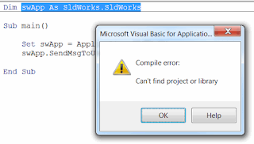
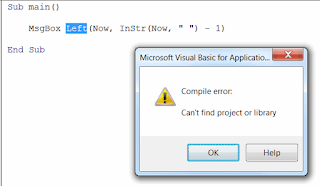
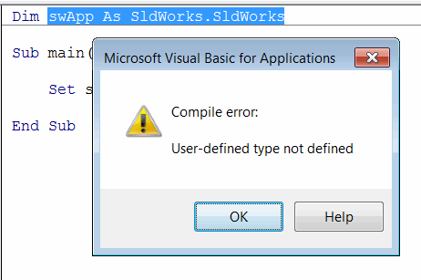
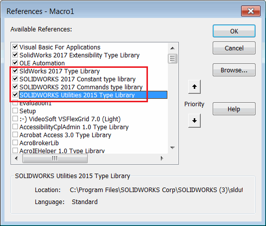
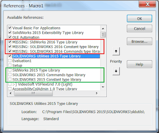

 修复遗留宏中的找不到项目或库错误
image: error-cant-find-project-or-library.png
labels: [宏, 故障排除]
redirect-from:
  - /2018/04/macro-troubleshooting-missing-solidworks-type-library-references.html
---
## 症状

* 从互联网下载的遗留SOLIDWORKS宏或一段时间前开发的宏无法运行。
* 显示*找不到项目或库错误*，并且SOLIDWORKS声明中的所有内容都被突出显示。

{ width=320 height=182 }

或者非SOLIDWORKS声明也可能被突出显示（例如Left或Mid函数）

{ width=320 height=185 }

* 如果宏中从未选择过这些库，则可能显示*编译错误：未定义的用户类型*。

{ width=200 }

## 原因

* 宏指向较旧版本的SOLIDWORKS类型库，无法自动解析它们。结果，这些库被标记为“MISSING”。

* SOLIDWORKS类型库从未被选择，或者在宏中明确取消选择（通常在将宏从*.swp宏转换时发生）

## 解决方法

* 通过"工具"->"宏"->"编辑"菜单打开宏进行[编辑](https://help.solidworks.com/2017/english/solidworks/sldworks/t_edit_macro.htm)
* 在VBA编辑器中导航到"工具"->"引用"菜单
* 如下所示选择SOLIDWORKS类型库。如果在"可用引用"列表中找不到库，请使用"浏览..."按钮，在SOLIDWORKS的安装文件夹中找到*sldworks.tlb*、*swconst.tlb*、*swcommands.tlb*。

{ width=200 }

* 如果已选择库或存在**MISSING**关键字，则需要按照以下步骤强制更新引用：

{ width=320 height=269 }

* 取消选中所有引用SOLIDWORKS的库（包括旁边带有**MISSING**关键字的库）
* 点击确定
* 再次打开相同的对话框，然后选中相应的SOLIDWORKS库。这些库通常在引用列表中可用。
如果没有，可以使用“浏览...”按钮从SOLIDWORKS安装文件夹中手动选择库。

或者，您可以将所有代码复制粘贴到新创建的宏中。