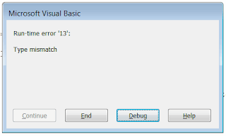
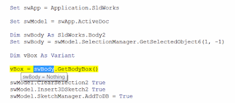

## 症状

运行处理活动模型或选择的SOLIDWORKS宏时，会出现*运行时错误'91'：对象变量或With块变量未设置*错误，或*运行时错误'13'：类型不匹配*错误，或以其他方式运行不正常。

{ width=320 height=191 }

## 原因

根据宏的功能，可能需要满足某些前提条件，例如打开零件或装配，或选择特定对象（例如实体、特征、尺寸等）。

如果宏没有正确处理错误并显示用户友好的消息，VBA环境将会失败。

## 解决方法

* 调查宏的前提条件。如果可能，请联系宏的开发人员，或比较它正常工作和不正常工作的条件之间的差异。
* 调查代码。检查在发生错误时哪一行代码被突出显示。
例如，如果*swModel*或*Part*变量为*Nothing*，则要求模型已打开。
如果从*GetSelectedObjectX*方法分配的对象为*Nothing*，则在运行宏之前选择不正确或没有选择任何对象。

{ width=400 height=175 }