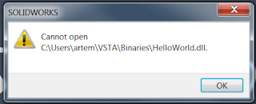
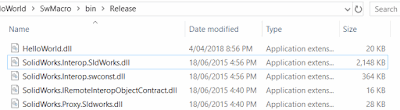
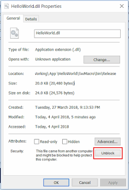

 修复运行 VSTA (C# 或 VB.NET) 宏时出现的无法打开错误
image: cannot-open-vsta-macro.png
labels: [宏, 故障排除]
redirect-from:
  - /2018/04/macro-troubleshooting-failed-to-run-vsta-macro.html
---
## 症状

无法运行 SOLIDWORKS VSTA (C# 或 VB.NET) 宏，显示 *无法打开* 错误。

{ width=320 height=129 }

## 原因

与 VBA 宏不同，VSTA 宏是基于 .NET Framework 的编译为进程内应用程序。

主要区别在于源代码和二进制文件（交付成果）是分开的元素。

为了运行宏，需要对其进行编译。.NET 应用程序使用互操作性与 COM 对象（如 SOLIDWORKS）进行通信。

这意味着需要将互操作性复制到本地以运行宏。

## 解决方法

* 将输出（bin）目录中的所有文件复制为交付成果。您可以排除 .pdb 和 .xml 文件，因为这些文件用于调试和文档目的。

{ width=400 height=108 }

* 如果宏没有提供这些文件，请尝试创建新的 VSTA 宏并复制缺少的文件。
* 如果宏（或 zip 归档文件）是从 Web 下载的，请确保文件没有被阻止，因为这可能会导致问题。

{ width=217 height=320 }