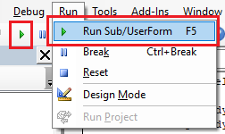

在SOLIDWORKS中运行宏的最简单方法是从“工具->宏->运行”菜单命令或工具栏调用它。

选择要运行的宏（对于VBA宏，可以是.swb或.swp文件；对于VSTA宏，可以是.dll文件）。除非宏明确编码为保持活动状态，或者对于VSTA宏，*设置*中的*在宏退出时停止VSTA调试器*选项被选中，否则宏在执行完成后会从内存中卸载。

还可以直接从VBA编辑器中运行宏，方法是从菜单/工具栏或使用*F10*快捷键[打开编辑](/docs/codestack/solidworks-api/getting-started/macros/edit/)。

或者，可以从[宏按钮](/docs/codestack/solidworks-api/getting-started/macros/macro-buttons/)或[在SOLIDWORKS会话启动时](/docs/codestack/solidworks-api/getting-started/macros/run-macro-on-solidworks-start/)的命令行中运行宏。