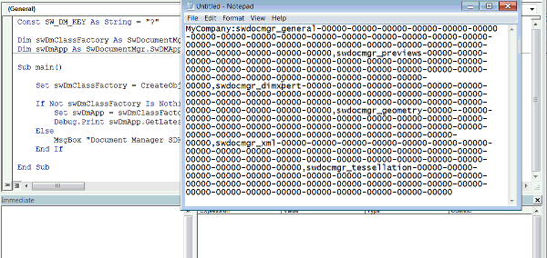

 Fixing the Compile error - Invalid outside procedure error when placing the long text into the VBA macro variable
image: doc-mgr-key-too-long.gif
labels: [macro, troubleshooting]
redirect-from:
  - /2018/04/macro-troubleshooting-too-long-vba-macro-line.html
---
## Symptoms

* SOLIDWORKS VBA macro is utilizing Document Manager APIs and new license was generated.
When generated license is placed into the macro some text highlighted red and *Compile error: Invalid outside procedure error* is displayed
* Macro is inserting static text into the note or custom properties. Text is replaced with new long text. Inserted string is highlighted and macro doesn't run

## Cause

Maximum number of symbols in a single line of VBA code is 1023.
It is not possible to insert more symbols without explicitly splitting the lines.
Pasting the line longer than the limit from the buffer will cause compilation errors.  

## Resolution

Split the line into multiple lines (no longer than 1023 symbols in single line) and use "string1" & _ "string2" to concatenate the lines.  

~~~ vb
Const SW_DM_KEY As String = "MyCompany:swdocmgr_general-00000-00000-00000-00000-00000-00000-00000-00000-00000-00000-00000-00000-00000-00000-00000-00000-00000-00000-00000-00000-00000-00000-00000-00000-00000-00000-00000-00000-00000-00000-00000," & _
"swdocmgr_previews-00000-00000-00000-00000-00000-00000-00000-00000-00000-00000-00000-00000-00000-00000-00000-00000-00000-00000-00000-00000-00000-00000-00000-00000-00000-00000-00000-00000-00000-00000-00000," & _
"swdocmgr_dimxpert-00000-00000-00000-00000-00000-00000-00000-00000-00000-00000-00000-00000-00000-00000-00000-00000-00000-00000-00000-00000-00000-00000-00000-00000-00000-00000-00000-00000-00000-00000-00000," & _
"swdocmgr_geometry-00000-00000-00000-00000-00000-00000-00000-00000-00000-00000-00000-00000-00000-00000-00000-00000-00000-00000-00000-00000-00000-00000-00000-00000-00000-00000-00000-00000-00000-00000-00000-00000," & _
"swdocmgr_xml-00000-00000-00000-00000-00000-00000-00000-00000-00000-00000-00000-00000-00000-00000-00000-00000-00000-00000-00000-00000-00000-00000-00000-00000-00000-00000-00000-00000-00000-00000-00000," & _
"swdocmgr_tessellation-00000-00000-00000-00000-00000-00000-00000-00000-00000-00000-00000-00000-00000-00000-00000-00000-00000-00000-00000-00000-00000-00000-00000-00000-00000-00000-00000-00000-00000-00000-00000"

Dim swDmClassFactory As SwDocumentMgr.swDmClassFactory
Dim swDmApp As SwDocumentMgr.SwDMApplication

Sub main()

    Set swDmClassFactory = CreateObject("SwDocumentMgr.SwDMClassFactory")
    
    If Not swDmClassFactory Is Nothing Then
        Set swDmApp = swDmClassFactory.GetApplication(SW_DM_KEY)
        Debug.Print swDmApp.GetLatestSupportedFileVersion()
    Else
        MsgBox "Document Manager SDK is not installed"
    End If
    
End Sub
~~~

