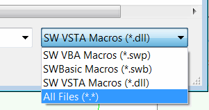
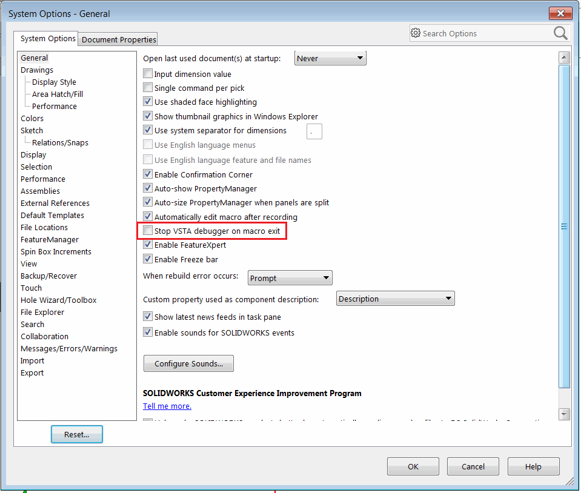

 本文介绍SOLIDWORKS支持的不同类型的宏（VBA、VSTA、SWBasic）
image: macro-edit-run-filters.png
labels: [宏, VSTA, VBA, SWMacro, SWB, SWP]
sidebar_position: 1
---
{ width=200 }

宏可以直接在内置的VBA编辑器中进行编辑，并且可以在SOLIDWORKS中使用开箱即用的引擎执行。运行宏不需要安装任何额外的软件（唯一的例外是需要独立安装Visual Studio的VSTA 3.0宏）。

## VBA宏（*.swp）

这可能是最流行的宏类型。这些宏基于VBA7（适用于SOLIDWORKS 2015及更新版本）和VBA6（适用于旧版本）。VBA6和VBA7是从Visual Basic 6派生的语言。因此，所有的语法都是相同的。有关该语言的更多文档，请参阅[Visual Basic教程](/docs/codestack/visual-basic)。

宏以二进制格式保存，扩展名为*.swb，并且只能由SOLIDWORKS VBA编辑器查看和编辑。

## SWBasic宏（*.swb）

与*.swp宏类似，这些宏类型也基于VBA6和VBA7语言。唯一的区别是这些宏以纯文本格式保存，扩展名为*.swp。

这使得宏可以在SOLIDWORKS环境之外使用任何文本编辑器（如记事本）进行阅读和编辑。当宏代码在诸如SVN或GIT等版本控制服务中进行维护时，这尤其有用。

这些宏不能引用任何第三方类型库（如Excel、文件系统对象等），只能包含对SOLIDWORKS类型库的引用。如果需要使用任何第三方类型库，可以通过[后期绑定](/docs/codestack/visual-basic/variables/declaration/#early-binding-and-late-binding)来实现。

这些宏只能有一个[模块](/docs/codestack/visual-basic/modules/)，不能使用[类](/docs/codestack/visual-basic/classes/)或[用户窗体](/docs/codestack/visual-basic/user-forms/)。

## C#和VB.NET VSTA宏

**V**isual **ST**udio for **A**pplication（VSTA）宏基于.NET语言（C#或VB.NET），提供了更大的灵活性，并利用了.NET框架的强大功能，使宏能够访问各种库、第三方组件和面向对象编程（OOP）范例。

与VBA宏不同，VSTA宏将项目与源代码（*.csproj、*.vbproj）分开进行编辑，并输出二进制文件（*.dll）以运行宏。因此，二进制文件可以在没有源代码的情况下使用。

VSTA宏是进程内应用程序，可以在主函数完成后自动释放内存或继续执行。

此行为由以下选项控制：

{ width=350 }

如果取消选中此选项，宏将保留加载到内存中，直到单击**停止**按钮。当宏执行任何异步操作（如处理事件或显示属性管理器页面）时，这是一个有用的选项。

VSTA宏基于.NET Framework 2.0，并可以使用内置的VSTA编辑器进行编辑和调试。

在SOLIDWORKS 2018中引入了新的VSTA 3.0版本，但仍然支持旧版本的VSTA。可以通过以下选项来控制目标版本：

{ width=350 }

VSTA 3.0需要独立安装Visual Studio（专业版或社区版均可）。VSTA 3.0的主要优点是能够使用更新版本的.NET Framework。