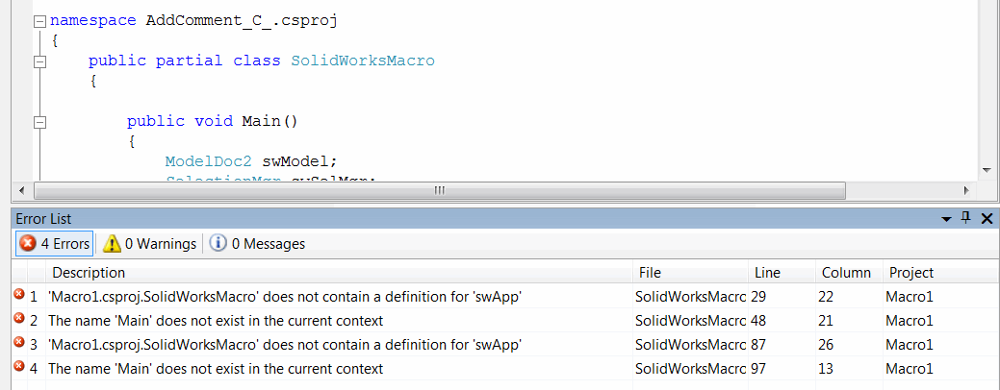
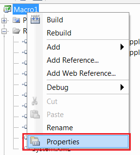
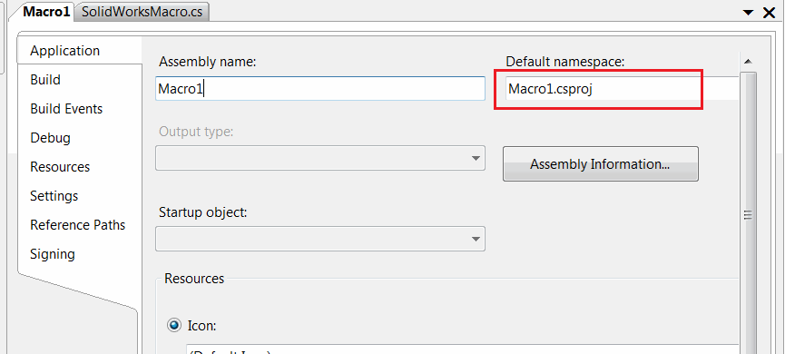
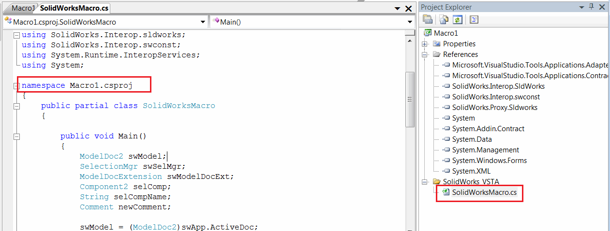

## 症状

将SOLIDWORKS VSTA宏（C#或VB.NET）的示例代码从SOLIDWORKS API帮助文档或任何其他来源复制到代码中时，会显示多个编译错误：

* MacroName.SolidWorksMacro不包含'SwApp'的定义
* 当前上下文中不存在名称'Main'

{ width=450 }

## 原因

VSTA宏基于多个连接的文件，这些文件必须位于相同的命名空间中。当创建新宏时，命名空间可能与示例源代码中使用的命名空间不相等。

~~~ cs
namespace MacroName.csproj
{
  ...
}
~~~

## 解决方法

将*SolidWorksMacro.cs*文件中的命名空间更改为与默认命名空间匹配

* 打开项目属性页面

{ width=250 }

* 复制*应用程序*选项卡中的*默认命名空间*字段中的值

{ width=350 }

* 将命名空间重命名为复制的值

{ width=500 }

* 重新构建宏