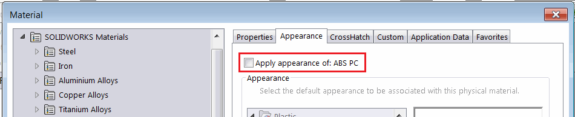

This example demonstrates how to change the *Apply Appearance* option in the material options using SOLIDWORKS API.

~~~ vb
Dim swApp As SldWorks.SldWorks
Dim swPart As SldWorks.PartDoc

Sub main()

    Set swApp = Application.SldWorks
    
    Set swPart = swApp.ActiveDoc
    
    If Not swPart Is Nothing Then
        
        Dim swMatVisPrps As SldWorks.MaterialVisualPropertiesData
        Set swMatVisPrps = swPart.GetMaterialVisualProperties
        swMatVisPrps.ApplyAppearance = False
        
        swPart.SetMaterialVisualProperties swMatVisPrps, swInConfigurationOpts_e.swAllConfiguration, Empty
    Else
        MsgBox "Please open part document"
    End If
    
End Sub
~~~

