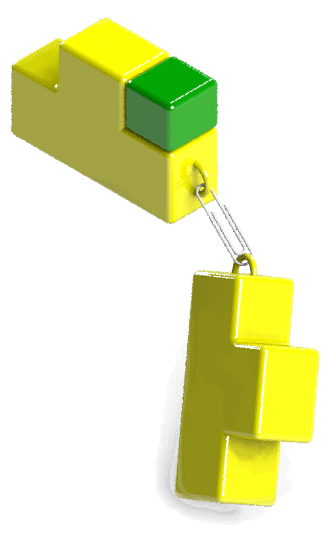

 A collection of combinations and code examples for mating relationships
image: assembly-mating.png
labels: [Assembly, Mating Relationships]
sidebar_position: 1
---
{ width=200 }

You can programmatically mate assembly components using the [SOLIDWORKS API method IAssemblyDoc::AddMate3](https://help.solidworks.com/2012/english/api/sldworksapi/SOLIDWORKS.Interop.sldworks~SOLIDWORKS.Interop.sldworks.IAssemblyDoc~AddMate3.html) (or its updated version).

Different markers are used to identify selected objects for different types of mates. Refer to the SOLIDWORKS API Help documentation for the marker values specific to each mating relationship, or use the SOLIDWORKS Macro Recorder to capture the correct markers.