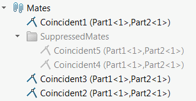

{ width=250 }

这个VBA宏允许使用SOLIDWORKS API将所有被压制的约束移动到指定的特征管理器文件夹中。如果文件夹不存在，宏将创建文件夹，如果文件夹已经存在，则将移动到已存在的文件夹中。

如果文件夹中存在未被压制的约束，宏也会将它们移动到文件夹中。

要配置文件夹名称，请更改*FOLDER_NAME*变量的值：

``` vb
Const FOLDER_NAME As String = "<文件夹名称>"
```

``` vb
Const FOLDER_NAME As String = "被压制的约束"

Dim swApp As SldWorks.SldWorks

Sub main()

    Set swApp = Application.SldWorks
    
    Dim swAssy As SldWorks.AssemblyDoc
    
    Set swAssy = swApp.ActiveDoc
    
    If Not swAssy Is Nothing Then
            
        Dim vSuppMates As Variant
        vSuppMates = GetAllSuppressedMates(swAssy)
        
        If Not IsEmpty(vSuppMates) Then
        
            Dim swFolderFeat As SldWorks.Feature
            Set swFolderFeat = swAssy.FeatureByName(FOLDER_NAME)
            
            If swFolderFeat Is Nothing Then
                InsertMatesIntoNewFolder swAssy, vSuppMates, FOLDER_NAME
            Else
                Dim swFolder As SldWorks.FeatureFolder
                Set swFolder = swFolderFeat.GetSpecificFeature2()
                vSuppMates = ObjectArrayExcept(vSuppMates, swFolder.GetFeatures())
                
                If Not IsEmpty(vSuppMates) Then
                    InsertMatesIntoExistingFolder swAssy, vSuppMates, swFolderFeat
                End If
                
                MoveUnsuppressedMatesFromFolder swAssy, swFolderFeat
                
            End If
            
        End If
        
    Else
        MsgBox "请打开装配体"
    End If
    
End Sub

Sub InsertMatesIntoNewFolder(assm As SldWorks.AssemblyDoc, mates As Variant, folderName As String)
    
    Dim swModel As SldWorks.ModelDoc2
    Set swModel = assm
    
    If swModel.Extension.MultiSelect2(mates, False, Nothing) = UBound(mates) + 1 Then
        
        Set swFolderFeat = swModel.FeatureManager.InsertFeatureTreeFolder2(swFeatureTreeFolderType_e.swFeatureTreeFolder_Containing)
                
        swFolderFeat.Name = folderName
        
    Else
        Err.Raise vbError, "", "选择要添加到新文件夹的约束失败"
    End If
    
End Sub

Sub InsertMatesIntoExistingFolder(assy As SldWorks.AssemblyDoc, mates As Variant, folderFeat As SldWorks.Feature)
    
    Dim swLastFeatInFolder As SldWorks.Feature
    
    While folderFeat.GetTypeName2() <> "FtrFolder" Or InStr(folderFeat.Name, "___EndTag___") = 0
        Set swLastFeatInFolder = folderFeat
        Set folderFeat = folderFeat.GetNextSubFeature
    Wend
    
    If swLastFeatInFolder.GetTypeName2() = "FtrFolder" Then
        Err.Raise vbError, "", "不支持。文件夹为空"
    End If
    
    Dim swModel As SldWorks.ModelDoc2
    Set swModel = assy
    
    Dim i As Integer
    
    For i = 0 To UBound(mates)
            
        Dim swMateFeat As SldWorks.Feature
        Set swMateFeat = mates(i)
        
        'swMoveLocation_e.swMoveToFolder选项不起作用，需要在文件夹中的最后一个约束之后移动
        If False = swModel.Extension.ReorderFeature(swMateFeat.Name, swLastFeatInFolder.Name, swMoveLocation_e.swMoveAfter) Then
            Err.Raise vbError, "", "将约束移动到文件夹失败"
        End If
    
        Set swLastFeatInFolder = swMateFeat
    Next
    
End Sub

Sub MoveUnsuppressedMatesFromFolder(assy As SldWorks.AssemblyDoc, folderFeat As SldWorks.Feature)
    
    Dim swModel As SldWorks.ModelDoc2
    Set swModel = assy
    
    Dim swFolder As SldWorks.FeatureFolder
    Set swFolder = folderFeat.GetSpecificFeature2
    
    Dim vMates As Variant
    vMates = swFolder.GetFeatures
    
    If Not IsEmpty(vMates) Then
        
        Dim i As Integer
        
        For i = 0 To UBound(vMates)
            
            Dim swMateFeat As SldWorks.Feature
            Set swMateFeat = vMates(i)
            
            If False = swMateFeat.IsSuppressed2(swInConfigurationOpts_e.swThisConfiguration, Empty)(0) Then
                If False = swModel.Extension.ReorderFeature(swMateFeat.Name, "", swMoveLocation_e.swMoveToEnd) Then
                    Err.Raise vbError, "", "将约束移出文件夹失败"
                End If
            End If
            
        Next
        
    End If
    
End Sub

Function GetAllSuppressedMates(assm As SldWorks.AssemblyDoc) As Variant
    
    Dim swSuppMates() As SldWorks.Feature
    Dim isInit As Boolean
    isInit = False
    
    Dim vMates As Variant
    vMates = GetAllMates(assm)
    
    If Not IsEmpty(vMates) Then
        
        Dim i As Integer
        For i = 0 To UBound(vMates)
            
            Dim swMateFeat As SldWorks.Feature
            Set swMateFeat = vMates(i)
            
            If swMateFeat.IsSuppressed2(swInConfigurationOpts_e.swThisConfiguration, Empty)(0) Then
                If isInit Then
                    ReDim Preserve swSuppMates(UBound(swSuppMates) + 1)
                Else
                    ReDim swSuppMates(0)
                    isInit = True
                End If
                Set swSuppMates(UBound(swSuppMates)) = swMateFeat
            End If
        Next
        
    End If
    
    GetAllSuppressedMates = swSuppMates
    
End Function

Function GetAllMates(assm As SldWorks.AssemblyDoc) As Variant
    
    Dim swMates() As SldWorks.Feature
    Dim isInit As Boolean
    isInit = False
    
    Dim swModel As SldWorks.ModelDoc2
    Set swModel = assm
    
    Dim swMateGroupFeat As SldWorks.Feature
    
    Dim featIndex As Integer
    featIndex = 0
        
    Do
        Set swMateGroupFeat = swModel.FeatureByPositionReverse(featIndex)
        
        featIndex = featIndex + 1
    Loop While swMateGroupFeat.GetTypeName2() <> "MateGroup"
    
    Dim swMateFeat As SldWorks.Feature
    
    Set swMateFeat = swMateGroupFeat.GetFirstSubFeature
    
    While Not swMateFeat Is Nothing
        
        If TypeOf swMateFeat.GetSpecificFeature2() Is SldWorks.Mate2 Then
            If isInit Then
                ReDim Preserve swMates(UBound(swMates) + 1)
            Else
                ReDim swMates(0)
                isInit = True
            End If
            Set swMates(UBound(swMates)) = swMateFeat
        End If
        
        Set swMateFeat = swMateFeat.GetNextSubFeature
    Wend
    
    GetAllMates = swMates
    
End Function

Function ObjectArrayExcept(mainArr As Variant, except As Variant) As Variant
    
    Dim retVal() As Object
    Dim isInit As Boolean
    
    Dim i As Integer
    
    For i = 0 To UBound(mainArr)
        
        Dim item As Object
        Set item = mainArr(i)
        
        If Not ObjectArrayContains(except, item) Then
            If isInit Then
                ReDim Preserve retVal(UBound(retVal) + 1)
            Else
                ReDim retVal(0)
                isInit = True
            End If
            Set retVal(UBound(retVal)) = item
        End If
            
    Next
    
    If isInit Then
        ObjectArrayExcept = retVal
    Else
        ObjectArrayExcept = Empty
    End If
    
End Function

Function ObjectArrayContains(arr As Variant, item As Object) As Boolean
    
    Dim i As Integer
    
    For i = 0 To UBound(arr)
        If arr(i) Is item Then
            ObjectArrayContains = True
            Exit Function
        End If
    Next
    
    ObjectArrayContains = False
    
End Function
```