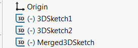

这个VBA宏使用SOLIDWORKS API将选定的草图（2D和3D）合并为一个单独的3D草图。该宏使用转换实体API将源草图的实体复制到目标草图中。

## 选项

可以通过更改宏开头的常量的值来配置宏

* *DELETE_SOURCE_SKETCHES* - 设置为True以删除原始源草图，设置为False以不删除
* *NEW_SKETCH_NAME* - 新生成的合并草图的名称，设置为空字符串以使用默认自动生成的名称

~~~ vb
Const DELETE_SOURCE_SKETCHES As Boolean = True '删除所有源草图
Const NEW_SKETCH_NAME As String = "MergedSketch" '新合并的草图将被命名为“MergedSketch”
~~~

## 注意事项

* 组件装配或绘图中的草图也受支持
* 源草图的关系和尺寸不会复制到目标草图中
* 草图将合并到活动的3D草图中，或者将自动创建新的3D草图

与[按类型选择特征](/docs/codestack/solidworks-api/document/selection/select-features-by-type/)一起使用此宏来选择要合并的所有草图。

~~~ vb
Const DELETE_SOURCE_SKETCHES As Boolean = False
Const NEW_SKETCH_NAME As String = ""

Dim swApp As SldWorks.SldWorks

Sub main()

    Set swApp = Application.SldWorks
    
    Dim swModel As SldWorks.ModelDoc2
    
try:
        
    On Error GoTo catch
        
    Set swModel = swApp.ActiveDoc
    
    If Not swModel Is Nothing Then
        MergeSelectedSketches swModel
    Else
        Err.Raise vbError, "", "请打开模型"
    End If
    
    GoTo finally
    
catch:
    Debug.Print Err.Number
    swApp.SendMsgToUser2 Err.Description, swMessageBoxIcon_e.swMbStop, swMessageBoxBtn_e.swMbOk
finally:

End Sub

Sub MergeSelectedSketches(model As SldWorks.ModelDoc2)
    
    Dim swSketch As SldWorks.Sketch
        
    If Not model.SketchManager.ActiveSketch Is Nothing Then
        If False = model.SketchManager.ActiveSketch.Is3D() Then
            Err.Raise vbError, "", "只支持将3D草图作为目标草图"
        End If
    End If
    
    Dim vSketchSegs As Variant
    Dim vSketches As Variant
    vSketchSegs = GetSelectedSketchSegments(model, vSketches)
    
    If model.SketchManager.ActiveSketch Is Nothing Then
        model.ClearSelection2 True
        model.SketchManager.Insert3DSketch True
    End If
    
    Dim swTargetSketch As SldWorks.Feature
    
    If model.Extension.MultiSelect2(vSketchSegs, False, Nothing) = UBound(vSketchSegs) + 1 Then
    
        model.SketchManager.SketchUseEdge3 False, False
        
        Set swTargetSketch = model.SketchManager.ActiveSketch
        
        model.SketchManager.ActiveSketch.RelationManager.DeleteAllRelations
                
        model.SketchManager.Insert3DSketch True
    Else
        Err.Raise vbError, "", "选择草图失败"
    End If
    
    If DELETE_SOURCE_SKETCHES Then
        If model.Extension.MultiSelect2(vSketches, False, Nothing) = UBound(vSketches) + 1 Then
            model.Extension.DeleteSelection2 swDeleteSelectionOptions_e.swDelete_Absorbed
        Else
            Err.Raise vbError, "", "选择要删除的草图失败"
        End If
    End If
    
    If NEW_SKETCH_NAME <> "" Then
        swTargetSketch.Name = NEW_SKETCH_NAME
    End If
    
End Sub

Function GetSelectedSketchSegments(model As SldWorks.ModelDoc2, ByRef vSketches As Variant) As Variant
    
    Dim swSketches() As SldWorks.Feature
    Dim isSkArrInit As Boolean
    isSkArrInit = False
    
    Dim swSketchSegs() As SldWorks.SketchSegment
    Dim isInit As Boolean
    isInit = False
    
    Dim swSelMgr As SldWorks.SelectionMgr
    Set swSelMgr = model.SelectionManager
    
    Dim i As Integer
    
    For i = 1 To swSelMgr.GetSelectedObjectCount2(-1)
        
        If swSelMgr.GetSelectedObjectType3(i, -1) = swSelectType_e.swSelSKETCHES Then
            
            Dim swFeat As SldWorks.Feature
            Set swFeat = swSelMgr.GetSelectedObject6(i, -1)
            
            If Not isSkArrInit Then
                isSkArrInit = True
                ReDim swSketches(0)
            Else
                ReDim Preserve swSketches(UBound(swSketches) + 1)
            End If
            
            Set swSketches(UBound(swSketches)) = swFeat
            
            Dim swSketch As SldWorks.Sketch
            Set swSketch = swFeat.GetSpecificFeature2
            
            Dim vSegs As Variant
            vSegs = swSketch.GetSketchSegments
            
            Dim j As Integer
            
            If Not IsEmpty(vSegs) Then
                                
                For j = 0 To UBound(vSegs)
                                
                    If Not isInit Then
                        ReDim swSketchSegs(0)
                        isInit = True
                    Else
                        ReDim Preserve swSketchSegs(UBound(swSketchSegs) + 1)
                    End If
                    
                    Set swSketchSegs(UBound(swSketchSegs)) = vSegs(j)
                
                Next
                
            End If
            
        End If
    Next
    
    GetSelectedSketchSegments = swSketchSegs
    
    If isSkArrInit Then
        vSketches = swSketches
    End If
    
End Function
~~~