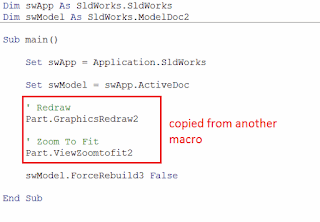

## 症状

SOLIDWORKS宏在独立工作时正常，但在合并为一个宏后无法工作。可能会显示错误：*运行时错误'424'：对象所需*

{ width=320 height=193 }

## 原因

* 合并的宏可能不兼容
* 源宏中可能存在需要初始化的内容，但未复制到目标宏中
* 源宏和目标宏之间的变量命名可能不同

{ width=320 height=221 }

## 解决方法

* 确定哪一行出错
* 检查变量的状态。将鼠标悬停在变量上，查看是否在工具提示中显示为*Nothing*。
* 确保正确复制了宏的相应部分
* 确保也复制了所需的初始化内容（如果适用）
* 确保变量命名一致