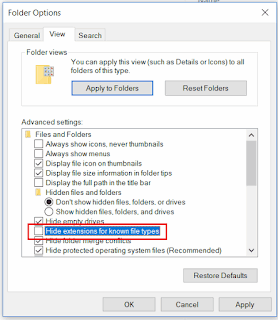

## 症状

SOLIDWORKS宏使用模型的标题（例如插入注释、链接自定义属性值、生成导出文件的新文件名）。
结果宏表现异常（扩展名重复插入）或显示错误：*运行时错误'5'：无效的过程调用或参数*。

扩展名通过[SOLIDWORKS API方法IModelDoc2::GetTitle](https://help.solidworks.com/2018/english/api/sldworksapi/solidworks.interop.sldworks~solidworks.interop.sldworks.imodeldoc2~gettitle.html)从文档标题中提取。

{ width=640 height=211 }

## 原因

有几个因素会影响标题向用户显示的方式：

* 模型标题中的扩展名显示取决于Windows设置中的“隐藏已知文件类型的扩展名”选项。
根据此设置，模型的标题可以包含或不包含扩展名（例如*Part1*或*Part1.sldprt*）。

{ width=277 height=320 }

* 对于新创建的文件（即从未保存过的文件），不会显示扩展名。
* 对于绘图，标题由名称和活动图纸组成。绘图不显示扩展名。

## 解决方法

* 根据宏的要求更改设置。
* 修改宏代码以考虑两种选项。下面的示例提供了两个函数，无论条件如何，都可以获取带有或不带有扩展名的标题。

~~~ vb
Dim swApp As SldWorks.SldWorks
Dim swModel As SldWorks.ModelDoc2

Sub main()

    Set swApp = Application.SldWorks

    Set swModel = swApp.ActiveDoc
    
    If Not swModel Is Nothing Then
    
        Debug.Print GetTitleWithoutExtension(swModel)
        Debug.Print GetTitleWithExtension(swModel)
        
    Else
        MsgBox "请打开模型"
    End If
    
End Sub

Function GetTitleWithExtension(model As SldWorks.ModelDoc2) As String
    
    Dim title As String
    Dim ext As String
    
    Select Case model.GetType
        Case swDocumentTypes_e.swDocPART
            ext = ".sldprt"
        Case swDocumentTypes_e.swDocASSEMBLY
            ext = ".sldasm"
        Case swDocumentTypes_e.swDocDRAWING
            ext = ".slddrw"
    End Select
    
    If model.GetPathName() = "" Then
        title = model.GetTitle + ext '未保存的文件不显示扩展名
    Else
        If IsExtensionShown() Then
            title = model.GetTitle
        Else
            title = model.GetTitle + ext
        End If
    End If
    
    If model.GetType() = swDocumentTypes_e.swDocDRAWING Then
        title = model.GetTitle() '绘图标题中不包含扩展名
        title = Left(title, InStrRev(title, "-") - 2) + ext '从绘图标题中删除图纸名称
    End If
    
    GetTitleWithExtension = title
    
End Function

Function GetTitleWithoutExtension(model As SldWorks.ModelDoc2) As String
    
    Const EXT_PATTERN = ".sldxxx"
    
    Dim title As String
    
    If model.GetPathName() = "" Then
        title = model.GetTitle '未保存的文件不显示扩展名
    Else
        If IsExtensionShown() Then
            title = model.GetTitle
            title = Left(title, Len(title) - Len(EXT_PATTERN))
        Else
            title = model.GetTitle
        End If
    End If
    
    If model.GetType() = swDocumentTypes_e.swDocDRAWING Then
        title = Left(title, InStrRev(title, "-") - 2)
    End If
    
    GetTitleWithoutExtension = title
    
End Function

Function IsExtensionShown() As Boolean

    Const REG_KEY As String = "HKEY_CURRENT_USER\Software\Microsoft\Windows\CurrentVersion\Explorer\Advanced\HideFileExt"
    Const UNCHECKED As Integer = 0
    
    Dim wshShell As Object
    Set wshShell = CreateObject("WScript.Shell")
    
    IsExtensionShown = wshShell.RegRead(REG_KEY) = UNCHECKED

End Function
~~~