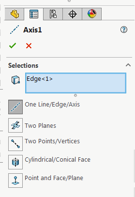

{ width=250 }

此VBA示例演示了如何使用SOLIDWORKS API修改轴特征的定义并更改选择。

* 首先选择要修改的目标轴特征
* 选择要设置为目标轴参考的对象。例如，两个相交的平面、边等。

结果是所选对象（倒数第二个）将被分配给轴（第一个选择）。

~~~ vb
Dim swApp As SldWorks.SldWorks

Sub main()

    Set swApp = Application.SldWorks
    
    Dim swModel As SldWorks.ModelDoc2
    Dim swSelMgr As SldWorks.SelectionMgr

    Set swModel = swApp.ActiveDoc
    
    Set swSelMgr = swModel.SelectionManager
    
    Dim swFeat As SldWorks.Feature
    Set swFeat = swSelMgr.GetSelectedObject6(1, -1)
    
    If Not swFeat Is Nothing Then
    
        Dim swAxisFeatDef As SldWorks.RefAxisFeatureData
        Set swAxisFeatDef = swFeat.GetDefinition
        
        Dim i As Integer
        
        Dim swRefs() As Object
        ReDim swRefs(swSelMgr.GetSelectedObjectCount2(-1) - 2)
        
        For i = 2 To swSelMgr.GetSelectedObjectCount2(-1)
            Set swRefs(i - 2) = swSelMgr.GetSelectedObject6(i, -1)
        Next
        
        swAxisFeatDef.AccessSelections swModel, Nothing
        
        swAxisFeatDef.SetSelections swRefs
        
        swFeat.ModifyDefinition swAxisFeatDef, swModel, Nothing
        
    End If
    
End Sub
~~~