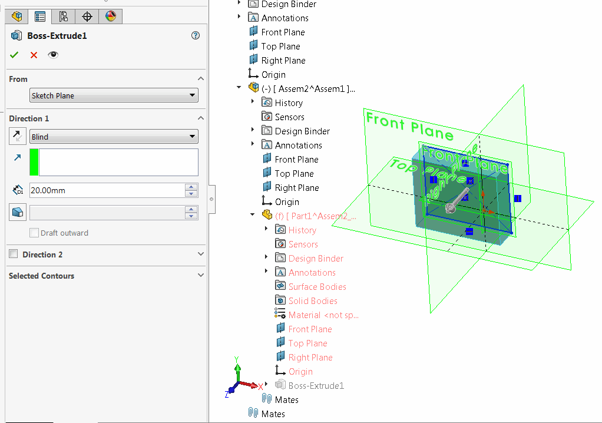

{ width=450 }

This example demonstrates how to modify feature definition in the context of the assembly using SOLIDWORKS API.

The steps performed in the macro are equivalent of the following steps in SOLIDWORKS User Interface

* Select component of the part which contains extrusion
* Select 'Edit Part' menu in the context menu of the component
* Select extrusion feature and click 'Edit' command from the context menu
* Modify the value of the extrusion in the forward direction
* Click green tick
* Exit the edit part mode

When editing feature in the assembly it is important to follow the correct [Assembly Context](/docs/codestack/solidworks-api/document/assembly/context/).

* Example below is implemented as VSTA3 macro
* Select component of the part in the assembly
* Specify the name of the extrude feature as the value of the *EXTRUDE_FEAT_NAME* variable
~~~ cs
const string EXTRUDE_FEAT_NAME = "Boss-Extrude1";
~~~
* Run macro. As the result the value of the extrusion is changed to the value of *EXTRUDE_DEPTH* variable (in meters)
~~~ cs
const double EXTRUDE_DEPTH = 0.02;
~~~

~~~ cs
using System;
using SolidWorks.Interop.sldworks;
using SolidWorks.Interop.swconst;

namespace ModifyFeatureInContextOfAssembly
{
    public partial class SolidWorksMacro
    {
        public void Main()
        {
            const string EXTRUDE_FEAT_NAME = "Boss-Extrude1";
            const double EXTRUDE_DEPTH = 0.02;
			
            try
            {
                SetExtrudeDepth(swApp.IActiveDoc2 as IAssemblyDoc,
                    swApp.IActiveDoc2.ISelectionManager.GetSelectedObjectsComponent3(1, -1) as IComponent2,
                    EXTRUDE_FEAT_NAME, EXTRUDE_DEPTH);
            }
            catch(Exception ex)
            {
                swApp.SendMsgToUser2(ex.Message, (int)swMessageBoxIcon_e.swMbStop, (int)swMessageBoxBtn_e.swMbOk);
            }

            return;
        }

        private void SetExtrudeDepth(IAssemblyDoc assy, IComponent2 comp, string extrudeFeatName, double depth)
        {
            if (comp != null)
            {
                if (comp.GetSuppression() == (int)swComponentSuppressionState_e.swComponentLightweight ||
                    comp.GetSuppression() == (int)swComponentSuppressionState_e.swComponentFullyLightweight)
                {
                    if (comp.SetSuppression2((int)swComponentSuppressionState_e.swComponentResolved) != (int)swSuppressionError_e.swSuppressionChangeOk)
                    {
                        throw new InvalidOperationException("Failed to set component state to resolved");
                    }
                }
                else if (comp.GetSuppression() == (int)swComponentSuppressionState_e.swComponentSuppressed)
                {
                    throw new NotSupportedException("Suppressed component is not supported");
                }

                var feat = comp.FeatureByName(extrudeFeatName);

                if (feat == null)
                {
                    throw new MissingMemberException("Feature is not found in the component");
                }

                if (comp.Select4(false, null, false))
                {
                    int info = -1;
                    if (assy.EditPart2(true, false, ref info) == (int)swEditPartCommandStatus_e.swEditPartSuccessful)
                    {
                        var featData = feat.GetDefinition() as IExtrudeFeatureData2;

                        if (featData != null)
                        {
                            if (featData.AccessSelections(assy, comp))
                            {
                                featData.SetDepth(true, depth);
                                if (feat.ModifyDefinition(featData, assy, comp))
                                {
                                    (assy as IModelDoc2).ClearSelection2(true);
                                    assy.EditAssembly();//Exit edit part mode
                                }
                                else
                                {
                                    throw new Exception("Failed to set the depth to the feature");
                                }
                            }
                            else
                            {
                                throw new InvalidOperationException("Failed to access feature");
                            }
                        }
                        else
                        {
                            throw new InvalidCastException("Selected feature is not an extrude feature");
                        }
                    }
                    else
                    {
                        throw new InvalidOperationException("Failed to edit part");
                    }
                }
                else
                {
                    throw new InvalidOperationException("Failed to select component");
                }
            }
            else
            {
                throw new Exception("Select component");
            }
        }

        public SldWorks swApp;
    }
}
~~~

