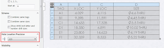

This example demonstrates how to change the precision for the hole locations in the selected Hole Table using SOLIDWORKS API.

{ width=320 height=95 }

~~~ vb
Dim swApp As SldWorks.SldWorks
Dim swModel As SldWorks.ModelDoc2
Dim swSelMgr As SldWorks.SelectionMgr

Sub main()
    
    On Error Resume Next
    
    Set swApp = Application.SldWorks
    
    Set swModel = swApp.ActiveDoc
    
    If Not swModel Is Nothing Then
    
        Set swSelMgr = swModel.SelectionManager
        
        Dim swHoleTableAnn As SldWorks.HoleTableAnnotation

        Set swHoleTableAnn = swSelMgr.GetSelectedObject6(1, -1)
        
        If Not swHoleTableAnn Is Nothing Then
                        
            Dim swHoleTable As SldWorks.HoleTable
            
            Set swHoleTable = swHoleTableAnn.HoleTable
                
            swHoleTable.SetHoleLocationPrecision False, 3
                
        Else
            MsgBox "Please select hole table"
        End If
        
    Else
        MsgBox "Please open the model"
    End If
    
End Sub
~~~

