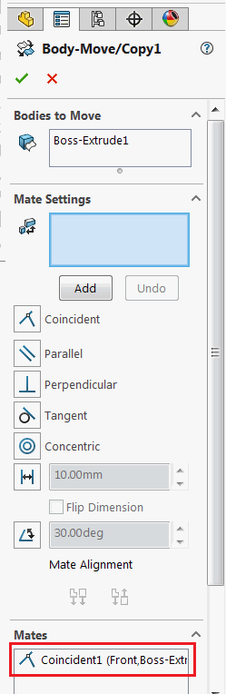

 使用SOLIDWORKS API创建移动-复制体特征，并在零件中的最大面和前平面之间添加共面约束的C# VSTA宏示例
image: move-copy-body-mate-pmp.png
labels: [移动-复制体,约束]
---
{ width=150 }

这是一个C# VSTA宏示例，它可以找到所选体的最大平面面，并在零件中插入移动-复制体特征，并使用SOLIDWORKS API在最大面和前平面之间添加共面约束。

* 打开零件文档
* 选择包含平面面的任何体
* 运行宏。结果是通过[IFeatureManager::InsertMoveCopyBody2](https://help.solidworks.com/2016/english/api/sldworksapi/solidworks.interop.sldworks~solidworks.interop.sldworks.ifeaturemanager~insertmovecopybody2.html) SOLIDWORKS API方法插入了移动-复制体特征。然后，使用[IMoveCopyBodyFeatureData::AddMate](https://help.solidworks.com/2016/english/api/sldworksapi/SolidWorks.Interop.sldworks~SolidWorks.Interop.sldworks.IMoveCopyBodyFeatureData~AddMate.html) SOLIDWORKS API方法在体的最大面和前平面之间添加了共面约束。

~~~ cs
using SolidWorks.Interop.sldworks;
using SolidWorks.Interop.swconst;
using System;
using System.Linq;
using System.Runtime.InteropServices;

namespace MoveBodyMate
{
    public partial class SolidWorksMacro
    {
        public void Main()
        {
            try
            {
                var model = swApp.IActiveDoc2;
                var body = model.ISelectionManager.GetSelectedObject6(1, -1) as IBody2;

                if (body == null)
                {
                    throw new NullReferenceException("选择要移动的体");
                }

                var plane = FindFrontPlane(model);
                var face = FindLargestPlanarFace(body);

                AddCoincidentMate(model, body, plane as IEntity, face as IEntity);
            }
            catch(Exception ex)
            {
                swApp.SendMsgToUser2(ex.Message, (int)swMessageBoxIcon_e.swMbStop, (int)swMessageBoxBtn_e.swMbOk);
            }
        }

        private static void AddCoincidentMate(ModelDoc2 model, IBody2 body, IEntity mateEnt, IEntity mateEntOnBody)
        {
            var selData = model.ISelectionManager.CreateSelectData();
            selData.Mark = 1;

            if (!body.Select2(false, selData))
            {
                throw new InvalidOperationException("选择体失败");
            }

            var moveCopyBodyFeat = model.FeatureManager.InsertMoveCopyBody2(0, 0, 0, 0, 0, 0, 0, 0, 0, 0, false, 1);

            var featData = moveCopyBodyFeat.GetDefinition() as IMoveCopyBodyFeatureData;

            if (featData.AccessSelections(model, null))
            {
                int err;

                var mate = featData.AddMate(new DispatchWrapper[]
                {
                    new DispatchWrapper(mateEnt),
                    new DispatchWrapper(mateEntOnBody)
                }, (int)swMateType_e.swMateCOINCIDENT, (int)swMateAlign_e.swMateAlignCLOSEST, 0, 0, out err);

                if (mate == null)
                {
                    throw new NullReferenceException(string.Format("添加约束失败: {0}", (swAddMateError_e)err));
                }

                if (!moveCopyBodyFeat.ModifyDefinition(featData, model, null))
                {
                    throw new InvalidOperationException("应用特征更改失败");
                }
            }
            else
            {
                throw new InvalidOperationException("无法访问定义");
            }
        }

        private IFeature FindFrontPlane(IModelDoc2 model)
        {
            var feat = model.IFirstFeature();

            while (feat != null && feat.GetTypeName2() != "RefPlane")
            {
                feat = feat.IGetNextFeature();
            }

            if (feat == null)
            {
                throw new NullReferenceException("无法找到前平面");
            }

            return feat;
        }

        private IFace2 FindLargestPlanarFace(IBody2 body)
        {
            var faces = body.GetFaces() as object[];

            if (faces == null)
            {
                throw new NullReferenceException("体中不包含面");
            }

            var face = faces.Cast<IFace2>()
                .Where(f => f.IGetSurface().IsPlane())
                .OrderBy(f => f.GetArea()).LastOrDefault();

            if (face == null)
            {
                throw new NullReferenceException("该体中没有平面面");
            }

            return face;
        }

        public SldWorks swApp;
    }
}

~~~