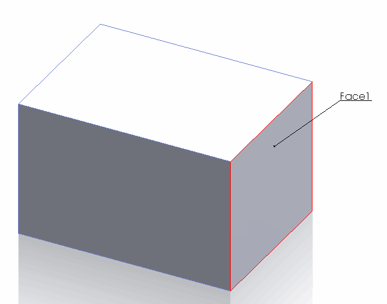
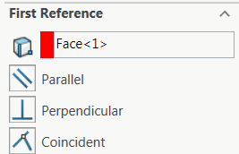

 本文介绍了对象名称的使用方法以及读取和更改名称的方式
image: face-name.png
labels: [id, track, name]
---
{ width=300 }

模型中的一些SOLIDWORKS对象可以被赋予用户名称。这些名称是模型中对象的唯一标识，并且在重建操作或会话中保持不变。可以从GUI中查看和编辑名称。

以下对象类型具有分配给它们的名称：

* 组件
* 配置
* 特征
* 图层
* 实体
* 平面
* 尺寸
* 实体（面、边、顶点）
* 草图段（线、弧、样条、椭圆）
* 绘图视图

### 实体名称

默认情况下，实体（面、边、顶点）的名称未分配。

可以从**实体属性**对话框中更改实体名称。参考[显示实体属性](https://help.solidworks.com/2017/english/solidworks/sldworks/hidd_ent_property.htm)

### 注意事项和限制

* 无法从GUI或API更改草图段的名称

* 在选择框中显示的名称不是实体的真实名称。这些只是在当前打开的属性管理器页面中为区分选择而临时分配的名称。这些名称不应作为参考使用。

* 在更改组件的名称时，需要考虑几个因素。更多信息请参考[重命名组件](/docs/codestack/solidworks-api/document/assembly/components/rename/)

以下示例允许使用SOLIDWORKS API将选定的对象重命名为指定的名称。

~~~ vb
Enum ElementType_e
    Component
    Configuration
    Feature
    Layer
    Body
    Sheet
    Entity 'Face, Edge, Vertex
    SketchSegment
    View
End Enum

Dim swApp As SldWorks.SldWorks

Sub main()

    Set swApp = Application.SldWorks
    
    Dim swModel As SldWorks.ModelDoc2

    Set swModel = swApp.ActiveDoc
    
    If Not swModel Is Nothing Then
        
        Dim swSelMgr As SldWorks.SelectionMgr
        Set swSelMgr = swModel.SelectionManager
        
        Dim swObj As Object
        Set swObj = swSelMgr.GetSelectedObject6(1, -1)
        
        If Not swObj Is Nothing Then
            
            Dim elementType As ElementType_e
            
            Dim name As String
            name = InputBox("指定新名称")
            
            SetObjectName swObj, swModel, name, elementType
            
            Dim newName As String
            newName = GetObjectName(swObj, swModel, elementType)
            
            Debug.Assert name = newName
            
        Else
            MsgBox "请选择对象"
        End If
        
    Else
        MsgBox "请打开模型"
    End If
        
End Sub

Function GetObjectName(obj As Object, model As SldWorks.ModelDoc2, ByRef elementType As ElementType_e) As String
    
    Dim name As String
    
    If TypeOf obj Is SldWorks.Component2 Then
        
        Dim swComp As SldWorks.Component2
        Set swComp = obj
        elementType = ElementType_e.Component
        name = swComp.Name2
        
    ElseIf TypeOf obj Is SldWorks.Configuration Then
        
        Dim swConf As SldWorks.Configuration
        Set swConf = obj
        elementType = ElementType_e.Configuration
        name = swConf.name
        
    ElseIf TypeOf obj Is SldWorks.Feature Then
        
        Dim swFeat As SldWorks.Feature
        Set swFeat = obj
        elementType = ElementType_e.Feature
        name = swFeat.name
        
    ElseIf TypeOf obj Is SldWorks.Layer Then
        
        Dim swLayer As SldWorks.Layer
        Set swLayer = obj
        elementType = ElementType_e.Layer
        name = swLayer.name
        
    ElseIf TypeOf obj Is SldWorks.Body2 Then
        
        Dim swBody As SldWorks.Body2
        Set swBody = obj
        elementType = ElementType_e.Body
        name = swBody.name
        
    ElseIf TypeOf obj Is SldWorks.Sheet Then
        
        Dim swSheet As SldWorks.Sheet
        Set swSheet = obj
        elementType = ElementType_e.Sheet
        name = swSheet.GetName
        
    ElseIf TypeOf obj Is SldWorks.Face2 _
        Or TypeOf obj Is SldWorks.Edge _
        Or TypeOf obj Is SldWorks.Vertex _
        Or TypeOf obj Is SldWorks.Entity Then
        
        Dim swEnt As SldWorks.Entity
        Set swEnt = obj
        elementType = ElementType_e.Entity
        name = model.GetEntityName(swEnt)
        
    ElseIf TypeOf obj Is SldWorks.View Then
        
        Dim swView As SldWorks.View
        Set swView = obj
        elementType = ElementType_e.View
        name = swView.name
        
    ElseIf TypeOf obj Is SldWorks.SketchSegment Then
        
        Dim swSkSeg As SldWorks.SketchSegment
        Set swSkSeg = obj
        elementType = ElementType_e.SketchSegment
        name = swSkSeg.GetName
        
    Else
        Err.Raise vbObjectError, , "对象没有名称"
    End If
    
    GetObjectName = name
    
End Function

Sub SetObjectName(obj As Object, model As SldWorks.ModelDoc2, name As String, ByRef elementType As ElementType_e)
    
    If TypeOf obj Is SldWorks.Component2 Then
        
        Dim swComp As SldWorks.Component2
        Set swComp = obj
        elementType = ElementType_e.Component
        swComp.Name2 = name
        
    ElseIf TypeOf obj Is SldWorks.Configuration Then
        
        Dim swConf As SldWorks.Configuration
        Set swConf = obj
        elementType = ElementType_e.Configuration
        swConf.name = name
        
    ElseIf TypeOf obj Is SldWorks.Feature Then
        
        Dim swFeat As SldWorks.Feature
        Set swFeat = obj
        elementType = ElementType_e.Feature
        swFeat.name = name
        
    ElseIf TypeOf obj Is SldWorks.Layer Then
        
        Dim swLayer As SldWorks.Layer
        Set swLayer = obj
        elementType = ElementType_e.Layer
        swLayer.name = name
        
    ElseIf TypeOf obj Is SldWorks.Body2 Then
        
        Dim swBody As SldWorks.Body2
        Set swBody = obj
        elementType = ElementType_e.Body
        swBody.name = name
        
    ElseIf TypeOf obj Is SldWorks.Sheet Then
        
        Dim swSheet As SldWorks.Sheet
        Set swSheet = obj
        elementType = ElementType_e.Sheet
        swSheet.SetName name
        
    ElseIf TypeOf obj Is SldWorks.Face2 _
        Or TypeOf obj Is SldWorks.Edge _
        Or TypeOf obj Is SldWorks.Vertex _
        Or TypeOf obj Is SldWorks.Entity Then
        
        Dim swEnt As SldWorks.Entity
        Set swEnt = obj
        elementType = ElementType_e.Entity
        
        If model.GetType() = swDocumentTypes_e.swDocPART Then
            Dim swPart As SldWorks.PartDoc
            Set swPart = model
            swPart.DeleteEntityName swEnt '如果名称已存在，则需要清除名称
            swPart.SetEntityName swEnt, name
        Else
            Err.Raise vbObjectError, , "只能在零件文档中更改实体名称"
        End If
        
    ElseIf TypeOf obj Is SldWorks.View Then
        
        Dim swView As SldWorks.View
        Set swView = obj
        elementType = ElementType_e.View
        swView.SetName2 name
        
    ElseIf TypeOf obj Is SldWorks.SketchSegment Then
        
        Err.Raise vbObjectError, , "无法更改草图段的名称"
        
    Else
        Err.Raise vbObjectError, , "对象没有名称"
    End If
    
End Sub
~~~