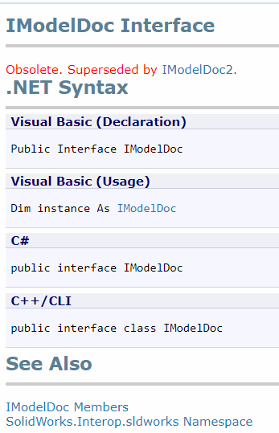

SOLIDWORKS API（以及SOLIDWORKS本身）都是向后兼容的，这意味着旧版本的API与新版本的SOLIDWORKS兼容。这意味着在发布新版本时，不应更改API方法的签名和行为。为此，SOLIDWORKS引入了方法和接口名称的修订系统。每当API的新版本可用时，它将作为**MethodName** *Last Revision + 1*添加到类图中。例如，[ISldWorks::OpenDoc6](https://help.solidworks.com/2018/english/api/sldworksapi/solidworks.interop.sldworks~solidworks.interop.sldworks.isldworks~opendoc6.html)是[ISldWorks::OpenDoc5](https://help.solidworks.com/2018/english/api/sldworksapi/solidworks.interop.sldworks~solidworks.interop.sldworks.isldworks~opendoc5.html)方法的较新版本。而[IModelDoc2](https://help.solidworks.com/2018/english/api/sldworksapi/SolidWorks.Interop.sldworks~SolidWorks.Interop.sldworks.IModelDoc2.html)是[IModelDoc](https://help.solidworks.com/2018/english/api/sldworksapi/SolidWorks.Interop.sldworks~SolidWorks.Interop.sldworks.IModelDoc.html)接口的较新（当前）版本。

## 过时的方法和接口

尽管SOLIDWORKS是向后兼容的，并且所有版本的方法都应该可以工作，但建议使用与SOLIDWORKS目标程序的最低版本兼容的最新版本。

这样做的主要原因是：

* 过时的方法（或任何备注和描述）可能在API文档中不可用。因此，可能需要维护先前版本的API帮助文档。

{ width=250 }

* 并不总是知道添加替代方法的原因。这可能是由于旧版本方法中存在的某个错误（或行为），如果使用该方法，可能会引入程序的未知副作用。

* 如果出现问题，从支持部门请求帮助可能会有问题，因为最明显的建议是将方法升级到新版本，因为旧方法可能被视为“无效保修”。