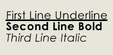

这个VBA示例演示了如何在SOLIDWORKS文档中插入注释，并使用不同的字体效果和样式格式化各行。

文本的部分可以使用**\<FONT\>**指令进行格式化。该指令有两个属性：

* **effect** - 可以等于**U**（下划线）或**RU**（取消下划线）
* **style** - 可以等于**B**（粗体）、**RB**（取消粗体）、**I**（斜体）或**RI**（取消斜体）

**\<FONT\>**指令之后的所有文本将根据**effect**和**style**的值进行格式化。

[INote::GetText](https://help.solidworks.com/2023/English/api/sldworksapi/SolidWorks.Interop.sldworks~SolidWorks.Interop.sldworks.INote~GetText.html)方法返回注释的解析值。对于上面的注释，它将返回以下结果：

~~~
第一行下划线
第二行粗体
第三行斜体
~~~

[INote::PropertyLinkedText](https://help.solidworks.com/2023/English/api/sldworksapi/SolidWorks.Interop.sldworks~SolidWorks.Interop.sldworks.INote~PropertyLinkedText.html)属性设置或获取支持**\<FONT\>**指令的文本。对于上面的注释，它将返回以下结果：

~~~
第一行下划线
第二行粗体
第三行斜体
~~~

~~~ vb
Dim swApp As SldWorks.SldWorks

Sub main()

    Set swApp = Application.SldWorks
    
    Dim swModel As SldWorks.ModelDoc2
    
    Set swModel = swApp.ActiveDoc
    
    Dim swSelMgr As SldWorks.SelectionMgr
    
    Set swSelMgr = swModel.SelectionManager
    
    Dim swNote As SldWorks.Note
    
    Set swNote = swModel.InsertNote("第一行下划线" & vbLf & "第二行粗体" & vbLf & "第三行斜体")
        
    Debug.Print swNote.GetText()
    Debug.Print swNote.PropertyLinkedText
    
End Sub
~~~