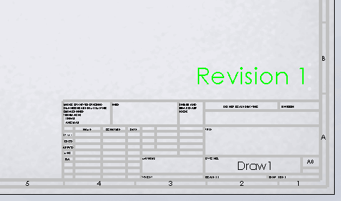

{ width=300 }

该示例演示了如何使用SOLIDWORKS API向SOLIDWORKS模型（零件、装配或图纸）中的选定注释添加文本标签（属性）。

在宏中，将标签的名称指定为*TAG*常量。

* 标签允许跟踪模型会话中的特定注释。如果宏需要更新注释（例如更改修订版或链接值），这将非常有用。
* 如果注释更改其文本或格式，标签将被保留。
* 如果注释移动（包括从工作表空间移动到工作表格式），标签将被保留。
* 无法从用户界面中看到/更改标签（只能通过SOLIDWORKS API访问）。

~~~ vb
Const TAG As String = "_CodeStackNote_"

Dim swApp As SldWorks.SldWorks

Sub main()

    Set swApp = Application.SldWorks
    
    Dim swModel As SldWorks.ModelDoc2
    
    Set swModel = swApp.ActiveDoc
    
    If Not swModel Is Nothing Then
        
        If Not TagSelectedNote(swModel, TAG) Then
            MsgBox "向注释添加标签失败"
        End If
        
    Else
        MsgBox "请打开模型"
    End If
    
End Sub

Function TagSelectedNote(model As SldWorks.ModelDoc2, TAG As String) As Boolean
    
    On Error Resume Next
    
    Dim swSelMgr As SldWorks.SelectionMgr
    Set swSelMgr = model.SelectionManager
            
    Dim swNote As SldWorks.Note
    
    Set swNote = swSelMgr.GetSelectedObject6(1, -1)
    
    If Not swNote Is Nothing Then
        swNote.TagName = TAG
        TagSelectedNote = True
        Exit Function
    Else
        MsgBox "请选择要添加标签的注释"
    End If
    
    TagSelectedNote = False
    
End Function
~~~