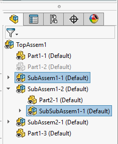

 VBA宏，以大型设计审查（LDR）模式和仅查看模式分别打开所有选定的子装配和零件组件
image: ldr-sub-assembly.svg
labels: [性能，ldr，仅查看，大型设计审查，打开]
group: 装配体
---
这个VBA宏可以从在大型设计审查（LDR）模式下打开的装配体或在详图模式下打开的图纸中运行。宏将以它们自己的窗口打开所有选定的组件，但与开箱即用的功能不同，装配体将不会被解析并将保留LDR模式。

然后可以在LDR模式下启用编辑，修改装配体并更新顶层装配体中的图形。

在所有步骤中保留LDR模式将显著提高性能。

## 图纸

这个宏也可以从在详图模式下打开的图纸中工作。在运行宏之前，需要选择图纸视图。

要启用图纸支持，需要在宏中启用文档管理器API。请按照[激活文档管理器](/docs/codestack/solidworks-document-manager-api/getting-started/create-connection#activating-document-manager)部分的详细步骤请求文档管理器许可证密钥。

在VBA编辑器的**工具->引用**菜单下添加对**SwDocumentMgr [Year] Type Library**的引用。请参阅[VBA中的文档管理器](/docs/codestack/solidworks-document-manager-api/getting-started/create-connection#vba)获取更多信息。

在**DM_LIC_KEY**变量中设置许可证密钥。请注意，此宏只需要密钥的**swdocmgr_general**部分。以下格式就足够了。

~~~ vb
Const DM_LIC_KEY As String = "[CompanyName]:swdocmgr_general-00000-{31 times}"
~~~

如果宏只会从装配体中使用，则不需要此例程。

## 注意事项和限制

* 子装配组件将以大型设计审查模式打开，而零件组件将以仅查看模式打开
* 如果目标零件或装配体没有存储显示数据，将会抛出错误
* 组件必须从特征管理器树中选择。在图形区域中选择的实体将被忽略
* 此VBA宏使用了[搜索引用文档的例程](https://help.solidworks.com/2016/english/SolidWorks/sldworks/c_Search_Routine_for_Referenced_Documents.htm)的简化版本，并且仅在回退到组件的缓存路径之前检查活动装配体的文件夹和子文件夹。在某些情况下，这可能导致加载不正确的引用（例如，如果使用搜索文件夹）。但这只适用于被复制并且缓存文件路径从未更新的装配体。

### 引用的配置

此宏将尝试以组件的引用配置打开装配体，但是默认情况下SOLIDWORKS仅在活动配置中存储显示数据，除非配置标记为“显示数据标记”。

{ width=250 }

如果组件的引用配置未标记为上述标记，并且它不是活动配置，则无法在大型设计审查中加载它。在这种情况下，宏将加载默认配置并显示下面的警告，指示加载了不同配置的图形。

~~~ vb
Type DocumentInfo
    filePath As String
    Configuration As String
End Type

Type DmDrawingViewInfo
    viewName As String
    RefDocPath As String
    RefConfigName As String
End Type

Const DM_LIC_KEY As String = "YOUR LICENSE KEY"

Dim swApp As SldWorks.SldWorks

Sub main()

    Set swApp = Application.SldWorks
    
    Dim swModel As SldWorks.ModelDoc2
    
    Set swModel = swApp.ActiveDoc
    
try_:
    On Error GoTo catch_
    
    If Not swModel Is Nothing Then
    
        If swModel.GetType() = swDocumentTypes_e.swDocASSEMBLY Then
            If False = swModel.IsOpenedViewOnly Then
                Err.Raise vbError, "", "Active assembly is not opened in Large Design Review mode"
            End If
        ElseIf swModel.GetType() = swDocumentTypes_e.swDocDRAWING Then
            Dim swDraw As SldWorks.DrawingDoc
            Set swDraw = swModel
            If False = swDraw.IsDetailingMode Then
                Err.Raise vbError, "", "Active drawing is not opened in Detailing mode"
            End If
        Else
            Err.Raise vbError, "", "Active document is not an assembly or drawing"
        End If
                
        Dim swDocsInfo() As DocumentInfo
        
        swDocsInfo = GetReferenceDocuments(swModel)
                
        OpenDocuments swModel, swDocsInfo
        
        GoTo finally_
        
    Else
        Err.Raise vbError, "", "Please open assembly or drawing document"
    End If

catch_:
    swApp.SendMsgToUser2 Err.Description, swMessageBoxIcon_e.swMbStop, swMessageBoxBtn_e.swMbOk
finally_:
 
End Sub

Sub OpenDocuments(model As SldWorks.ModelDoc2, docsInfo() As DocumentInfo)
    
    If Not IsDocsInfoEmpty(docsInfo) Then
            
        Dim i As Integer
        
        For i = 0 To UBound(docsInfo)
            
            Dim swDocInfo As DocumentInfo
            swDocInfo = docsInfo(i)
        
            Dim compPath As String
            compPath = ResolveReferencePath(model.GetPathName(), swDocInfo.filePath)
            
            Dim swDocSpec As SldWorks.DocumentSpecification
            Set swDocSpec = swApp.GetOpenDocSpec(compPath)
            
            swDocSpec.ConfigurationName = swDocInfo.Configuration
            swDocSpec.ViewOnly = True
            
            Dim swRefModel As SldWorks.ModelDoc2
            Set swRefModel = swApp.OpenDoc7(swDocSpec)
            
            If swRefModel Is Nothing And swDocSpec.Error = swFileLoadError_e.swFileRequiresRepairError Then
                
                swDocSpec.ConfigurationName = ""
                Set swRefModel = swApp.OpenDoc7(swDocSpec)
                
                If Not swRefModel Is Nothing Then
                
                    Dim swModelView As SldWorks.ModelView
                    Set swModelView = swRefModel.ActiveView
                    
                    Dim vViewBox As Variant
                    
                    vViewBox = swModelView.GetVisibleBox
                    
                    Dim activeConfName As String
                    activeConfName = swApp.GetActiveConfigurationName(compPath)
                    
                    If LCase(activeConfName) <> LCase(swDocInfo.Configuration) Then
                        swApp.ShowBubbleTooltipAt2 vViewBox(0), vViewBox(1), swArrowPosition.swArrowLeftTop, _
                            "CodeStack", _
                            "Referenced configuration '" & swDocInfo.Configuration & "' of the assembly does not have a 'Display Data Mark' and was opened in the active configuration '" & activeConfName & "'", _
                            swBitMaps.swBitMapTreeError, "", "", 0, swLinkString.swLinkStringNone, "", ""
                    End If
                    
                End If
                
            End If
            
            If swRefModel Is Nothing Then
                Err.Raise vbError, "", "Failed to open component. Error code: " & swDocSpec.Error
            End If
            
        Next
        
    Else
        Err.Raise vbError, "", "No component selected"
    End If
    
End Sub

Function GetReferenceDocuments(model As SldWorks.ModelDoc2) As DocumentInfo()
    
    Dim swDocsInfo() As DocumentInfo
        
    Dim i As Integer
    
    Dim swSelMgr As SldWorks.SelectionMgr
    Set swSelMgr = model.SelectionManager
    
    Dim viewInfo() As DmDrawingViewInfo
    
    If model.GetType() = swDocumentTypes_e.swDocDRAWING Then
        viewInfo = GetDmDrawingViews(model.GetPathName())
    End If
    
    For i = 1 To swSelMgr.GetSelectedObjectCount2(-1)
        
        Dim path As String
        Dim confName As String
        
        If swSelMgr.GetSelectedObjectType3(i, -1) = swSelectType_e.swSelCOMPONENTS Then
            
            Dim swComp As SldWorks.Component2
            Set swComp = swSelMgr.GetSelectedObject6(i, -1)
            
            path = swComp.GetPathName()
            confName = swComp.ReferencedConfiguration
        
        ElseIf swSelMgr.GetSelectedObjectType3(i, -1) = swSelectType_e.swSelDRAWINGVIEWS Then
            
            Dim swView As SldWorks.View
            Set swView = swSelMgr.GetSelectedObject6(i, -1)
            
            GetViewReferencedDocumentInfo viewInfo, swView.Name, path, confName
            
        End If
        
        If path <> "" Then
            
            Dim unique As Boolean
            unique = False
            
            If IsDocsInfoEmpty(swDocsInfo) Then
                ReDim swDocsInfo(0)
                unique = True
            Else
                unique = Not ContainsDocumentInfo(swDocsInfo, path)
                If True = unique Then
                    ReDim Preserve swDocsInfo(UBound(swDocsInfo) + 1)
                End If
            End If
                
            If True = unique Then
                swDocsInfo(UBound(swDocsInfo)).filePath = path
                swDocsInfo(UBound(swDocsInfo)).Configuration = confName
            End If
            
        End If
        
    Next
    
    GetReferenceDocuments = swDocsInfo
    
End Function

Function GetDmDrawingViews(drwFilePath As String) As DmDrawingViewInfo()
    
    Dim viewInfos() As DmDrawingViewInfo
    
    Dim swDmApp As SwDocumentMgr.SwDMApplication4

    Dim swClassFact As SwDocumentMgr.SwDMClassFactory
    
    Set swClassFact = New SwDocumentMgr.SwDMClassFactory
    
    Set swDmApp = swClassFact.GetApplication(DM_LIC_KEY)
    
    If Not swDmApp Is Nothing Then

        Dim swDmDoc As SwDocumentMgr.SwDMDocument10

        Dim res As SwDmDocumentOpenError
        
        Set swDmDoc = swDmApp.GetDocument(drwFilePath, swDmDocumentDrawing, True, res)
        
        If Not swDmDoc Is Nothing Then
            
            Dim searchOpts As SwDocumentMgr.SwDMSearchOption
            Set searchOpts = swDmApp.GetSearchOptionObject
            searchOpts.SearchFilters = SwDmSearchFilters.SwDmSearchExternalReference + SwDmSearchFilters.SwDmSearchRootAssemblyFolder + SwDmSearchFilters.SwDmSearchSubfolders + SwDmSearchFilters.SwDmSearchInContextReference
                
            Dim vFilePaths As Variant
            
            vFilePaths = swDmDoc.GetAllExternalReferences2(searchOpts, Empty)
        
            Dim vViews As Variant
            vViews = swDmDoc.GetViews
            
            ReDim viewInfos(UBound(vViews))
            
            Dim i As Integer
            
            For i = 0 To UBound(vViews)
                Dim swDmView As SwDocumentMgr.SwDMView2
                Set swDmView = vViews(i)
                viewInfos(i).viewName = swDmView.Name
                viewInfos(i).RefConfigName = swDmView.ReferencedConfiguration
                viewInfos(i).RefDocPath = FindPathByFileName(vFilePaths, swDmView.ReferencedDocument)
            Next
            
            swDmDoc.CloseDoc
            
            GetDmDrawingViews = viewInfos
            
        Else
            Err.Raise vbError, "", "Failed to open the drawing document in Document Manager. Error code: " & res
        End If
        
    Else
        Err.Raise vbError, "", "Failed to connect to Document Manager application"
    End If
    
End Function

Function GetViewReferencedDocumentInfo(viewInfo() As DmDrawingViewInfo, viewName As String, ByRef path As String, ByRef confName As String)

    Dim i As Integer
    
    For i = 0 To UBound(viewInfo)
        If LCase(viewInfo(i).viewName) = LCase(viewName) Then
            path = viewInfo(i).RefDocPath
            confName = viewInfo(i).RefConfigName
            Exit Function
        End If
        
    Next

    Err.Raise vbError, "", "Failed to find drawing view information"
    
End Function

Function IsDocsInfoEmpty(docsInfo() As DocumentInfo)
    IsDocsInfoEmpty = ((Not docsInfo) = -1)
End Function

Function FindPathByFileName(vFilePaths As Variant, fileName As String) As String

    Dim i As Integer
    
    For i = 0 To UBound(vFilePaths)
        Dim filePath As String
        filePath = vFilePaths(i)
        
        Dim thisFileName As String
        thisFileName = Right(filePath, InStrRev(filePath, "\") + 1)
        
        If LCase(thisFileName) = LCase(fileName) Then
            FindPathByFileName = filePath
            Exit Function
        End If
        
    Next

    Err.Raise vbError, "", "Failed to find the path by file name"
    
End Function

Function ContainsDocumentInfo(docsInfo() As DocumentInfo, path As String) As Boolean
    
    Dim i As Integer
    
    For i = 0 To UBound(docsInfo)
        If LCase(path) = LCase(docsInfo(i).filePath) Then
            ContainsDocumentInfo = True
            Exit Function
        End If
    Next
    
    ContainsDocumentInfo = False
    
End Function

Function ResolveReferencePath(rootDocPath As String, refPath As String) As String
    
    Dim pathParts As Variant
    pathParts = Split(refPath, "\")
    
    Dim rootFolder As String
    rootFolder = rootDocPath
    rootFolder = Left(rootFolder, InStrRev(rootFolder, "\") - 1)

    Dim i As Integer
    
    Dim curRelPath As String
    
    For i = UBound(pathParts) To 1 Step -1
        
        curRelPath = pathParts(i) & IIf(curRelPath <> "", "\", "") & curRelPath
        Dim path As String
        path = rootFolder & "\" & curRelPath
        
        If Dir(path) <> "" Then
            ResolveReferencePath = path
            Exit Function
        End If
        
    Next
    
    ResolveReferencePath = refPath
    
End Function
~~~